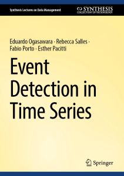

# Event Detection in Time Series — Examples and Resources

Welcome! This repository accompanies the book Event Detection in Time Series (Springer). It contains runnable examples for each chapter, already rendered to Markdown under `examples/chapter*`.

- Book: https://link.springer.com/book/10.1007/978-3-031-75941-3
- Issues and suggestions: https://github.com/eogasawara/TSED/issues

## How This Repo Is Organized
- Examples by chapter: see [`examples/chapter1`](https://github.com/eogasawara/TSED/tree/main/examples/chapter1) … [`examples/chapter8`](https://github.com/eogasawara/TSED/tree/main/examples/chapter8). Each folder contains self‑contained Markdown files you can read directly on GitHub or run locally.

## Chapter Guide (with links)
- Chapter 1 — Getting Started and Basics ([`examples/chapter1`](https://github.com/eogasawara/TSED/tree/main/examples/chapter1))
  - First end‑to‑end event detection workflow with Harbinger (load data, fit, detect, visualize) and simple motif examples.
- Chapter 2 — Representation, Preprocessing and Prediction ([`examples/chapter2`](https://github.com/eogasawara/TSED/tree/main/examples/chapter2))
  - Stationarity, trends, normalization; Fourier/Wavelet/EMD decompositions; ACF/ARIMA; PAA+SAX; introductory LSTM examples for sequence modeling.
- Chapter 3 — Detectors and Models ([`examples/chapter3`](https://github.com/eogasawara/TSED/tree/main/examples/chapter3))
  - Classical and ML detectors: ARIMA residuals, GARCH, histogram/k‑means, SVM, autoencoders, and multivariate cases.
- Chapter 4 — Change Detection ([`examples/chapter4`](https://github.com/eogasawara/TSED/tree/main/examples/chapter4))
  - Change points and concept drift: CUSUM, Page‑Hinkley, AMOC/PELT/BinSeg, Chow test, ADWIN/KSWIN/HDDM/EDDM, PCA/autoencoder monitoring, and model management.
- Chapter 5 — Motifs and Discords ([`examples/chapter5`](https://github.com/eogasawara/TSED/tree/main/examples/chapter5))
  - Matrix Profile for motifs/discords, PAA+SAX pipelines, DTW comparisons, and preprocessing tips.
- Chapter 6 — Online Detection ([`examples/chapter6`](https://github.com/eogasawara/TSED/tree/main/examples/chapter6))
  - Streaming/online updates with frame‑by‑frame visualizations and animated outputs.
- Chapter 7 — Evaluation ([`examples/chapter7`](https://github.com/eogasawara/TSED/tree/main/examples/chapter7))
  - ROC and PR curves, tolerance windows, and soft evaluation (SoftED) to credit near‑miss detections.
- Chapter 8 — Bibliographic Exploration ([`examples/chapter8`](https://github.com/eogasawara/TSED/tree/main/examples/chapter8))
  - Word clouds, production over time, intersections across topics, and summary tables for the literature survey.
- Appendix: [`examples/appendix`](https://github.com/eogasawara/TSED/tree/main/examples/appendix) includes supplementary experiments and deeper dives.
- Benchmark: [`bench`](https://github.com/eogasawara/TSED/tree/main/bench) includes description for benchmarking event/anomaly detection methods.

## Reporting Issues and Contributing
- Found a problem or have a suggestion? Please open an issue: https://github.com/eogasawara/TSED/issues
- When possible, include the chapter path (for example, `examples/chapter5/chap5_motifs_mp.md`), steps to reproduce, and your environment details.

Thanks for reading the book and exploring the examples. Enjoy detecting events!
