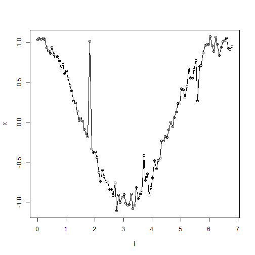
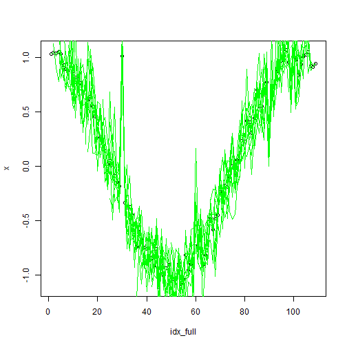
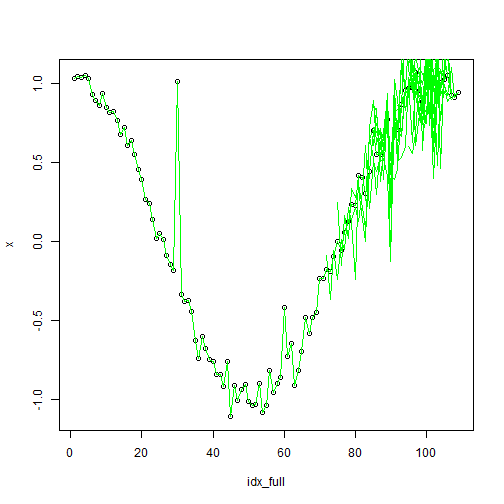
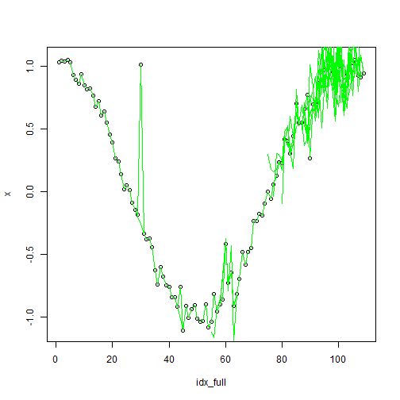

``` r
library(tspredit)
library(daltoolbox)
```
## Theoretical Overview
This appendix illustrates basic time series data augmentation over sliding windows to enrich training data.
## Example Overview and Goals
We will: generate a synthetic series with noise and spikes, build sliding windows, apply different augmentations (jitter, awareness, aware-smooth), and visualize overlays.
### Setup and Libraries
Load augmentation and time-series utilities.

### Synthetic Series
Create a noisy cosine signal with a few injected spikes.

``` r
i <- seq(0, 2 * pi + 8 * pi / 50, pi / 50)
x <- cos(i)
# Additive Gaussian noise
noise <- rnorm(length(x), mean = 0, sd = sd(x) / 10)
x <- x + noise
# Inject three spike-like anomalies for visualization
set.seed(42)
x[30] <- rnorm(1, 0, sd(x))
x[60] <- rnorm(1, 0, sd(x))
x[90] <- rnorm(1, 0, sd(x))
```
### Baseline Plot
Plot the original noisy signal.

``` r
plot(i, x)
lines(i, x)
```


### Sliding Windows
Create fixed-size windows as augmentation inputs.

``` r
sw_size <- 10
xw <- ts_data(x, sw_size)
idx_full <- 1:length(x)
```
### Augmentation: Jitter
Apply jitter to windows and overlay on the original plot.

``` r
plot(x = idx_full, y = x, main = "")
lines(x = idx_full, y = x, col = "black")
# Show original windows (green)
for (j in 1:nrow(xw)) {
  lines(x = j:(j + sw_size - 1), y = xw[j, 1:sw_size], col = "green")
}
# Fit jitter augmentation and overlay augmented windows
augment <- ts_aug_jitter()
augment <- fit(augment, xw)
xa <- transform(augment, xw)
idx <- attr(xa, "idx")
for (j in 1:nrow(xa)) {
  lines(x = idx[j]:(idx[j] + sw_size - 1), y = xa[j, 1:sw_size], col = "green")
}
```


### Augmentation: Awareness
Perturb windows with position/value awareness and overlay.

``` r
plot(x = idx_full, y = x, main = "")
lines(x = idx_full, y = x, col = "black")
for (j in 1:nrow(xw)) {
  lines(x = j:(j + sw_size - 1), y = xw[j, 1:sw_size], col = "green")
}
augment <- ts_aug_awareness(0.25)
augment <- fit(augment, xw)
xa <- transform(augment, xw)
idx <- attr(xa, "idx")
for (j in 1:nrow(xa)) {
  lines(x = idx[j]:(idx[j] + sw_size - 1), y = xa[j, 1:sw_size], col = "green")
}
```


### Augmentation: Aware-Smooth
Apply smoothing-aware augmentation and overlay.

``` r
plot(x = idx_full, y = x, main = "")
lines(x = idx_full, y = x, col = "black")
for (j in 1:nrow(xw)) {
  lines(x = j:(j + sw_size - 1), y = xw[j, 1:sw_size], col = "green")
}
augment <- ts_aug_awaresmooth(0.25)
augment <- fit(augment, xw)
xa <- transform(augment, xw)
idx <- attr(xa, "idx")
for (j in 1:nrow(xa)) {
  lines(x = idx[j]:(idx[j] + sw_size - 1), y = xa[j, 1:sw_size], col = "green")
}
```


## References
* General: Box, G. E. P. & Jenkins, G. (1970). Time Series Analysis.
* Ogasawara, E., Salles, R., Porto, F., Pacitti, E. Event Detection in Time Series. Springer, 2025. doi:10.1007/978-3-031-75941-3.
