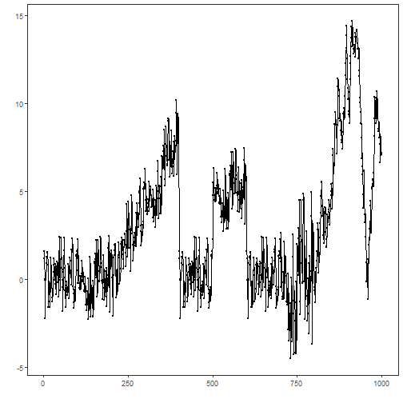
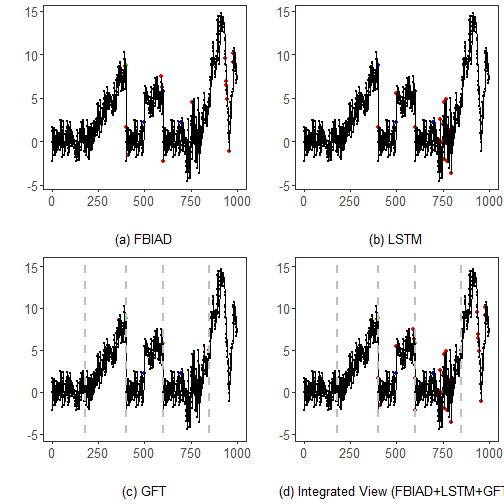

``` r
library(RColorBrewer)
library(ggplot2)
library(gridExtra)
library(dplyr)
library(forecast)
library(daltoolbox)
library(daltoolboxdp)
library(tspredit)
library(harbinger)
source("https://raw.githubusercontent.com/eogasawara/TSED/refs/heads/main/code/header.R")
```
## Theoretical Overview
This appendix shows how to run multiple detectors on the same series and combine their outputs into an integrated view.
## Example Overview and Goals
We will: load a non-stationary series, run FBIAD, LSTM, and GFT detectors, print detections for each, and build a combined detection mask.
### Libraries and Setup
Load only the packages required by this appendix, then source the shared helpers.

``` r
library(RColorBrewer)
library(ggplot2)
library(gridExtra)
library(dplyr)
library(forecast)
library(daltoolbox)
library(daltoolboxdp)
library(tspredit)
library(harbinger)
source("https://raw.githubusercontent.com/eogasawara/TSED/refs/heads/main/code/header.R")
```
### What You Will Do
Run three detectors (FBIAD, LSTM, GFT), inspect results, and combine detections.
### Data Loading and Prep
Load a non-stationary example series.

``` r
data(examples_harbinger)
```
### Other Steps
Additional supporting steps that glue the workflow.

``` r
dataset <- examples_harbinger$nonstationarity
```
### Visualization and Output
Plot the series with detected events and optionally save figures. Combine ggplot layers in one chunk for clarity.

``` r
har_plot(harbinger(), dataset$serie)
```


### Detector A: FBIAD
Configure and fit FBIAD, then detect events.
### Model Configuration
Define the detector/model and its key hyperparameters.

``` r
model_a <- hanr_fbiad()
```
### Other Steps
Additional supporting steps that glue the workflow.

``` r
model_a <- fit(model_a, dataset$serie)
```
### Event Detection
Run the detector to obtain event flags or scores.

``` r
detection_a <- detect(model_a, dataset$serie)
```
### Other Steps
Additional supporting steps that glue the workflow.

``` r
print(detection_a |> dplyr::filter(event == TRUE))
```

```
##    idx event    type
## 1  394  TRUE anomaly
## 2  400  TRUE anomaly
## 3  401  TRUE anomaly
## 4  414  TRUE anomaly
## 5  593  TRUE anomaly
## 6  598  TRUE anomaly
## 7  604  TRUE anomaly
## 8  756  TRUE anomaly
## 9  938  TRUE anomaly
## 10 941  TRUE anomaly
## 11 943  TRUE anomaly
## 12 949  TRUE anomaly
## 13 959  TRUE anomaly
## 14 979  TRUE anomaly
## 15 982  TRUE anomaly
```
### Visualization and Output
Plot the series with detected events and optionally save figures. Combine ggplot layers in one chunk for clarity.

``` r
grfa <- har_plot(model_a, dataset$serie, detection_a, dataset$event) + 
  labs(caption = "(a) FBIAD") + theme(plot.caption = element_text(hjust = 0.5)) + font
```
### Detector B: LSTM
Configure and fit LSTM-based detector, then detect events.
### Model Configuration
Define the detector/model and its key hyperparameters.

``` r
model_b <- hanr_ml(ts_lstm(ts_norm_diff(), input_size = 4, epochs = 10000))
```
### Other Steps
Additional supporting steps that glue the workflow.

``` r
model_b <- fit(model_b, dataset$serie)
```
### Event Detection
Run the detector to obtain event flags or scores.

``` r
detection_b <- detect(model_b, dataset$serie)
```
### Other Steps
Additional supporting steps that glue the workflow.

``` r
print(detection_b |> dplyr::filter(event == TRUE))
```

```
##    idx event    type
## 1  401  TRUE anomaly
## 2  501  TRUE anomaly
## 3  601  TRUE anomaly
## 4  732  TRUE anomaly
## 5  737  TRUE anomaly
## 6  747  TRUE anomaly
## 7  750  TRUE anomaly
## 8  756  TRUE anomaly
## 9  758  TRUE anomaly
## 10 761  TRUE anomaly
## 11 768  TRUE anomaly
## 12 771  TRUE anomaly
## 13 774  TRUE anomaly
## 14 787  TRUE anomaly
## 15 795  TRUE anomaly
```
### Visualization and Output
Plot the series with detected events and optionally save figures. Combine ggplot layers in one chunk for clarity.

``` r
grfb <- har_plot(model_b, dataset$serie, detection_b, dataset$event) + 
  labs(caption = "(b) LSTM") + theme(plot.caption = element_text(hjust = 0.5)) + font
```
### Detector C: GFT
Configure and fit graph Fourier transform-based detector, then detect events.
### Model Configuration
Define the detector/model and its key hyperparameters.

``` r
model_c <- hcp_gft()
```
### Other Steps
Additional supporting steps that glue the workflow.

``` r
model_c <- fit(model_c, dataset$serie)
```
### Event Detection
Run the detector to obtain event flags or scores.

``` r
detection_c <- detect(model_c, dataset$serie)
```
### Other Steps
Additional supporting steps that glue the workflow.

``` r
print(detection_c |> dplyr::filter(event == TRUE))
```

```
##   idx event        type
## 1 178  TRUE changepoint
## 2 400  TRUE changepoint
## 3 600  TRUE changepoint
## 4 850  TRUE changepoint
```
### Visualization and Output
Plot the series with detected events and optionally save figures. Combine ggplot layers in one chunk for clarity.

``` r
grfc <- har_plot(model_c, dataset$serie, detection_c, dataset$event) + 
  labs(caption = "(c) GFT") + theme(plot.caption = element_text(hjust = 0.5)) + font
```
### Integrated View
Combine detections by logical OR and label non-GFT positives as anomalies.

``` r
detection_d <- detection_c
detection_d$event <- detection_a$event | detection_b$event | detection_c$event
detection_d$type[(!detection_c$event)] <- "anomaly"
detection_d$type[!detection_d$event] <- ""
```
### Visualization and Output
Plot the series with detected events and optionally save figures. Combine ggplot layers in one chunk for clarity.

``` r
grfd <- har_plot(harbinger(), dataset$serie, detection_d, dataset$event) + 
  labs(caption = "(d) Integrated View (FBIAD+LSTM+GFT)") + theme(plot.caption = element_text(hjust = 0.5)) + font
```
### Panel Visualization
Arrange the four panels. Uncomment to save as an image.

``` r
# mypng(file = "figures/multiple-detection.png", width = 1600, height = 1260)
gridExtra::grid.arrange(grfa, grfb, grfc, grfd,
                        layout_matrix = matrix(c(1, 2, 3, 4), byrow = TRUE, ncol = 2))
```



``` r
# dev.off()
```
## References
* General: Box, G. E. P. & Jenkins, G. (1970). Time Series Analysis.
* Ogasawara, E., Salles, R., Porto, F., Pacitti, E. Event Detection in Time Series. Springer, 2025. doi:10.1007/978-3-031-75941-3.
