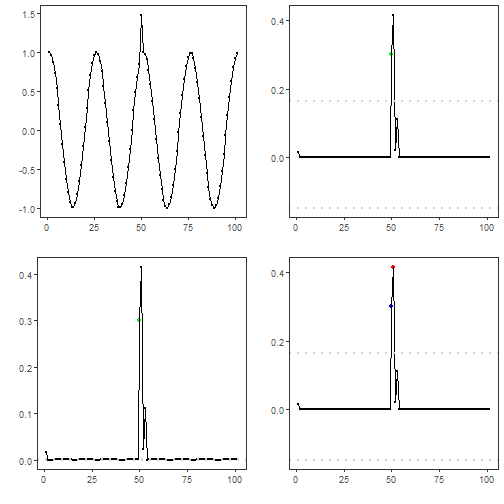

``` r
library(RColorBrewer)
library(ggplot2)
library(daltoolbox)
library(harbinger)
library(gridExtra)
source("https://raw.githubusercontent.com/eogasawara/TSED/refs/heads/main/code/header.R")
```
## Theoretical Overview
This appendix explores how different outlier thresholding strategies affect event detection results.
## Example Overview and Goals
We will: run ARIMA-based detection with default thresholding, with a boxplot rule, and with a high-group consolidation rule, then compare plots.
### Libraries and Setup
Load only the packages required by this appendix, then source the shared helpers.

``` r
library(RColorBrewer)
library(ggplot2)
library(daltoolbox)
library(harbinger)
library(gridExtra)
source("https://raw.githubusercontent.com/eogasawara/TSED/refs/heads/main/code/header.R")
```
### High-Group Check Helper
When contiguous outliers are found, retain only the index with largest residual within each group.

``` r
har_outliers_checks_highgroup <- function(outliers, values) {
  threshold <- attr(outliers, "threshold")
  values <- abs(values)
  if (is_matrix_or_df(values)) values <- rowSums(values)
  size <- length(values)
  group <- split(outliers, cumsum(c(1, diff(outliers) != 1)))
  keep <- rep(FALSE, size)
  for (g in group) {
    if (length(g) > 0) {
      i <- which.max(values[g]); i <- g[i]
      keep[i] <- TRUE
    }
  }
  attr(keep, "threshold") <- threshold
  return(keep)
}
```
### Data Loading and Prep
Read a simple anomalies example dataset.

``` r
data(examples_anomalies)
```
### Other Steps
Additional supporting steps that glue the workflow.

``` r
dataset <- examples_anomalies$simple
```
### Visualization and Output
Plot the series with detected events and optionally save figures. Combine ggplot layers in one chunk for clarity.

``` r
grf1 <- har_plot(harbinger(), dataset$serie)
```
### ARIMA + Default Threshold
Run ARIMA detection with default thresholding.
### Model Configuration
Define the detector/model and its key hyperparameters.

``` r
model <- hanr_arima()
```
### Other Steps
Additional supporting steps that glue the workflow.

``` r
model <- fit(model, dataset$serie)
```
### Event Detection
Run the detector to obtain event flags or scores.

``` r
detection <- detect(model, dataset$serie)
```
### Visualization and Output
Plot the series with detected events and optionally save figures. Combine ggplot layers in one chunk for clarity.

``` r
grf2 <- har_plot(model, attr(detection, "res"), detection,
                 dataset$event, yline = attr(detection, "threshold"))
```
### ARIMA + Boxplot Rule
Replace the outlier function with a boxplot rule.
### Model Configuration
Define the detector/model and its key hyperparameters.

``` r
model <- hanr_arima()
```
### Other Steps
Additional supporting steps that glue the workflow.

``` r
model$har_outliers <- harutils()$har_outliers_boxplot
model <- fit(model, dataset$serie)
```
### Event Detection
Run the detector to obtain event flags or scores.

``` r
detection <- detect(model, dataset$serie)
```
### Visualization and Output
Plot the series with detected events and optionally save figures. Combine ggplot layers in one chunk for clarity.

``` r
grf3 <- har_plot(model, attr(detection, "res"), detection,
                 dataset$event, yline = attr(detection, "threshold"))
```
### ARIMA + High-Group Filter
Keep only the highest residual per contiguous outlier group.
### Model Configuration
Define the detector/model and its key hyperparameters.

``` r
model <- hanr_arima()
```
### Other Steps
Additional supporting steps that glue the workflow.

``` r
model$har_outliers_check <- harutils()$har_outliers_checks_highgroup  
model <- fit(model, dataset$serie)
```
### Event Detection
Run the detector to obtain event flags or scores.

``` r
detection <- detect(model, dataset$serie)
```
### Visualization and Output
Plot the series with detected events and optionally save figures. Combine ggplot layers in one chunk for clarity.

``` r
grf4 <- har_plot(model, attr(detection, "res"), detection,
                 dataset$event, yline = attr(detection, "threshold"))
```
### Panel Layout
Arrange the four panels. Uncomment to save as an image.

``` r
# mypng(file = "threshold.png", width = 1440, height = 1260)
gridExtra::grid.arrange(grf1, grf2, grf3, grf4,
                        layout_matrix = matrix(c(1, 2, 3, 4), byrow = TRUE, ncol = 2))
```



``` r
# dev.off()
```
## References
* General: Box, G. E. P. & Jenkins, G. (1970). Time Series Analysis.
* Ogasawara, E., Salles, R., Porto, F., Pacitti, E. Event Detection in Time Series. Springer, 2025. doi:10.1007/978-3-031-75941-3.
