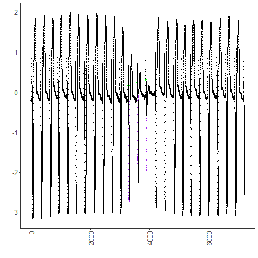

``` r
library(ggplot2)
library(RColorBrewer)
library(daltoolbox)
library(harbinger)
source("https://raw.githubusercontent.com/eogasawara/TSED/refs/heads/main/code/header.R")
```
## Theoretical Overview
This example focuses on motif discovery and discords (e.g., SAX/Matrix Profile). Motifs are recurring patterns; discords are anomalous subsequences. Symbolic or matrix-profile methods efficiently discover both.
## Example Overview and Goals
We will: set up libraries, load a labeled dataset, configure and fit a detector, run detection, align detections with labeled motifs, and visualize the results.
### What You Will Do
You will: prepare the environment, load a labeled ECG dataset, fit a detector, detect motifs/discords, map labels for clarity, and visualize the outcome.
### Setup and Libraries
Load project utilities and required packages.

``` r
# Shared helpers (themes, saving utilities, etc.)
```
### Data Loading and Prep
Read the dataset and perform minimal preparation for modeling.

``` r
# Load example motif datasets
data(examples_motifs)
# Select a labeled ECG time series (MIT-BIH record 102)
data <- examples_motifs$mitdb102
rownames(data) <- 1:nrow(data)  # ensure a simple, sequential index
```
### Model Configuration and Detection
Configure a generic detector and run detection on the labeled series.

``` r
# Fit a default Harbinger detector and detect candidate events
model <- fit(harbinger(), data$serie)
detection <- detect(model, data$serie)
```
### Label Alignment
Map labels for better interpretability in the inspection and plot.

``` r
# Add optional descriptive fields: type, sequence id, and sequence length
detection$type <- NA
detection$seq <- NA
detection$seqlen <- NA
# Mark labeled events as motifs for clarity in downstream visualization
detection$event[data$event] <- TRUE
detection$type[data$event] <- "motif"
detection$seq[data$event] <- 1
detection$seqlen[data$event] <- 50
# Show only detected (or labeled) events
print(detection[detection$event, ])
```

```
##       idx event  type seq seqlen
## 3290 3290  TRUE motif   1     50
## 3587 3587  TRUE motif   1     50
## 3889 3889  TRUE motif   1     50
```
### Visualization and Output
Plot the series with detected/labeled events and save the figure.

``` r
grf <- har_plot(model, data$serie, detection, data$event) +
  font +
  theme(axis.text.x = element_text(angle = 90, vjust = 0.5, hjust = 1))
#save_png(grf, "figures/chap1_labeled_motif.png", 1280, 720)
grf
```


## References
* Yeh, C.-C. M., et al. (2016). Matrix Profile I: All Pairs Similarity Joins for Time Series.
* Ogasawara, E., Salles, R., Porto, F., Pacitti, E. Event Detection in Time Series. Springer, 2025. doi:10.1007/978-3-031-75941-3.
