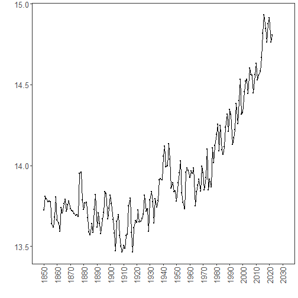

``` r
library(ggplot2)
library(RColorBrewer)
library(daltoolbox)
library(harbinger)
source("https://raw.githubusercontent.com/eogasawara/TSED/refs/heads/main/code/header.R")
```
## Theoretical Overview
This example focuses on event detection in time series. We follow a standard workflow: data preparation, model configuration, fitting, detection, optional inspection, and visualization.
## Example Overview and Goals
We demonstrate a concise, reproducible workflow: set up libraries, load data, configure and fit a detector, run detection, optionally inspect results, and visualize the final output.
### What You Will Do
You will: (1) prepare the environment, (2) load a sample dataset, (3) configure and fit a detector, (4) detect events, and (5) visualize results.
### Setup and Libraries
Load project utilities and required packages.

``` r
# Load shared helpers (plot theme, save helpers, etc.)
# Core toolboxes used throughout the book/examples
```
### Data Loading and Prep
Read the dataset and perform minimal preparation for modeling.

``` r
# Load collection of example datasets from harbinger
data(examples_harbinger)
# Select yearly global temperature series and initialize event labels
data <- examples_harbinger$global_temperature_yearly
data$event <- FALSE  # ground-truth labels (none in this example)
```
### Model Configuration
Define the detector and any key options.

``` r
# Create a generic Harbinger detector (auto-selects sensible defaults)
model <- harbinger()
```
### Fit the Model
Train (fit) the detector to the time series.

``` r
# Fit the detector on the univariate time series
model <- fit(model, data$serie)
```
### Event Detection
Run the detector to obtain event flags and auxiliary information.

``` r
# Produce detection results; detection$event is a logical vector
detection <- detect(model, data$serie)
```
### Visualization and Output
Plot the series with detected events and save the figure.

``` r
# Create a visualization overlaying detections on the original series
grf <- har_plot(model, data$serie, detection, data$event, idx = data$i) +
  font +
  scale_x_date(
    breaks = "10 years",
    date_labels = "%Y",
    limits = c(as.Date("1850-01-01"), as.Date("2030-01-01"))
  ) +
  theme(axis.text.x = element_text(angle = 90, vjust = 0.5, hjust = 1))
# Save image for reproducibility
#save_png(grf, "figures/chap1_ygt.png", 1280, 720)
grf
```


## References
* General: Box, G. E. P. & Jenkins, G. (1970). Time Series Analysis.
* Ogasawara, E., Salles, R., Porto, F., Pacitti, E. Event Detection in Time Series. Springer, 2025. doi:10.1007/978-3-031-75941-3.
