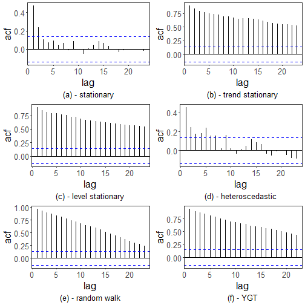

``` r
library(ggplot2)
library(RColorBrewer)
library(forecast)
library(harbinger)
source("https://raw.githubusercontent.com/eogasawara/TSED/refs/heads/main/code/header.R")
```
## Theoretical Overview
This example focuses on autocorrelation analysis (ACF) across regimes. ACF profiles help diagnose stationarity, trends, and random-walk behavior.
## Example Overview and Goals
We will: set up libraries, load data, split into segments with different properties, plot their ACFs, and compare with the target series.
### Other Steps
Additional supporting steps that glue the workflow.

``` r
# Chapter 2: Acf
# Overview:
# - Loads example dataset (if applicable)
# - Fits a detector and runs event detection
# - Plots results with events overlaid
#
```
### Setup and Libraries
Short rationale for the libraries and any project-specific sources.

### Other Steps
Additional supporting steps that glue the workflow.

``` r
# Load example dataset
```
### Data Loading and Prep
Read the dataset and perform any minimal preparation required for modeling.

``` r
data(examples_harbinger)
```
### Other Steps
Additional supporting steps that glue the workflow.

``` r
data <- examples_harbinger$global_temperature_yearly
data$event <- FALSE
serie <- data$serie
serie_a <- examples_harbinger$nonstationarity$serie[1:200]
serie_b <- examples_harbinger$nonstationarity$serie[201:400]
serie_c <- examples_harbinger$nonstationarity$serie[401:600]
serie_d <- examples_harbinger$nonstationarity$serie[601:800]
serie_e <- examples_harbinger$nonstationarity$serie[801:1000]
grf <- ggAcf(serie_a)
grf <- grf + theme_bw(base_size = 10)
grf <- grf + theme(plot.title = element_blank())
grf <- grf + theme(panel.grid.major = element_blank()) + theme(panel.grid.minor = element_blank())
grf <- grf + ylab("acf")
grf <- grf + xlab("lag")
grf <- grf + labs(caption = "(a) - stationary") 
grf <- grf + theme(plot.caption = element_text(hjust = 0.5))
grf <- grf  + font
grfaa<- grf
grf <- ggAcf(serie_b)
grf <- grf + theme_bw(base_size = 10)
grf <- grf + theme(plot.title = element_blank())
grf <- grf + theme(panel.grid.major = element_blank()) + theme(panel.grid.minor = element_blank())
grf <- grf + ylab("acf")
grf <- grf + xlab("lag")
grf <- grf + labs(caption = "(b) - trend stationary") 
grf <- grf + theme(plot.caption = element_text(hjust = 0.5))
grf <- grf  + font
grfab <- grf
grf <- ggAcf(serie_c)
grf <- grf + theme_bw(base_size = 10)
grf <- grf + theme(plot.title = element_blank())
grf <- grf + theme(panel.grid.major = element_blank()) + theme(panel.grid.minor = element_blank())
grf <- grf + ylab("acf")
grf <- grf + xlab("lag")
grf <- grf + labs(caption = "(c) - level stationary") 
grf <- grf + theme(plot.caption = element_text(hjust = 0.5))
grf <- grf  + font
grfac <- grf
grf <- ggAcf(serie_d)
grf <- grf + theme_bw(base_size = 10)
grf <- grf + theme(plot.title = element_blank())
grf <- grf + theme(panel.grid.major = element_blank()) + theme(panel.grid.minor = element_blank())
grf <- grf + ylab("acf")
grf <- grf + xlab("lag")
grf <- grf + labs(caption = "(d) - heteroscedastic") 
grf <- grf + theme(plot.caption = element_text(hjust = 0.5))
grf <- grf  + font
grfad <- grf
grf <- ggAcf(serie_e)
grf <- grf + theme_bw(base_size = 10)
grf <- grf + theme(plot.title = element_blank())
grf <- grf + theme(panel.grid.major = element_blank()) + theme(panel.grid.minor = element_blank())
grf <- grf + ylab("acf")
grf <- grf + xlab("lag")
grf <- grf + labs(caption = "(e) - random walk") 
grf <- grf + theme(plot.caption = element_text(hjust = 0.5))
grf <- grf  + font
grfae <- grf
grf <- ggAcf(serie)
grf <- grf + theme_bw(base_size = 10)
grf <- grf + theme(plot.title = element_blank())
grf <- grf + theme(panel.grid.major = element_blank()) + theme(panel.grid.minor = element_blank())
grf <- grf + ylab("acf")
grf <- grf + xlab("lag")
grf <- grf + labs(caption = "(f) - YGT") 
grf <- grf + theme(plot.caption = element_text(hjust = 0.5))
grf <- grf  + font
grfaf <- grf
```
### Visualization and Output
Plot the series with detected events and optionally save figures. Combine ggplot layers in one chunk for clarity.

``` r
#mypng(file = "figures/chap2_acf.png", width = 1600, height = 1260) # 144 # 720*1.75
gridExtra::grid.arrange(grfaa, grfab, grfac, grfad, grfae, grfaf,
                        layout_matrix = matrix(c(1,1,2,2,3,3,4,4,5,5,6,6), byrow = TRUE, ncol = 4))
```



``` r
#dev.off()  
```
## References
* General: Box, G. E. P. & Jenkins, G. (1970). Time Series Analysis.
* Ogasawara, E., Salles, R., Porto, F., Pacitti, E. Event Detection in Time Series. Springer, 2025. doi:10.1007/978-3-031-75941-3.
