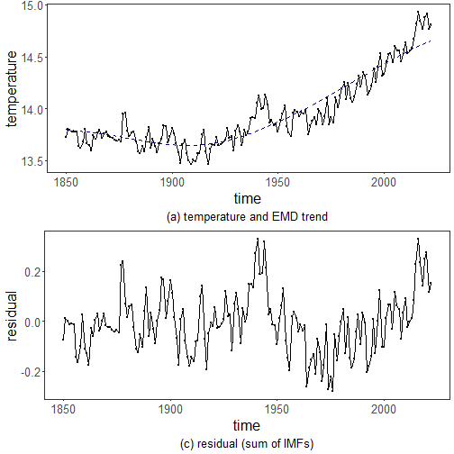

``` r
library(ggplot2)
library(RColorBrewer)
library(harbinger)
library(hht)
source("https://raw.githubusercontent.com/eogasawara/TSED/refs/heads/main/code/header.R")
```
## Theoretical Overview
This example focuses on Empirical Mode Decomposition (EMD). EMD decomposes signals into intrinsic mode functions, separating oscillatory modes for analysis and detection.
## Example Overview and Goals
We demonstrate a complete, reproducible workflow: setting up libraries, loading data, configuring a detector, fitting it, running detection, optionally evaluating, and visualizing the results.
### Other Steps
Additional supporting steps that glue the workflow.

``` r
# Chapter 2: Emd
# Overview:
# - Loads example dataset (if applicable)
# - Fits a detector and runs event detection
# - Plots results with events overlaid
#
```
### Setup and Libraries
Short rationale for the libraries and any project-specific sources.

### Other Steps
Additional supporting steps that glue the workflow.

``` r
options(scipen = 999)
```
### Setup and Libraries
Short rationale for the libraries and any project-specific sources.

### Other Steps
Additional supporting steps that glue the workflow.

``` r
set.seed(1)
```
### Data Loading and Prep
Read the dataset and perform any minimal preparation required for modeling.

``` r
data(examples_harbinger)
```
### Other Steps
Additional supporting steps that glue the workflow.

``` r
data <- examples_harbinger$global_temperature_yearly
data$event <- FALSE
y <- data$serie
yts <- ts(y, start = c(1850, 1))
xts <- time(yts)
id <- 1:length(yts)
model <- hht::CEEMD(yts, id, verbose = FALSE, 0.1, 1)
```

```
## Warning in hht::CEEMD(yts, id, verbose = FALSE, 0.1, 1): Attempted to extract more IMFs from the signal than are present in the noise series
## for trial 1.
```

``` r
residual <- apply(model[["imf"]], 1, sum)
yhat <- model$residue
```
### Visualization and Output
Plot the series with detected events and optionally save figures. Combine ggplot layers in one chunk for clarity.

``` r
grf <- autoplot(yts)
```
### Other Steps
Additional supporting steps that glue the workflow.

``` r
grf <- grf + theme_bw(base_size = 10)
grf <- grf + theme(plot.title = element_blank())
grf <- grf + theme(panel.grid.major = element_blank()) + theme(panel.grid.minor = element_blank())
grf <- grf + ylab("temperature")
grf <- grf + xlab("time")
grf <- grf + geom_point(aes(y=yts),size = 0.5, col="black") 
grf <- grf + geom_line(aes(y=ts(yhat, start = c(1850, 1))), linetype = "dashed", col="darkblue") 
grf <- grf + labs(caption = "(a) temperature and EMD trend") 
grf <- grf + theme(plot.caption = element_text(hjust = 0.5))
grf <- grf  + font
grfb <- grf
```
### Visualization and Output
Plot the series with detected events and optionally save figures. Combine ggplot layers in one chunk for clarity.

``` r
grf <- autoplot(ts(residual, start = c(1850, 1)))
```
### Other Steps
Additional supporting steps that glue the workflow.

``` r
grf <- grf + theme_bw(base_size = 10)
grf <- grf + theme(plot.title = element_blank())
grf <- grf + theme(panel.grid.major = element_blank()) + theme(panel.grid.minor = element_blank())
grf <- grf + ylab("residual")
grf <- grf + xlab("time")
grf <- grf + labs(caption = "(c) residual (sum of IMFs)") 
grf <- grf + geom_point(size = 0.5, col="black") 
grf <- grf + theme(plot.caption = element_text(hjust = 0.5))
grf <- grf  + font
grfc <- grf
```
### Visualization and Output
Plot the series with detected events and optionally save figures. Combine ggplot layers in one chunk for clarity.

``` r
#mypng(file="figures/chap2_emd.png", width = 1280, height = 1080) 
gridExtra::grid.arrange(grfb, grfc, 
                        layout_matrix = matrix(c(1,2), byrow = TRUE, ncol = 1))
```



``` r
#dev.off() 
```
## References
* Huang, N. E., et al. (1998). The empirical mode decomposition and the Hilbert spectrum for nonlinear and non-stationary time series analysis.
* Ogasawara, E., Salles, R., Porto, F., Pacitti, E. Event Detection in Time Series. Springer, 2025. doi:10.1007/978-3-031-75941-3.
