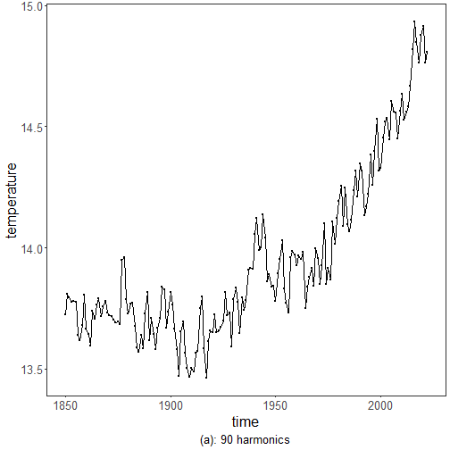
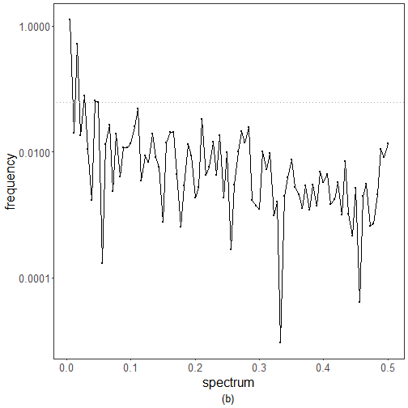
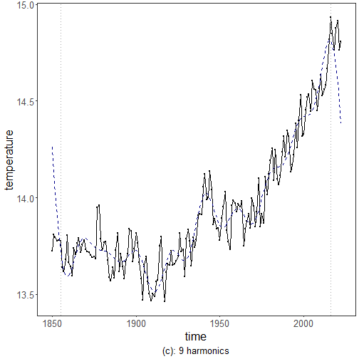
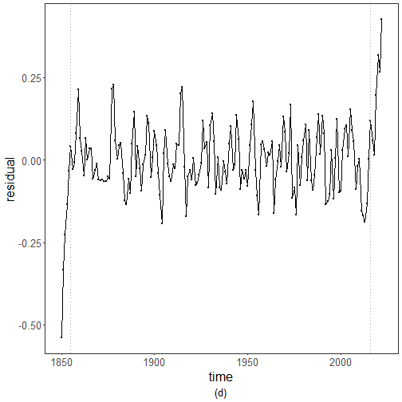
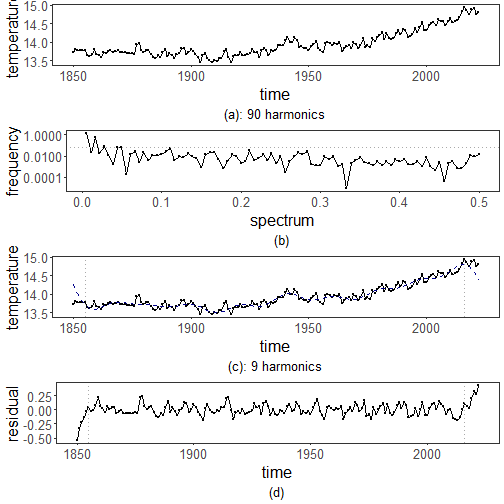

``` r
library(ggplot2)
library(RColorBrewer)
source("https://raw.githubusercontent.com/eogasawara/TSED/refs/heads/main/code/header.R")
```
## Theoretical Overview
This example focuses on spectral methods (FFT). Frequency-domain analysis reveals periodicities and transients indicative of events.
## Example Overview and Goals
We will: set up libraries, load data, build a simple FFT-based smoother from dominant harmonics, inspect the periodogram to choose a cutoff, and visualize reconstruction and residuals.
### What You Will Do
You will: prepare the environment, compute a truncated harmonic reconstruction using FFT, analyze the periodogram for significant frequencies, and plot original, reconstruction, and residuals.
### Setup and Libraries
Short rationale for the libraries and any project-specific sources.

``` r
options(scipen = 999)
```
### Other Steps
Additional supporting steps that glue the workflow.

``` r
options(scipen=999)
# Load example dataset
```
### Data Loading and Prep
Read the dataset and perform any minimal preparation required for modeling.

``` r
data(examples_harbinger)
```
### Other Steps
Additional supporting steps that glue the workflow.

``` r
data <- examples_harbinger$global_temperature_yearly
data$event <- FALSE
y <- data$serie
yts <- ts(y, start = c(1850, 1))
xts <- time(yts)
fft_harmonics <- function(x, n = NULL) {
  minx <- min(x)
  x <- x - minx
  dff = fft(x)
  if (is.null(n)) {
    n <- length(dff)/2 - 1    
  }
  t = seq(from = 1, to = length(x))
  ndff = array(data = 0, dim = c(length(t), 1L))
  ndff[1] = dff[1] #Always, it's the DC component
  if(n != 0){
    ndff[2:(n+1)] = dff[2:(n+1)] #The positive frequencies always come first
    #The negative ones are trickier
    ndff[length(ndff):(length(ndff) - n + 1)] = dff[length(x):(length(x) - n + 1)]
  }
  indff = fft(ndff/length(x), inverse = TRUE)
  return(Mod(indff) + minx)
}
# Determine the number of harmonics to include based on the significant frequency components
periodogram <- spec.pgram(y, plot=FALSE)
harmonics <- length(periodogram$freq)
yhat <- fft_harmonics(y, harmonics)
print(sum(abs(y-yhat)))
```

```
## [1] 0.00000000000009947598
```
### Visualization and Output
Plot the series with detected events and optionally save figures. Combine ggplot layers in one chunk for clarity.

``` r
grf <- autoplot(ts(yhat, start = c(1850, 1)))
```
### Other Steps
Additional supporting steps that glue the workflow.

``` r
grf <- grf + theme_bw(base_size = 10)
grf <- grf + theme(plot.title = element_blank())
grf <- grf + theme(panel.grid.major = element_blank()) + theme(panel.grid.minor = element_blank())
grf <- grf + ylab("temperature")
grf <- grf + xlab("time")
grf <- grf + geom_point(aes(y=yts),size = 0.5, col="black") 
grf <- grf + labs(caption = sprintf("(a): %d harmonics", harmonics)) 
grf <- grf + theme(plot.caption = element_text(hjust = 0.5))
grf <- grf  + font
grfa <- grf
```
### Visualization and Output
Plot the series with detected events and optionally save figures. Combine ggplot layers in one chunk for clarity.

``` r
plot(grfa)
```


### Other Steps
Additional supporting steps that glue the workflow.

``` r
df <- data.frame(x = periodogram$freq, y = periodogram$spec)
harmonics <- as.integer(sqrt(length(periodogram$freq)))
spec <- df$y[harmonics]
for (i in harmonics:nrow(df)) {
  spec <- df$y[i]
  significant_freq <- which(df$y > spec)
  if(i >= max(significant_freq)) {
    harmonics <- i
    break
  }
}
# periodogram 
```
### Visualization and Output
Plot the series with detected events and optionally save figures. Combine ggplot layers in one chunk for clarity.

``` r
grf <- ggplot(df, aes(x = x, y = y)) + geom_line() + geom_point(size=0.5) + scale_y_log10()
```
### Other Steps
Additional supporting steps that glue the workflow.

``` r
grf <- grf + theme_bw(base_size = 10)
grf <- grf + theme(plot.title = element_blank())
grf <- grf + theme(panel.grid.major = element_blank()) + theme(panel.grid.minor = element_blank())
grf <- grf + ylab("frequency")
grf <- grf + xlab("spectrum")  
grf <- grf + geom_hline(yintercept = spec, col="darkgrey", size = 0.5, linetype="dotted")
grf <- grf + labs(caption = "(b)") 
grf <- grf + theme(plot.caption = element_text(hjust = 0.5))
grf <- grf  + font
grfb <- grf
```
### Visualization and Output
Plot the series with detected events and optionally save figures. Combine ggplot layers in one chunk for clarity.

``` r
plot(grfb)
```


### Other Steps
Additional supporting steps that glue the workflow.

``` r
yhat <- fft_harmonics(y, harmonics)
print(c(harmonics, sum(abs(y-yhat))))
```

```
## [1]  9.00000 14.28878
```

``` r
tolerance <- ceiling(0.03*length(yts))
```
### Visualization and Output
Plot the series with detected events and optionally save figures. Combine ggplot layers in one chunk for clarity.

``` r
grf <- autoplot(ts(yts, start = c(1850, 1)))
```
### Other Steps
Additional supporting steps that glue the workflow.

``` r
grf <- grf + theme_bw(base_size = 10)
grf <- grf + theme(plot.title = element_blank())
grf <- grf + theme(panel.grid.major = element_blank()) + theme(panel.grid.minor = element_blank())
grf <- grf + ylab("temperature")
grf <- grf + xlab("time")
grf <- grf + geom_point(aes(y=yts),size = 0.5, col="black") 
grf <- grf + geom_line(aes(y=yhat), linetype = "dashed", col="darkblue") 
grf <- grf + geom_vline(xintercept = xts[tolerance], col="darkgrey", size = 0.5, linetype="dotted")
grf <- grf + geom_vline(xintercept = xts[length(xts)-tolerance], col="darkgrey", size = 0.5, linetype="dotted")
grf <- grf + labs(caption = sprintf("(c): %d harmonics", harmonics)) 
grf <- grf + theme(plot.caption = element_text(hjust = 0.5))
grf <- grf  + font
grfc <- grf
```
### Visualization and Output
Plot the series with detected events and optionally save figures. Combine ggplot layers in one chunk for clarity.

``` r
plot(grf)
```


### Other Steps
Additional supporting steps that glue the workflow.
### Visualization and Output
Plot the series with detected events and optionally save figures. Combine ggplot layers in one chunk for clarity.

``` r
grf <- autoplot(ts(y - yhat, start = c(1850, 1)))
```
### Other Steps
Additional supporting steps that glue the workflow.

``` r
grf <- grf + theme_bw(base_size = 10)
grf <- grf + theme(plot.title = element_blank())
grf <- grf + theme(panel.grid.major = element_blank()) + theme(panel.grid.minor = element_blank())
grf <- grf + ylab("residual")
grf <- grf + xlab("time")
grf <- grf + geom_point(size = 0.5, col="black") 
grf <- grf + geom_vline(xintercept = xts[tolerance], col="darkgrey", size = 0.5, linetype="dotted")
grf <- grf + geom_vline(xintercept = xts[length(xts)-tolerance], col="darkgrey", size = 0.5, linetype="dotted")
grf <- grf + labs(caption = sprintf("(d)")) 
grf <- grf + theme(plot.caption = element_text(hjust = 0.5))
grf <- grf  + font
grfd <- grf
```
### Visualization and Output
Plot the series with detected events and optionally save figures. Combine ggplot layers in one chunk for clarity.

``` r
plot(grfd)
```


### Visualization and Output
Plot the series with detected events and optionally save figures. Combine ggplot layers in one chunk for clarity.

``` r
#mypng(file = "figures/chap2_fft.png", width = 1280, height = 1440)
gridExtra::grid.arrange(grfa, grfb, grfc, grfd, 
                        layout_matrix = matrix(c(1,2,3,4), byrow = TRUE, ncol = 1))
```



``` r
#dev.off() 
```
## References
* Cooley, J. W., & Tukey, J. W. (1965). An algorithm for the machine calculation of complex Fourier series.
* Ogasawara, E., Salles, R., Porto, F., Pacitti, E. Event Detection in Time Series. Springer, 2025. doi:10.1007/978-3-031-75941-3.
