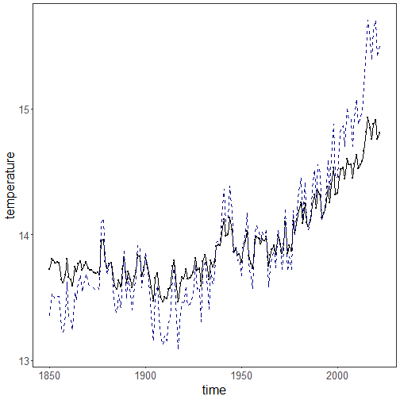
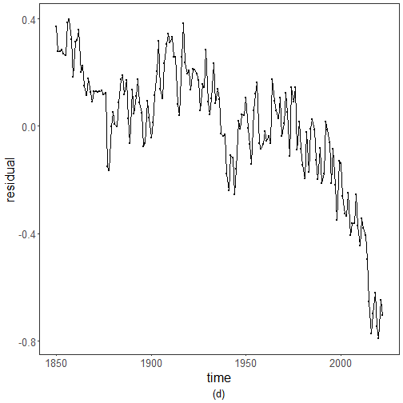
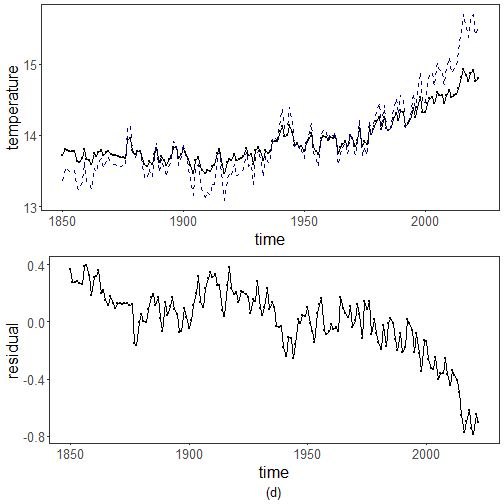

``` r
library(ggplot2)
library(RColorBrewer)
library(harbinger)
source("https://raw.githubusercontent.com/eogasawara/TSED/refs/heads/main/code/header.R")
```
## Theoretical Overview
This example focuses on spectral methods (FFT). Frequency-domain analysis reveals periodicities and transients indicative of events.
## Example Overview and Goals
We demonstrate a complete, reproducible workflow: setting up libraries, loading data, configuring a detector, fitting it, running detection, optionally evaluating, and visualizing the results.
### What You Will Do
You will: prepare the environment, compute an FFT-based residual by zeroing low frequencies, and visualize the separation.
### Setup and Libraries
Short rationale for the libraries and any project-specific sources.

``` r
options(scipen = 999)
```
### Other Steps
Additional supporting steps that glue the workflow.
### Data Loading and Prep
Read the dataset and perform any minimal preparation required for modeling.

``` r
data(examples_harbinger)
```
### Other Steps
Additional supporting steps that glue the workflow.

``` r
data <- examples_harbinger$global_temperature_yearly
data$event <- FALSE
y <- data$serie
yts <- ts(y, start = c(1850, 1))
xts <- time(yts)
compute_cut_index <- function(freqs) {
  cutindex <- which.max(freqs)
  if (min(freqs) != max(freqs)) {
    threshold <- mean(freqs) + 2.698 * sd(freqs)
    freqs[freqs < threshold] <- min(freqs) + max(freqs)
    cutindex <- which.min(freqs)
  }
  return(cutindex)
}
fft_signal <- stats::fft(yts)
spectrum <- base::Mod(fft_signal) ^ 2
half_spectrum <- spectrum[1:(length(yts) / 2 + 1)]
cutindex <- compute_cut_index(half_spectrum)
print(cutindex)
```

```
## [1] 1
```

``` r
n <- length(fft_signal)
fft_signal[1:cutindex] <- 0
fft_signal[(n - cutindex):n] <- 0
residual <- - base::Re(stats::fft(fft_signal, inverse = TRUE) / n)
yhat <- yts - residual
```
### Visualization and Output
Plot the series with detected events and optionally save figures. Combine ggplot layers in one chunk for clarity.

``` r
grf <- autoplot(ts(yts, start = c(1850, 1)))
```
### Other Steps
Additional supporting steps that glue the workflow.

``` r
grf <- grf + theme_bw(base_size = 10)
grf <- grf + theme(plot.title = element_blank())
grf <- grf + theme(panel.grid.major = element_blank()) + theme(panel.grid.minor = element_blank())
grf <- grf + ylab("temperature")
grf <- grf + xlab("time")
grf <- grf + geom_point(aes(y=yts),size = 0.5, col="black") 
grf <- grf + geom_line(aes(y=yhat), linetype = "dashed", col="darkblue") 
grf <- grf + theme(plot.caption = element_text(hjust = 0.5))
grf <- grf  + font
grfc <- grf
```
### Visualization and Output
Plot the series with detected events and optionally save figures. Combine ggplot layers in one chunk for clarity.

``` r
plot(grf)
```


### Other Steps
Additional supporting steps that glue the workflow.
### Visualization and Output
Plot the series with detected events and optionally save figures. Combine ggplot layers in one chunk for clarity.

``` r
grf <- autoplot(ts(residual, start = c(1850, 1)))
```
### Other Steps
Additional supporting steps that glue the workflow.

``` r
grf <- grf + theme_bw(base_size = 10)
grf <- grf + theme(plot.title = element_blank())
grf <- grf + theme(panel.grid.major = element_blank()) + theme(panel.grid.minor = element_blank())
grf <- grf + ylab("residual")
grf <- grf + xlab("time")
grf <- grf + geom_point(size = 0.5, col="black") 
grf <- grf + labs(caption = sprintf("(d)")) 
grf <- grf + theme(plot.caption = element_text(hjust = 0.5))
grf <- grf  + font
grfd <- grf
```
### Visualization and Output
Plot the series with detected events and optionally save figures. Combine ggplot layers in one chunk for clarity.

``` r
plot(grfd)
```


### Visualization and Output
Plot the series with detected events and optionally save figures. Combine ggplot layers in one chunk for clarity.

``` r
#mypng(file = "figures/chap2_fft_harbinger.png", width = 1280, height = 1080)
gridExtra::grid.arrange(grfc, grfd, 
                        layout_matrix = matrix(c(1,2), byrow = TRUE, ncol = 1))
```



``` r
#dev.off() 
```
## References
* Cooley, J. W., & Tukey, J. W. (1965). An algorithm for the machine calculation of complex Fourier series.
* Ogasawara, E., Salles, R., Porto, F., Pacitti, E. Event Detection in Time Series. Springer, 2025. doi:10.1007/978-3-031-75941-3.
