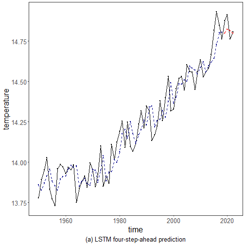

``` r
library(ggplot2)
library(RColorBrewer)
library(ggpmisc)
library(daltoolbox)
source("https://raw.githubusercontent.com/eogasawara/TSED/refs/heads/main/code/header.R")
```
## Theoretical Overview
This example focuses on LSTM neural networks for sequence modeling. Long Short-Term Memory (LSTM) networks model complex temporal dependencies; deviations in prediction errors may indicate events.
## Example Overview and Goals
We will: set up libraries, load data, create sliding-window sequences, configure and train an LSTM, evaluate on train/test splits, and visualize predictions.
### What You Will Do
You will: prepare the environment, build sliding windows, train an LSTM with a normalization preprocessor, evaluate, and visualize fitted vs. forecasted segments.
### Setup and Libraries
Load shared helpers and packages.

``` r
options(scipen = 999)
```
### Data Loading and Prep
Read the dataset and perform minimal preparation.

``` r
data(examples_harbinger)
```
### Other Steps
Additional supporting steps that glue the workflow.

``` r
data <- examples_harbinger$global_temperature_yearly
data$event <- FALSE
x <- data$serie
sw_size <- 10
ts <- ts_data(x, sw_size)         # build sliding windows
ts_head(ts, 3)
```

```
##            t9       t8       t7       t6       t5       t4       t3       t2       t1       t0
## [1,] 13.72417 13.80667 13.79417 13.77667 13.78000 13.77417 13.64000 13.61750 13.67917 13.80583
## [2,] 13.80667 13.79417 13.77667 13.78000 13.77417 13.64000 13.61750 13.67917 13.80583 13.66333
## [3,] 13.79417 13.77667 13.78000 13.77417 13.64000 13.61750 13.67917 13.80583 13.66333 13.64333
```

``` r
test_size <- 4                     # holdout size
samp <- ts_sample(ts, test_size)
ts_head(samp$train, 3)
```

```
##            t9       t8       t7       t6       t5       t4       t3       t2       t1       t0
## [1,] 13.72417 13.80667 13.79417 13.77667 13.78000 13.77417 13.64000 13.61750 13.67917 13.80583
## [2,] 13.80667 13.79417 13.77667 13.78000 13.77417 13.64000 13.61750 13.67917 13.80583 13.66333
## [3,] 13.79417 13.77667 13.78000 13.77417 13.64000 13.61750 13.67917 13.80583 13.66333 13.64333
```

``` r
ts_head(samp$test)
```

```
##            t9       t8       t7       t6       t5       t4       t3       t2       t1       t0
## [1,] 14.63250 14.52750 14.55917 14.58250 14.66667 14.81833 14.93083 14.84750 14.76167 14.87750
## [2,] 14.52750 14.55917 14.58250 14.66667 14.81833 14.93083 14.84750 14.76167 14.87750 14.91333
## [3,] 14.55917 14.58250 14.66667 14.81833 14.93083 14.84750 14.76167 14.87750 14.91333 14.76167
## [4,] 14.58250 14.66667 14.81833 14.93083 14.84750 14.76167 14.87750 14.91333 14.76167 14.80833
```

``` r
preproc <- ts_norm_gminmax()       # normalization
```
### Other Steps
Additional supporting steps that glue the workflow.

``` r
x <- data$serie
sw_size <- 10
ts <- ts_data(x, sw_size)
ts_head(ts, 3)
```

```
##            t9       t8       t7       t6       t5       t4       t3       t2       t1       t0
## [1,] 13.72417 13.80667 13.79417 13.77667 13.78000 13.77417 13.64000 13.61750 13.67917 13.80583
## [2,] 13.80667 13.79417 13.77667 13.78000 13.77417 13.64000 13.61750 13.67917 13.80583 13.66333
## [3,] 13.79417 13.77667 13.78000 13.77417 13.64000 13.61750 13.67917 13.80583 13.66333 13.64333
```

``` r
test_size <- 4
samp <- ts_sample(ts, test_size)
ts_head(samp$train, 3)
```

```
##            t9       t8       t7       t6       t5       t4       t3       t2       t1       t0
## [1,] 13.72417 13.80667 13.79417 13.77667 13.78000 13.77417 13.64000 13.61750 13.67917 13.80583
## [2,] 13.80667 13.79417 13.77667 13.78000 13.77417 13.64000 13.61750 13.67917 13.80583 13.66333
## [3,] 13.79417 13.77667 13.78000 13.77417 13.64000 13.61750 13.67917 13.80583 13.66333 13.64333
```

``` r
ts_head(samp$test)
```

```
##            t9       t8       t7       t6       t5       t4       t3       t2       t1       t0
## [1,] 14.63250 14.52750 14.55917 14.58250 14.66667 14.81833 14.93083 14.84750 14.76167 14.87750
## [2,] 14.52750 14.55917 14.58250 14.66667 14.81833 14.93083 14.84750 14.76167 14.87750 14.91333
## [3,] 14.55917 14.58250 14.66667 14.81833 14.93083 14.84750 14.76167 14.87750 14.91333 14.76167
## [4,] 14.58250 14.66667 14.81833 14.93083 14.84750 14.76167 14.87750 14.91333 14.76167 14.80833
```

``` r
preproc <- ts_norm_gminmax()
```
### Model Configuration
Define the detector/model and its key hyperparameters.

``` r
model <- ts_lstm(preproc, input_size = 4, epochs = 10000)
```
### Other Steps
Additional supporting steps that glue the workflow.

``` r
io_train <- ts_projection(samp$train)
model <- fit(model, x = io_train$input, y = io_train$output)
adjust <- predict(model, io_train$input)
adjust <- as.vector(adjust)
output <- as.vector(io_train$output)
```
### Evaluation
Compute evaluation metrics or diagnostics if ground truth is available.

``` r
ev_adjust <- daltoolbox::evaluate(model, output, adjust)
```
### Other Steps
Additional supporting steps that glue the workflow.

``` r
print(head(ev_adjust$metrics))
```

```
##           mse       smape        R2
## 1 0.008971446 0.005547336 0.9146668
```

``` r
steps_ahead <- 4
io_test <- ts_projection(samp$test)
prediction <- predict(model, x = io_test$input[1, ], steps_ahead = steps_ahead)
prediction <- as.vector(prediction)
output <- as.vector(io_test$output)
if (steps_ahead > 1)
  output <- output[1:steps_ahead]
print(sprintf("%.2f, %.2f", output, prediction))
```

```
## [1] "14.88, 14.80" "14.91, 14.82" "14.76, 14.82" "14.81, 14.80"
```
### Evaluation
Compute evaluation metrics or diagnostics if ground truth is available.

``` r
ev_test <- daltoolbox::evaluate(model, output, prediction)
```
### Other Steps
Additional supporting steps that glue the workflow.

``` r
print(head(ev_test$metrics))  
```

```
##           mse       smape        R2
## 1 0.004282246 0.003866649 -0.230288
```

``` r
yvalues <- c(io_train$output, io_test$output)
yts <- c(rep(NA, 9), yvalues)
yts <- yts[-c(1:100)]
yhat <- c(rep(NA, 9), adjust, prediction)
yhat <- yhat[-c(1:100)]
yts <- ts(yts, frequency = 1, start = c(1950, 1))
yhat <- ts(yhat, frequency = 1, start = c(1950, 1))
yhatadj <- yhat
yhatadj[(length(yhat) - length(prediction) + 1):(length(yhat))] <- NA
yhatpred <- yhat
yhatpred[1:(length(yhat) - length(prediction))] <- NA
```
### Visualization and Output
Plot the series with detected events and optionally save figures. Combine ggplot layers in one chunk for clarity.

``` r
grf <- autoplot(yts, col = "black")
```
### Other Steps
Additional supporting steps that glue the workflow.

``` r
grf <- grf + theme_bw(base_size = 10)
grf <- grf + theme(plot.title = element_blank())
grf <- grf + theme(panel.grid.major = element_blank()) + theme(panel.grid.minor = element_blank())
grf <- grf + ylab("temperature") + xlab("time")
grf <- grf + geom_point(aes(y = yts), size = 0.5, col = "black") 
grf <- grf + geom_line(aes(y = yhatadj), col = "darkblue", linetype = "dashed") 
grf <- grf + geom_point(aes(y = yhatadj), size = 0.5, col = "darkblue") 
grf <- grf + geom_line(aes(y = yhatpred), col = "red", linetype = "dashed") 
grf <- grf + geom_point(aes(y = yhatpred), size = 0.5, col = "red") 
grf <- grf + labs(caption = sprintf("(a) LSTM four-step-ahead prediction")) 
grf <- grf + theme(plot.caption = element_text(hjust = 0.5)) + font
grfA <- grf
```
### Visualization and Output
Plot the series with detected events and optionally save figures. Combine ggplot layers in one chunk for clarity.

``` r
#save_png(grfA, "figures/chap2_lstm.png", 1280, 720)
grfA
```

```
## Warning: Removed 4 rows containing missing values or values outside the scale range (`geom_line()`).
```

```
## Warning: Removed 4 rows containing missing values or values outside the scale range (`geom_point()`).
```

```
## Warning: Removed 69 rows containing missing values or values outside the scale range (`geom_line()`).
```

```
## Warning: Removed 69 rows containing missing values or values outside the scale range (`geom_point()`).
```


## References
* Hochreiter, S., & Schmidhuber, J. (1997). Long short-term memory.
* Ogasawara, E., Salles, R., Porto, F., Pacitti, E. Event Detection in Time Series. Springer, 2025. doi:10.1007/978-3-031-75941-3.
