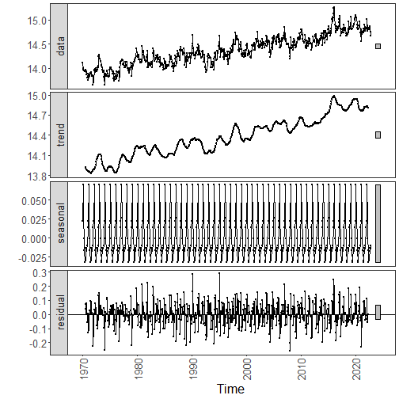

``` r
library(ggplot2)
library(RColorBrewer)
library(dplyr)
library(forecast)
source("https://raw.githubusercontent.com/eogasawara/TSED/refs/heads/main/code/header.R")
```
## Theoretical Overview
This example focuses on Motif discovery and discords (SAX/Matrix Profile). Motifs are recurring patterns; discords are anomalous subsequences. Symbolic or matrix-profile methods efficiently discover them.
## Example Overview and Goals
We demonstrate a complete, reproducible workflow: setting up libraries, loading data, configuring a detector, fitting it, running detection, optionally evaluating, and visualizing the results.
### Other Steps
Additional supporting steps that glue the workflow.

``` r
# Chapter 2: Mgt Decomposition
# Overview:
# - Loads example dataset (if applicable)
# - Fits a detector and runs event detection
# - Plots results with events overlaid
#
```
### Setup and Libraries
Short rationale for the libraries and any project-specific sources.

### Other Steps
Additional supporting steps that glue the workflow.

``` r
# Load example dataset
```
### Data Loading and Prep
Read the dataset and perform any minimal preparation required for modeling.

``` r
data(examples_harbinger)
```
### Other Steps
Additional supporting steps that glue the workflow.

``` r
data <- examples_harbinger$global_temperature_monthly
data$event <- FALSE
```
### Setup and Libraries
Short rationale for the libraries and any project-specific sources.

### Other Steps
Additional supporting steps that glue the workflow.

``` r
data <- data |> dplyr::filter(i > as.Date("1970-01-01"))
ts_data <- ts(data$serie, frequency = 12, start = c(1970, 1))
# Seasonal-trend decomposition (additive)
decomp <- decompose(ts_data)
# Alternative: multiplicative decomposition
# decomp <- decompose(ts_data, type = "multiplicative")
```
### Visualization and Output
Plot the series with detected events and optionally save figures. Combine ggplot layers in one chunk for clarity.

``` r
grf <- autoplot(decomp, labels = c("trend", "seasonal", "residual"))
```
### Other Steps
Additional supporting steps that glue the workflow.

``` r
grf <- grf + theme_bw(base_size = 10) + geom_point(size = 0.25)
grf <- grf + theme(plot.title = element_blank())
grf <- grf + theme(panel.grid.major = element_blank()) + theme(panel.grid.minor = element_blank())
grf <- grf + theme(axis.text.x = element_text(angle = 90, vjust = 0.5, hjust=1)) 
grf <- grf  + font
```
### Visualization and Output
Plot the series with detected events and optionally save figures. Combine ggplot layers in one chunk for clarity.

``` r
#save_png(grf, "figures/chap2_mgt_decomposition.png", 1280, 1080) # 720*2
grf
```

```
## Warning: Removed 24 rows containing missing values or values outside the scale range (`geom_point()`).
```


### Other Steps
Additional supporting steps that glue the workflow.
## References
* Hyndman, R. J., Athanasopoulos, G. Forecasting: Principles and Practice. OTexts, 2018.
* Ogasawara, E., Salles, R., Porto, F., Pacitti, E. Event Detection in Time Series. Springer, 2025. doi:10.1007/978-3-031-75941-3.

