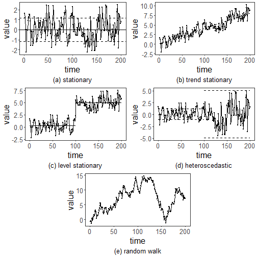

``` r
library(ggplot2)
library(RColorBrewer)
library(harbinger)
library(tseries)
library(lmtest)
source("https://raw.githubusercontent.com/eogasawara/TSED/refs/heads/main/code/header.R")
```
## Theoretical Overview
This example focuses on stationarity regimes: stationary, trend-stationary, level-stationary, heteroscedastic, and random walk.
## Example Overview and Goals
We will: set up libraries, load synthetic/nonstationary segments, visualize their characteristics, and summarize basic test statistics.
### What You Will Do
You will: inspect regimes via plots and simple tests (ADF/PP/BP) and save a multi-panel figure.
### Setup and Libraries
Short rationale for the libraries and any project-specific sources.

### Other Steps
Additional supporting steps that glue the workflow.

``` r
# Load example dataset
```
### Data Loading and Prep
Read the dataset and perform any minimal preparation required for modeling.

``` r
data("examples_anomalies")
```
### Other Steps
Additional supporting steps that glue the workflow.

``` r
bp.test <- function(serie) {
  data <- data.frame(x = 1:length(serie), y = serie)
  fit <- lm(y ~ x, data = data)
  return(bptest(fit))
}
```
### Data Loading and Prep
Read the dataset and perform any minimal preparation required for modeling.

``` r
data(examples_harbinger)
```
### Other Steps
Additional supporting steps that glue the workflow.

``` r
serie_a <- examples_harbinger$nonstationarity$serie[1:200]
serie_b <- examples_harbinger$nonstationarity$serie[201:400]
serie_c <- examples_harbinger$nonstationarity$serie[401:600]
serie_d <- examples_harbinger$nonstationarity$serie[601:800]
serie_e <- examples_harbinger$nonstationarity$serie[801:1000]
x <- 1:200
ts_data <- ts(serie_a)
```
### Visualization and Output
Plot the series with detected events and optionally save figures. Combine ggplot layers in one chunk for clarity.

``` r
grf <- autoplot(ts_data)
```
### Other Steps
Additional supporting steps that glue the workflow.

``` r
grf <- grf + theme_bw(base_size = 10) + geom_point(size = 0.25)
grf <- grf + theme(plot.title = element_blank())
grf <- grf + theme(panel.grid.major = element_blank()) + theme(panel.grid.minor = element_blank())
grf <- grf + ylab("value")
grf <- grf + xlab("time")
grf <- grf + geom_hline(yintercept = 0, col="black", size = 0.5)
grf <- grf + geom_hline(yintercept = +var(ts_data), col="black", linetype = 'dashed', size = 0.5)
grf <- grf + geom_hline(yintercept = -var(ts_data), col="black", linetype = 'dashed', size = 0.5)
grf <- grf + labs(caption = "(a) stationary") 
grf <- grf + theme(plot.caption = element_text(hjust = 0.5))
grf <- grf  + font
grfsa <- grf
ts_data <- ts(serie_b)
model <- lm(ts_data ~ x)
```
### Visualization and Output
Plot the series with detected events and optionally save figures. Combine ggplot layers in one chunk for clarity.

``` r
grf <- autoplot(ts_data)
```
### Other Steps
Additional supporting steps that glue the workflow.

``` r
grf <- grf + theme_bw(base_size = 10) + geom_point(size = 0.25)
grf <- grf + theme(plot.title = element_blank())
grf <- grf + theme(panel.grid.major = element_blank()) + theme(panel.grid.minor = element_blank())
grf <- grf + ylab("value")
grf <- grf + xlab("time")
grf <- grf + geom_line(aes(y=model$fitted.values),linetype="dashed") 
grf <- grf + labs(caption = "(b) trend stationary") 
grf <- grf + theme(plot.caption = element_text(hjust = 0.5))
grf <- grf  + font
grfsb <- grf
ts_data <- ts(serie_c)
```
### Visualization and Output
Plot the series with detected events and optionally save figures. Combine ggplot layers in one chunk for clarity.

``` r
grf <- autoplot(ts_data)
```
### Other Steps
Additional supporting steps that glue the workflow.

``` r
grf <- grf + theme_bw(base_size = 10) + geom_point(size = 0.25)
grf <- grf + theme(plot.title = element_blank())
grf <- grf + theme(panel.grid.major = element_blank()) + theme(panel.grid.minor = element_blank())
grf <- grf + ylab("value")
grf <- grf + xlab("time")
grf <- grf + geom_segment(aes(x=1,xend=100,y=mean(serie_c[1:100]),yend=mean(serie_c[1:100])))
grf <- grf + geom_segment(aes(x=101,xend=200,y=mean(serie_c[101:200]),yend=mean(serie_c[101:200])))
grf <- grf + labs(caption = "(c) level stationary") 
grf <- grf + theme(plot.caption = element_text(hjust = 0.5))
grf <- grf  + font
grfsc <- grf
y <- ts_data <- ts(serie_d)
```
### Visualization and Output
Plot the series with detected events and optionally save figures. Combine ggplot layers in one chunk for clarity.

``` r
grf <- autoplot(ts_data)
```
### Other Steps
Additional supporting steps that glue the workflow.

``` r
grf <- grf + theme_bw(base_size = 10) + geom_point(size = 0.25)
grf <- grf + theme(plot.title = element_blank())
grf <- grf + theme(panel.grid.major = element_blank()) + theme(panel.grid.minor = element_blank())
grf <- grf + ylab("value")
grf <- grf + xlab("time")
grf <- grf + geom_segment(aes(x=1,xend=100,y=mean(y)+var(y[1:100]),yend=mean(y)+var(y[1:100])), linetype="dashed")
grf <- grf + geom_segment(aes(x=1,xend=100,y=mean(y)-var(y[1:100]),yend=mean(y)-var(y[1:100])), linetype="dashed")
grf <- grf + geom_segment(aes(x=101,xend=200,y=mean(y)+var(y[101:200]),yend=mean(y)+var(y[101:200])), linetype="dashed")
grf <- grf + geom_segment(aes(x=101,xend=200,y=mean(y)-var(y[101:200]),yend=mean(y)-var(y[101:200])), linetype="dashed")
grf <- grf + labs(caption = "(d) heteroscedastic") 
grf <- grf + theme(plot.caption = element_text(hjust = 0.5))
grf <- grf  + font
grfsd <- grf
ts_data <- ts(serie_e)
```
### Visualization and Output
Plot the series with detected events and optionally save figures. Combine ggplot layers in one chunk for clarity.

``` r
grf <- autoplot(ts_data)
```
### Other Steps
Additional supporting steps that glue the workflow.

``` r
grf <- grf + theme_bw(base_size = 10) + geom_point(size = 0.25)
grf <- grf + theme(plot.title = element_blank())
grf <- grf + theme(panel.grid.major = element_blank()) + theme(panel.grid.minor = element_blank())
grf <- grf + ylab("value")
grf <- grf + xlab("time")
grf <- grf + labs(caption = "(e) random walk") 
grf <- grf + theme(plot.caption = element_text(hjust = 0.5))
grf <- grf  + font
grfse <- grf
test <- data.frame(
           serie = c("(a)", "(b)", "(c)", "(d)", "(e)", "gt"), 
           adf = c(adf.test(serie_a)$p.value, 
                   adf.test(serie_b)$p.value, 
                   adf.test(serie_c)$p.value,
                   adf.test(serie_d)$p.value,
                   adf.test(serie_e)$p.value,
                   adf.test(examples_harbinger$global_temperature_monthly$serie)$p.value),
           pp = c(PP.test(serie_a)$p.value, 
                  PP.test(serie_b)$p.value, 
                  PP.test(serie_c)$p.value,
                  PP.test(serie_d)$p.value,
                  PP.test(serie_e)$p.value,
                  PP.test(examples_harbinger$global_temperature_monthly$serie)$p.value),
           bp = c(bp.test(serie_a)$p.value, 
                  bp.test(serie_b)$p.value, 
                  bp.test(serie_c)$p.value,
                  bp.test(serie_d)$p.value,
                  bp.test(serie_e)$p.value,
                  bp.test(examples_harbinger$global_temperature_monthly$serie)$p.value)
)
```

```
## Warning in adf.test(serie_a): p-value smaller than printed p-value
```

```
## Warning in adf.test(serie_b): p-value smaller than printed p-value
```

``` r
test$adf <- round(test$adf, 2)
test$pp <- round(test$adf, 2)
test$bp <- round(test$bp, 2)
print(head(test))
```

```
##   serie  adf   pp   bp
## 1   (a) 0.01 0.01 0.11
## 2   (b) 0.01 0.01 0.11
## 3   (c) 0.16 0.16 0.58
## 4   (d) 0.03 0.03 0.00
## 5   (e) 0.60 0.60 0.00
## 6    gt 0.01 0.01 0.00
```
### Visualization and Output
Plot the series with detected events and optionally save figures. Combine ggplot layers in one chunk for clarity.

``` r
#mypng(file="figures/chap2_stationary.png", width = 1600, height = 1260) #144 #720*1.75
gridExtra::grid.arrange(grfsa, grfsb, grfsc, grfsd, grid::nullGrob(), grfse, grid::nullGrob(),
                        layout_matrix = matrix(c(1,1,2,2,3,3,4,4,5,6,6,7), byrow = TRUE, ncol = 4))
```

```
## Warning in geom_segment(aes(x = 1, xend = 100, y = mean(serie_c[1:100]), : All aesthetics have length 1, but the data has 200 rows.
## ℹ Please consider using `annotate()` or provide this layer with data containing a single row.
```

```
## Warning in geom_segment(aes(x = 101, xend = 200, y = mean(serie_c[101:200]), : All aesthetics have length 1, but the data has 200 rows.
## ℹ Please consider using `annotate()` or provide this layer with data containing a single row.
```

```
## Warning in geom_segment(aes(x = 1, xend = 100, y = mean(y) + var(y[1:100]), : All aesthetics have length 1, but the data has 200 rows.
## ℹ Please consider using `annotate()` or provide this layer with data containing a single row.
```

```
## Warning in geom_segment(aes(x = 1, xend = 100, y = mean(y) - var(y[1:100]), : All aesthetics have length 1, but the data has 200 rows.
## ℹ Please consider using `annotate()` or provide this layer with data containing a single row.
```

```
## Warning in geom_segment(aes(x = 101, xend = 200, y = mean(y) + var(y[101:200]), : All aesthetics have length 1, but the data has 200 rows.
## ℹ Please consider using `annotate()` or provide this layer with data containing a single row.
```

```
## Warning in geom_segment(aes(x = 101, xend = 200, y = mean(y) - var(y[101:200]), : All aesthetics have length 1, but the data has 200 rows.
## ℹ Please consider using `annotate()` or provide this layer with data containing a single row.
```



``` r
#dev.off()  
```
## References
* General: Box, G. E. P. & Jenkins, G. (1970). Time Series Analysis.
* Ogasawara, E., Salles, R., Porto, F., Pacitti, E. Event Detection in Time Series. Springer, 2025. doi:10.1007/978-3-031-75941-3.
