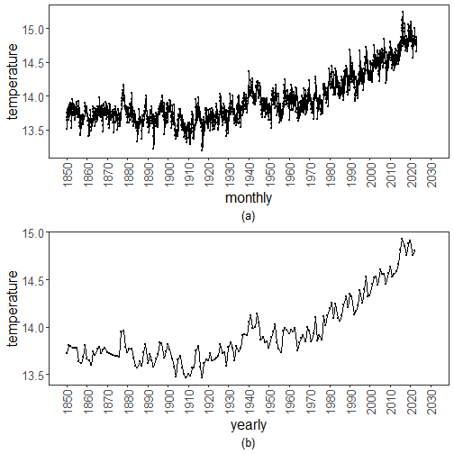

``` r
library(ggplot2)
library(RColorBrewer)
library(harbinger)
source("https://raw.githubusercontent.com/eogasawara/TSED/refs/heads/main/code/header.R")
```
## Theoretical Overview
This example focuses on time aggregation (monthly vs yearly) and its impact on detection and visualization.
## Example Overview and Goals
We will: set up libraries, run a simple detector on monthly and yearly series, and compare the visual outputs.
### Other Steps
Additional supporting steps that glue the workflow.

``` r
# Chapter 2: Ta
# Overview:
# - Loads example dataset (if applicable)
# - Fits a detector and runs event detection
# - Plots results with events overlaid
#
```
### Setup and Libraries
Short rationale for the libraries and any project-specific sources.

### Other Steps
Additional supporting steps that glue the workflow.
### Data Loading and Prep
Read the dataset and perform any minimal preparation required for modeling.

``` r
data(examples_harbinger)
```
### Other Steps
Additional supporting steps that glue the workflow.

``` r
data <- examples_harbinger$global_temperature_monthly
data$event <- FALSE
```
### Model Configuration
Define the detector/model and its key hyperparameters.

``` r
model <- harbinger()
```
### Other Steps
Additional supporting steps that glue the workflow.

``` r
model <- fit(model, data$serie)
# Run event detection
```
### Event Detection
Run the detector to obtain event flags or scores.

``` r
detection <- detect(model, data$serie)
```
### Other Steps
Additional supporting steps that glue the workflow.
### Visualization and Output
Plot the series with detected events and optionally save figures. Combine ggplot layers in one chunk for clarity.

``` r
grf <- har_plot(model, data$serie, detection, data$event, idx = data$i, pointsize=0.25) +
  font + 
  scale_x_date(breaks = "10 years",  date_labels = "%Y",  limits = c(as.Date("1850-01-01"), as.Date("2030-01-01"))) +
  theme(axis.text.x = element_text(angle = 90, vjust = 0.5, hjust=1), plot.caption=element_text(hjust = 0.5)) 
```
### Other Steps
Additional supporting steps that glue the workflow.

``` r
grf <- grf + ylab("temperature")
grf <- grf + xlab("monthly")
grf <- grf + labs(caption = "(a)") 
grfM <- grf
```
### Data Loading and Prep
Read the dataset and perform any minimal preparation required for modeling.

``` r
data(examples_harbinger)
```
### Other Steps
Additional supporting steps that glue the workflow.

``` r
data <- examples_harbinger$global_temperature_yearly
data$event <- FALSE
```
### Model Configuration
Define the detector/model and its key hyperparameters.

``` r
model <- harbinger()
```
### Other Steps
Additional supporting steps that glue the workflow.

``` r
model <- fit(model, data$serie)
```
### Event Detection
Run the detector to obtain event flags or scores.

``` r
detection <- detect(model, data$serie)
```
### Visualization and Output
Plot the series with detected events and optionally save figures. Combine ggplot layers in one chunk for clarity.

``` r
grf <- har_plot(model, data$serie, detection, data$event, idx = data$i) +
  font + 
  scale_x_date(breaks = "10 years",  date_labels = "%Y",  limits = c(as.Date("1850-01-01"), as.Date("2030-01-01"))) +
  theme(axis.text.x = element_text(angle = 90, vjust = 0.5, hjust=1), plot.caption=element_text(hjust = 0.5)) 
```
### Other Steps
Additional supporting steps that glue the workflow.

``` r
grf <- grf + ylab("temperature")
grf <- grf + xlab("yearly")
grf <- grf + labs(caption = "(b)") 
grfY <- grf
```
### Visualization and Output
Plot the series with detected events and optionally save figures. Combine ggplot layers in one chunk for clarity.

``` r
#mypng(file = "figures/chap2_ta.png", width = 1280, height = 1080) # 144 # 720*1.5
gridExtra::grid.arrange(grfM, grfY, layout_matrix = matrix(c(1,2), byrow = TRUE, ncol = 1))
```



``` r
#dev.off()
```
## References
* General: Box, G. E. P. & Jenkins, G. (1970). Time Series Analysis.
* Ogasawara, E., Salles, R., Porto, F., Pacitti, E. Event Detection in Time Series. Springer, 2025. doi:10.1007/978-3-031-75941-3.
