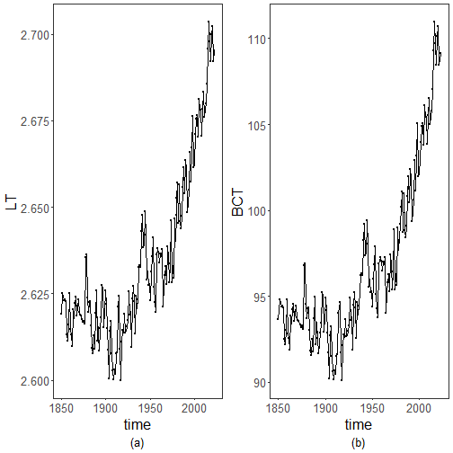

``` r
library(ggplot2)
library(RColorBrewer)
library(tseries)
library(TSPred)
library(lmtest)
source("https://raw.githubusercontent.com/eogasawara/TSED/refs/heads/main/code/header.R")
```
## Theoretical Overview
This example focuses on variance-stabilizing transformations (e.g., Log and Box-Cox) to make series more amenable to modeling and event detection.
## Example Overview and Goals
We will: set up libraries, load data, apply Log and Box-Cox transformations, quickly test stationarity, and visualize results side by side.
### What You Will Do
You will: prepare the environment, transform the series using Log and Box-Cox, compare simple stationarity diagnostics, and plot the effects.
### Setup and Libraries
Short rationale for the libraries and any project-specific sources.

### Other Steps
Additional supporting steps that glue the workflow.

``` r
# Load example dataset
```
### Data Loading and Prep
Read the dataset and perform any minimal preparation required for modeling.

``` r
data(examples_harbinger)
```
### Other Steps
Additional supporting steps that glue the workflow.

``` r
data <- examples_harbinger$global_temperature_yearly
data$event <- FALSE
bp.test <- function(serie) {
  data <- data.frame(x = 1:length(serie), y = serie)
  fit <- lm(y ~ x, data = data)
  return(bptest(fit))
}
nonstationary.test <- function(serie) {
  return(data.frame(adf = round(adf.test(serie)$p.value, 2),
                    PP = round(PP.test(as.vector(serie))$p.value, 2),
                    bp = round(bp.test(serie)$p.value, 2)))
}
y <- data$serie
# Log transform and quick stationarity summary
y_transformed <- TSPred::LogT(y)
yhat <- TSPred::LogT.rev(y_transformed)
nonstationary.test(y_transformed)
```

```
##    adf   PP   bp
## BP 0.9 0.25 0.03
```

``` r
serie <- ts(y_transformed, start = c(1850, 1))
```
### Visualization and Output
Plot the series with detected events and optionally save figures. Combine ggplot layers in one chunk for clarity.

``` r
grf <- autoplot(serie)
```
### Other Steps
Additional supporting steps that glue the workflow.

``` r
grf <- grf + theme_bw(base_size = 10)
grf <- grf + theme(plot.title = element_blank())
grf <- grf + theme(panel.grid.major = element_blank()) + theme(panel.grid.minor = element_blank())
grf <- grf + geom_point(aes(y=serie), size = 0.25, col="black") 
grf <- grf + ylab("LT")
grf <- grf + xlab("time")
grf <- grf + labs(caption = "(a)") 
grf <- grf + theme(plot.caption = element_text(hjust = 0.5))
grf <- grf  + font
```
### Visualization and Output
Plot the series with detected events and optionally save figures. Combine ggplot layers in one chunk for clarity.
### Other Steps
Additional supporting steps that glue the workflow.

``` r
grfa <- grf
#BoxCox
y_transformed <- TSPred::BCT(y)
yhat <- BCT.rev(y_transformed,  attr(y_transformed, "lambda"))
nonstationary.test(y_transformed)
```

```
##     adf   PP bp
## BP 0.93 0.33  0
```

``` r
seriebc <- ts(y_transformed, start = c(1850, 1))
```
### Visualization and Output
Plot the series with detected events and optionally save figures. Combine ggplot layers in one chunk for clarity.

``` r
grf <- autoplot(seriebc)
```
### Other Steps
Additional supporting steps that glue the workflow.

``` r
grf <- grf + theme_bw(base_size = 10)
grf <- grf + theme(plot.title = element_blank())
grf <- grf + theme(panel.grid.major = element_blank()) + theme(panel.grid.minor = element_blank())
grf <- grf + geom_point(aes(y=seriebc), size = 0.25, col="black") 
grf <- grf + ylab("BCT")
grf <- grf + xlab("time")
grf <- grf + labs(caption = "(b)") 
grf <- grf + theme(plot.caption = element_text(hjust = 0.5))
grf <- grf  + font
grfb <- grf
```
### Visualization and Output
Plot the series with detected events and optionally save figures. Combine ggplot layers in one chunk for clarity.

``` r
#mypng(file="figures/chap2_vs.png", width = 1600, height = 720) # 1280 * 1.5
gridExtra::grid.arrange(grfa, grfb, layout_matrix = matrix(c(1,2), byrow = TRUE, ncol = 2))
```



``` r
#dev.off() 
```
## References
* General: Box, G. E. P. & Jenkins, G. (1970). Time Series Analysis.
* Ogasawara, E., Salles, R., Porto, F., Pacitti, E. Event Detection in Time Series. Springer, 2025. doi:10.1007/978-3-031-75941-3.
