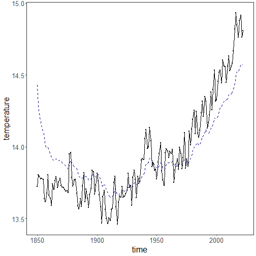
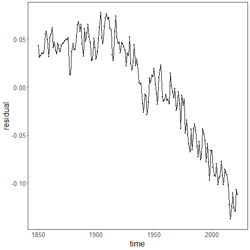
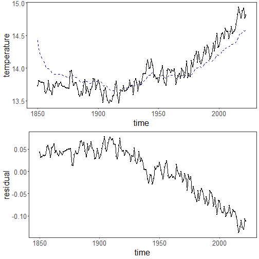
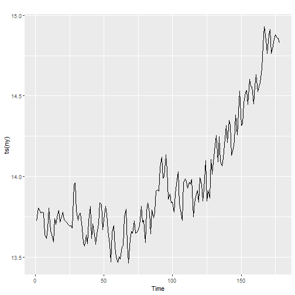

``` r
library(ggplot2)
library(RColorBrewer)
library(harbinger)
library(forecast)
source("https://raw.githubusercontent.com/eogasawara/TSED/refs/heads/main/code/header.R")
```
## Theoretical Overview
This example focuses on spectral methods (wavelets). Frequency-domain analysis reveals periodicities and transients indicative of events.
## Example Overview and Goals
We will: set up libraries, load data, compute a multiresolution wavelet decomposition, derive trend and residual components, and visualize the results.
### What You Will Do
You will: prepare the environment, load a yearly temperature series, run MODWT to obtain approximation (V) and detail (W) components, reconstruct trend and residuals, and plot both.
### Setup and Libraries
Load shared helpers and required packages.

``` r
# Shared helpers (themes, saving utilities, etc.)
options(scipen = 999)
```
### Other Steps
Additional supporting steps that glue the workflow.
### Data Loading and Prep
Read the dataset and perform any minimal preparation required for modeling.

``` r
data(examples_harbinger)
```
### Other Steps
Additional supporting steps that glue the workflow.

``` r
data <- examples_harbinger$global_temperature_yearly
data$event <- FALSE
y <- data$serie
yts <- ts(y, start = c(1850, 1))
xts <- time(yts)
wt <- wavelets::modwt(yts, filter="haar", boundary="periodic")
V <- as.data.frame(wt@V)
W <- as.data.frame(wt@W)
#for (i in 1:length(wt@V)) {
#  wt@V[[i]] <- as.matrix(rep(0, length(wt@V[[i]])), ncol=1)
#}
#iwt <- wavelets::imodwt(wt)
yhat <- apply(V, 1, mean)
residual <- -apply(W, 1, mean)
```
### Visualization and Output
Plot the series with detected events and optionally save figures. Combine ggplot layers in one chunk for clarity.

``` r
grf <- autoplot(ts(yts, start = c(1850, 1)))
```
### Other Steps
Additional supporting steps that glue the workflow.

``` r
grf <- grf + theme_bw(base_size = 10)
grf <- grf + theme(plot.title = element_blank())
grf <- grf + theme(panel.grid.major = element_blank()) + theme(panel.grid.minor = element_blank())
grf <- grf + ylab("temperature")
grf <- grf + xlab("time")
grf <- grf + geom_point(aes(y=yts),size = 0.5, col="black") 
grf <- grf + geom_line(aes(y=yhat), linetype = "dashed", col="darkblue") 
grf <- grf + theme(plot.caption = element_text(hjust = 0.5))
grf <- grf  + font
grfa <- grf
```
### Visualization and Output
Plot the series with detected events and optionally save figures. Combine ggplot layers in one chunk for clarity.

``` r
plot(grf)
```


### Other Steps
Additional supporting steps that glue the workflow.
### Visualization and Output
Plot the series with detected events and optionally save figures. Combine ggplot layers in one chunk for clarity.

``` r
grf <- autoplot(ts(residual, start = c(1850, 1)))
```
### Other Steps
Additional supporting steps that glue the workflow.

``` r
grf <- grf + theme_bw(base_size = 10)
grf <- grf + theme(plot.title = element_blank())
grf <- grf + theme(panel.grid.major = element_blank()) + theme(panel.grid.minor = element_blank())
grf <- grf + ylab("residual")
grf <- grf + xlab("time")
grf <- grf + geom_point(size = 0.5, col="black") 
grf <- grf + theme(plot.caption = element_text(hjust = 0.5))
grf <- grf  + font
grfb <- grf
```
### Visualization and Output
Plot the series with detected events and optionally save figures. Combine ggplot layers in one chunk for clarity.

``` r
plot(grf)
```


### Other Steps
Additional supporting steps that glue the workflow.

``` r
mypng(file = "figures/chap2_wavelet.png", width = 1280, height = 1080)
```
### Visualization and Output
Plot the series with detected events and optionally save figures. Combine ggplot layers in one chunk for clarity.

``` r
gridExtra::grid.arrange(grfa, grfb,
                        layout_matrix = matrix(c(1, 2), byrow = TRUE, ncol = 1))
```



``` r
dev.off()
```

```
## agg_png 
##       3
```
### Other Steps
Additional supporting steps that glue the workflow.

``` r
wt <- wavelets::modwt(yts, filter="haar", boundary="periodic")
V <- as.data.frame(wt@V)
W <- as.data.frame(wt@W)
n.ahead <- 5
V_pred <- lapply(V, function(comp) forecast(auto.arima(comp), h=n.ahead)$mean)
W_pred <- lapply(W, function(comp) forecast(auto.arima(comp), h=n.ahead)$mean)
for (i in 1:wt@level) {
  wt@W[[i]] <- as.matrix(c(wt@W[[i]],W_pred[[i]]))
  wt@V[[i]] <- as.matrix(c(wt@V[[i]],V_pred[[i]]))
}
newseries <- c(wt@series,rep(NA,n.ahead))
wt@series <- as.matrix(newseries)
wt@attr.X <- attributes(stats::ts(newseries))
iwt <- wavelets::imodwt(wt)
#gets prediction time series
pred <- stats::ts(utils::tail(iwt,n.ahead),start=(length(iwt)-n.ahead+1))
ny <- c(yts, pred)
```
### Visualization and Output
Plot the series with detected events and optionally save figures. Combine ggplot layers in one chunk for clarity.

``` r
autoplot(ts(ny))
```


## References
* Cooley, J. W., & Tukey, J. W. (1965). An algorithm for the machine calculation of complex Fourier series.
* Ogasawara, E., Salles, R., Porto, F., Pacitti, E. Event Detection in Time Series. Springer, 2025. doi:10.1007/978-3-031-75941-3.
