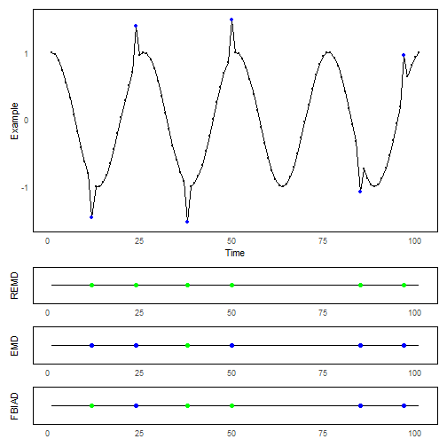

``` r
library(ggplot2)
library(RColorBrewer)
library(ggpmisc)
library(daltoolbox)
library(harbinger)
library(patchwork)
source("https://raw.githubusercontent.com/eogasawara/TSED/refs/heads/main/code/header.R")
```
## Theoretical Overview
This example compares different detectors (REMD, EMD, FBIAD) on a labeled series and shows where detections agree or differ.
## Example Overview and Goals
We will: define a helper to run and visualize detections, load a toy labeled series, draw the base series with labels, then stack detection summaries.
### What You Will Do
Run three detectors and visualize true positives (green), false negatives (blue), and false positives (red).
### Setup and Libraries
Load helpers and packages.

### Other Steps
Additional supporting steps that glue the workflow.

``` r
options(scipen = 999)
```
### Setup and Libraries
Short rationale for the libraries and any project-specific sources.

### Other Steps
Additional supporting steps that glue the workflow.

``` r
event_plot <- function(model, serie, event, title) {
  model_remd <- fit(model, serie)
# Run event detection
    detection <- detect(model, serie)
  dataset  <- data.frame(col_TP_verde = logical(length(dataset$serie)), col_FN_blue = logical(length(dataset$serie)), col_FP_red = logical(length(dataset$serie)))
  dataset$col_TP_verde <- as.logical(event) & as.logical(detection$event)
  dataset$col_FN_blue <- as.logical(event) & as.logical(!detection$event)
  dataset$col_FP_red <- (!as.logical(event)) & as.logical(detection$event)
  dataset$x <- 1:length(serie)
  dataset$y <- 0  
#Plot the series with detected events and optionally save figures. Combine ggplot layers in one chunk for clarity.
  grf <-  ggplot() + geom_line(data = dataset, aes(x = x, y = y), color = "black") 
  # Additional supporting steps that glue the workflow.
  grf <- grf + geom_point(data = subset(dataset, col_TP_verde == TRUE), size = 2, col = "green", aes(x = x, y = y))
  grf <- grf + geom_point(data = subset(dataset, col_FN_blue == TRUE), size = 2, col = "blue", aes(x = x, y = y))
  grf <- grf + geom_point(data = subset(dataset, col_FP_red == TRUE), size = 2, col = "red", aes(x = x, y = y))
  grf <- grf + theme_minimal()
  grf <- grf + theme(
    panel.background = element_rect(fill = "white"),  # Define a cor de fundo como branco
    panel.grid.major = element_blank(),  # Remove linhas de grade principais
    panel.grid.minor = element_blank(),
    axis.text.y = element_blank() 
  )
  grf <- grf+ ylab(title) + xlab(NULL)   
  return(grf)
}
#loading the example database
# Load example dataset
```
### Data Loading and Prep
Read the dataset and perform any minimal preparation required for modeling.

``` r
data("examples_anomalies")
```
### Other Steps
Additional supporting steps that glue the workflow.

``` r
#Using the tt warped time dataset$serie
dataset <- examples_anomalies$tt_warped
#dataset$event <- factor(dataset$event, labels=c("FALSE", "TRUE"))
head(dataset)
```

```
##       serie event
## 1 1.0000000 FALSE
## 2 0.9689124 FALSE
## 3 0.8775826 FALSE
## 4 0.7316889 FALSE
## 5 0.5403023 FALSE
## 6 0.3153224 FALSE
```

``` r
#### Time Series
dataset$x <- 1:length(dataset$serie)
```
### Visualization and Output
Plot the series with detected events and optionally save figures. Combine ggplot layers in one chunk for clarity.

``` r
grf_base <- ggplot(data = dataset, aes(x = 1:length(serie), y = serie)) 
```
### Other Steps
Additional supporting steps that glue the workflow.

``` r
grf_base <- grf_base + geom_line() 
grf_base <- grf_base + geom_point(color = "black", size = 0.5) 
grf_base <- grf_base + geom_point(data = subset(dataset, event == TRUE),  aes(x = x), color = "blue", size = 1.5)   # Adiciona pontos azuis onde dataset$event = TRUE
grf_base <- grf_base + theme_minimal() 
grf_base <- grf_base +theme(
  panel.background = element_rect(fill = "white"), 
  panel.grid.major = element_blank(), 
  panel.grid.minor = element_blank()   
)
grf_base <- grf_base + labs( x = "Time", y = "Example") 
############# Models ################
# Configure detector and fit to the series
```
### Model Configuration
Define the detector/model and its key hyperparameters.

``` r
model <- hanr_remd()
```
### Visualization and Output
Plot the series with detected events and optionally save figures. Combine ggplot layers in one chunk for clarity.

``` r
grfremd <- event_plot(model, dataset$serie, dataset$event, "REMD")
```
### Other Steps
Additional supporting steps that glue the workflow.

### Model Configuration
Define the detector/model and its key hyperparameters.

``` r
model <- hanr_emd()
```
### Visualization and Output
Plot the series with detected events and optionally save figures. Combine ggplot layers in one chunk for clarity.

``` r
grfemd <- event_plot(model, dataset$serie, dataset$event, "EMD")
```
### Other Steps
Additional supporting steps that glue the workflow.

### Model Configuration
Define the detector/model and its key hyperparameters.

``` r
model <- hanr_fbiad()
```
### Visualization and Output
Plot the series with detected events and optionally save figures. Combine ggplot layers in one chunk for clarity.

``` r
grffbiad <- event_plot(model, dataset$serie, dataset$event, "FBIAD")
```
### Other Steps
Additional supporting steps that glue the workflow.

``` r
grf <- wrap_plots(grf_base, grfremd, grfemd, grffbiad, 
                  ncol = 1,   widths = c(1,1), heights = c(6, 1, 1, 1))
```
### Visualization and Output
Plot the series with detected events and optionally save figures. Combine ggplot layers in one chunk for clarity.

### Visualization and Output
Plot the series with detected events and optionally save figures. Combine ggplot layers in one chunk for clarity.

``` r
#save_png(grf, "figures/chap3_models.png", 1280, 1280)
print(grf)
```



``` r
#dev.off()
```
## References
* General: Box, G. E. P. & Jenkins, G. (1970). Time Series Analysis.
* Ogasawara, E., Salles, R., Porto, F., Pacitti, E. Event Detection in Time Series. Springer, 2025. doi:10.1007/978-3-031-75941-3.
