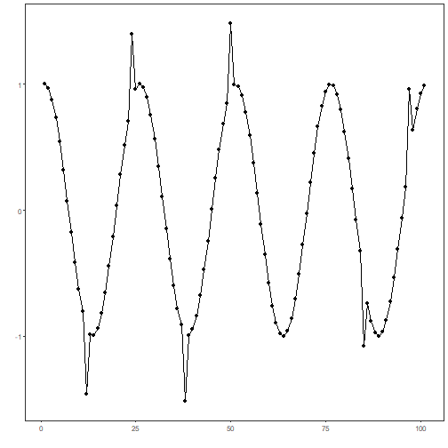
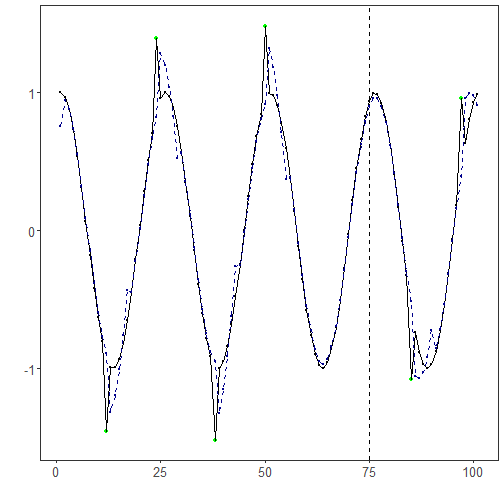

``` r
library(ggplot2)
library(RColorBrewer)
library(ggpmisc)
library(daltoolbox)
library(harbinger)
source("https://raw.githubusercontent.com/eogasawara/TSED/refs/heads/main/code/header.R")
```
## Theoretical Overview
This example focuses on ARIMA-based modeling and residual detection. Autoregressive Integrated Moving Average (ARIMA) models capture autocorrelation and trend components; events are indicated by unusual residuals or structural breaks.
## Example Overview and Goals
We will: set up libraries, load a labeled anomalies dataset, split into train/test, configure an ARIMA-based detector, detect events, and visualize with a train/test delimiter.
### What You Will Do
Prepare the environment, train ARIMA on a training subset, run full-series detection, and plot detections and fitted values.
### Setup and Libraries
Load helpers and packages.

``` r
options(scipen = 999)
```
### Data Loading and Prep
Load a toy anomalies dataset and create a train/test split.

``` r
data("examples_anomalies")
# Use the time-warped example with labels
dataset <- examples_anomalies$tt_warped
dataset$event <- factor(dataset$event, labels = c("FALSE", "TRUE"))
# Visualize raw series
plot_ts(x = seq_along(dataset$serie), y = dataset$serie)
```



``` r
# Temporal split: first 75 points as train
train <- dataset[1:75, ]
test  <- dataset[-(1:75), ]
```
### Model Configuration
Define the detector/model and its key hyperparameters.

``` r
model <- hanr_arima()
```
### Other Steps
Additional supporting steps that glue the workflow.

``` r
# Fit on training subset
model <- fit(model, train$serie)
```
### Event Detection
Run the detector to obtain event flags or scores.

``` r
# Detect over the full sequence
detection <- detect(model, dataset$serie)
```
### Other Steps
Additional supporting steps that glue the workflow.

``` r
# Optional: build in-sample fitted values using daltoolbox for plotting
ts <- ts_data(dataset$serie, 0)
io <- ts_projection(ts)
model_ts <- ts_arima()
model_ts <- fit(model_ts, x = io$input, y = io$output)
adjust <- as.vector(predict(model_ts, io$input))
```
### Visualization and Output
Plot the series with detected events and optionally save figures. Combine ggplot layers in one chunk for clarity.

``` r
grf <- har_plot(model, dataset$serie, detection, as.logical(dataset$event))
```
### Other Steps
Additional supporting steps that glue the workflow.

``` r
grf <- grf + geom_vline(xintercept = 75, col = "black", linetype = "dashed")
grf <- grf + geom_line(aes(y = adjust), linetype = "dashed", col = "darkblue")
grf <- grf + geom_point(aes(y = adjust), size = 0.25, col = "darkblue")
grf <- grf + font
```
### Visualization and Output
Plot the series with detected events and optionally save figures. Combine ggplot layers in one chunk for clarity.

``` r
#save_png(grf, "figures/chap3_arima.png", 1280, 720)
grf
```


## References
* Box, G. E. P., Jenkins, G. M., Reinsel, G. C., & Ljung, G. M. (2015). Time Series Analysis: Forecasting and Control.
* Ogasawara, E., Salles, R., Porto, F., Pacitti, E. Event Detection in Time Series. Springer, 2025. doi:10.1007/978-3-031-75941-3.
