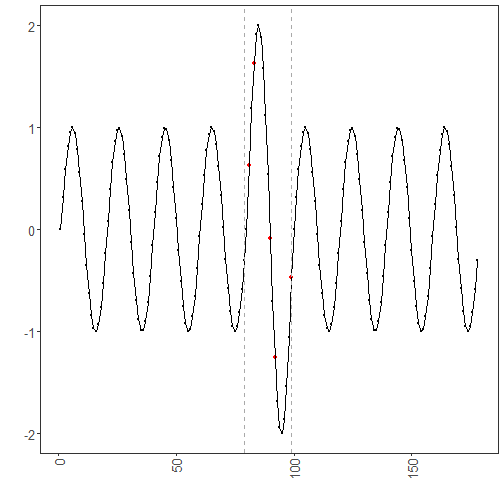

``` r
library(ggplot2)
library(RColorBrewer)
library(daltoolbox)
library(harbinger)
source("https://raw.githubusercontent.com/eogasawara/TSED/refs/heads/main/code/header.R")
```
## Theoretical Overview
This example focuses on GARCH volatility modeling. GARCH captures time-varying conditional variance; spikes in volatility may relate to events.
## Example Overview and Goals
We will: simulate a series with changing variance, configure a GARCH-based detector, detect volatility events, and visualize.
### What You Will Do
Prepare a synthetic series, fit a GARCH detector, detect variance spikes, and plot.
### Setup and Libraries
Load helpers and packages.

### Data and Prep
Create a synthetic series with higher-variance middle segment.

``` r
n <- 78  # number of time points
data <- c(sin((0:n) / pi), 2 * sin((0:19) / pi), sin((0:n) / pi))
event <- rep(FALSE, n)
```
### Model Configuration
Define the detector/model and its key hyperparameters.

``` r
model <- hanr_garch()
```
### Other Steps
Additional supporting steps that glue the workflow.

``` r
model <- fit(model, data)
```
### Event Detection
Run the detector to obtain event flags or scores.

``` r
detection <- detect(model, data)
```
### Other Steps
Additional supporting steps that glue the workflow.

``` r
print(detection |> dplyr::filter(event == TRUE))
```

```
##   idx event    type
## 1  81  TRUE anomaly
## 2  83  TRUE anomaly
## 3  90  TRUE anomaly
## 4  92  TRUE anomaly
## 5  99  TRUE anomaly
```

``` r
print(nrow(detection |> dplyr::filter(event == TRUE)))
```

```
## [1] 5
```
### Visualization and Output
Plot the series with detected events and optionally save figures. Combine ggplot layers in one chunk for clarity.

``` r
grf <- har_plot(model, data, detection) + font +
  theme(axis.text.x = element_text(angle = 90, vjust = 0.5, hjust = 1))
```
### Other Steps
Additional supporting steps that glue the workflow.

``` r
grf <- grf + geom_vline(xintercept = 79, col = "darkgray", linewidth = 0.5, linetype = "dashed")
grf <- grf + geom_vline(xintercept = 99, col = "darkgray", linewidth = 0.5, linetype = "dashed")
```
### Visualization and Output
Plot the series with detected events and optionally save figures. Combine ggplot layers in one chunk for clarity.

``` r
#save_png(grf, "figures/chap3_garch.png", 1280, 720)
grf
```


## References
* Bollerslev, T. (1986). Generalized autoregressive conditional heteroskedasticity.
* Ogasawara, E., Salles, R., Porto, F., Pacitti, E. Event Detection in Time Series. Springer, 2025. doi:10.1007/978-3-031-75941-3.
