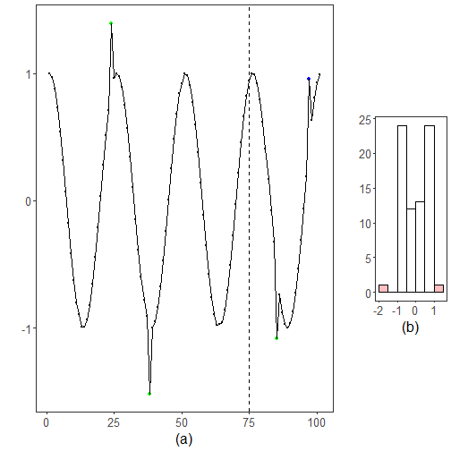

``` r
library(ggplot2)
library(RColorBrewer)
library(daltoolbox)
library(harbinger)
source("https://raw.githubusercontent.com/eogasawara/TSED/refs/heads/main/code/header.R")
```
## Theoretical Overview
This example uses a histogram-based detector to flag values in low-density regions.
## Example Overview and Goals
We will: load and lightly clean a toy series, inspect density via a histogram, fit a histogram-based detector, detect events, and visualize.
### What You Will Do
Prepare the environment, set up a simple density thresholding, detect, and plot two panels (series + histogram).
### Setup and Libraries
Load helpers and packages.

### Data Loading and Prep
Load a toy anomalies dataset and apply small cleanups to avoid trivial artifacts.

``` r
data("examples_anomalies")
dataset <- examples_anomalies$tt_warped
dataset$event <- factor(dataset$event, labels = c("FALSE", "TRUE"))
# Minor smoothing/cleanup of a few positions just for illustration
dataset$serie[1]  <- dataset$serie[1] - 0.001
dataset$serie[12] <- (dataset$serie[11] + dataset$serie[13]) / 2; dataset$event[12] <- FALSE
dataset$serie[50] <- (dataset$serie[49] + dataset$serie[51]) / 2; dataset$event[50] <- FALSE
dataset$serie[64] <- (dataset$serie[63] + dataset$serie[65]) / 2; dataset$event[64] <- FALSE
ts_data <- dataset$serie
train <- dataset[1:75, ]
```
### Other Steps
Additional supporting steps that glue the workflow.

``` r
# Build a histogram on the training slice to visualize low-density bins
hist_data <- hist(train$serie, plot = FALSE)
colors <- rep("white", length(hist_data$density))
colors[hist_data$density < 0.05] <- "red"
grfHist <- plot_hist(dataset[1:75, 1, drop = FALSE],
                     label_x = " ", label_y = " ", color = colors) + font
```

```
## Using  as id variables
```

``` r
grfHist <- grfHist + xlab("(b)") + font
```
### Model Configuration
Define the detector/model and its key hyperparameters.

``` r
model <- hanr_histogram()
```
### Other Steps
Additional supporting steps that glue the workflow.

``` r
model <- fit(model, train$serie)
```
### Event Detection
Run the detector to obtain event flags or scores.

``` r
detection <- detect(model, dataset$serie)
```
### Other Steps
Additional supporting steps that glue the workflow.
### Visualization and Output
Plot the series with detected events and optionally save figures. Combine ggplot layers in one chunk for clarity.

``` r
grf <- har_plot(model, ts_data, detection, as.logical(dataset$event))
```
### Other Steps
Additional supporting steps that glue the workflow.

``` r
grf <- grf + geom_vline(xintercept = 75, col = "black", linetype = "dashed")
grf <- grf + xlab("(a)") + font
```
### Visualization and Output
Plot the series with detected events and optionally save figures. Combine ggplot layers in one chunk for clarity.

``` r
#mypng(file = "figures/chap3_histogram.png", width = 1600, height = 720)
gridExtra::grid.arrange(grf, grid::nullGrob(), grfHist, grid::nullGrob(),
                        layout_matrix = matrix(c(1,1,1,1,1,1,2,2,
                                                 1,1,1,1,1,1,3,3,
                                                 1,1,1,1,1,1,3,3,
                                                 1,1,1,1,1,1,4,4),
                                               byrow = TRUE, ncol = 8))
```



``` r
#dev.off()
```
## References
* General: Box, G. E. P. & Jenkins, G. (1970). Time Series Analysis.
* Ogasawara, E., Salles, R., Porto, F., Pacitti, E. Event Detection in Time Series. Springer, 2025. doi:10.1007/978-3-031-75941-3.
