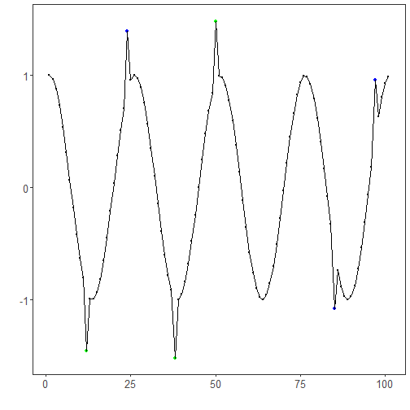

``` r
library(ggplot2)
library(RColorBrewer)
library(daltoolbox)
library(harbinger)
source("https://raw.githubusercontent.com/eogasawara/TSED/refs/heads/main/code/header.R")
```
## Theoretical Overview
This example focuses on k-means clustering. Clustering time windows and labeling outliers can identify unusual behavior segments.
## Example Overview and Goals
We will: load a labeled toy series, configure k-means on windowed features, detect cluster outliers, evaluate, and visualize.
### What You Will Do
Prepare the environment, run k-means-based detection, print/evaluate detections, and plot.
### Setup and Libraries
Load helpers and packages.

### Data Loading and Prep
Load a toy anomalies dataset.

``` r
data("examples_anomalies")
dataset <- examples_anomalies$tt_warped
```
### Other Steps
Additional supporting steps that glue the workflow.

``` r
plot_ts(x = seq_along(dataset$serie), y = dataset$serie)
```


``` r
model <- hanct_kmeans(1)
model <- fit(model, dataset$serie)
```
### Event Detection
Run the detector to obtain event flags or scores.

``` r
detection <- detect(model, dataset$serie)
```
### Other Steps
Additional supporting steps that glue the workflow.

``` r
print(detection |> dplyr::filter(event == TRUE))
```

```
##   idx event    type
## 1  12  TRUE anomaly
## 2  38  TRUE anomaly
## 3  50  TRUE anomaly
```
### Evaluation
Compute evaluation metrics or diagnostics if ground truth is available.

``` r
evaluation <- daltoolbox::evaluate(model, detection$event, dataset$event)
```
### Other Steps
Additional supporting steps that glue the workflow.

``` r
print(evaluation$confMatrix)
```

```
##           event      
## detection TRUE  FALSE
## TRUE      3     0    
## FALSE     3     95
```
### Visualization and Output
Plot the series with detected events and optionally save figures. Combine ggplot layers in one chunk for clarity.

``` r
grf <- har_plot(model, dataset$serie, detection, dataset$event)
```
### Other Steps
Additional supporting steps that glue the workflow.

``` r
grf <- grf + font
```
### Visualization and Output
Plot the series with detected events and optionally save figures. Combine ggplot layers in one chunk for clarity.

``` r
#save_png(grf, "figures/chap3_kmeans.png", 1280, 720)
grf
```


## References
* MacQueen, J. (1967). Some methods for classification and analysis of multivariate observations.
* Ogasawara, E., Salles, R., Porto, F., Pacitti, E. Event Detection in Time Series. Springer, 2025. doi:10.1007/978-3-031-75941-3.
