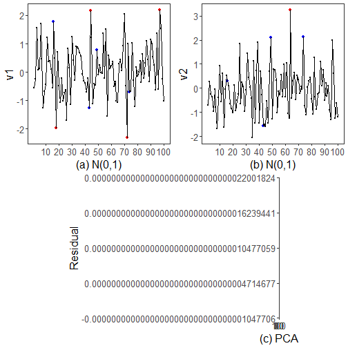

``` r
library(ggplot2)
library(RColorBrewer)
library(daltoolbox)
library(harbinger)
source("https://raw.githubusercontent.com/eogasawara/TSED/refs/heads/main/code/header.R")
```
## Theoretical Overview
This example shows a simple multivariate workflow: detect on each variable and via PCA residuals, then combine results.
## Example Overview and Goals
We will: generate a 2-variable synthetic dataset, detect via PCA residuals and ARIMA per variable, combine detections, and visualize three panels.
### What You Will Do
Prepare synthetic data, detect via PCA and ARIMA, and compare.
### Setup and Libraries
Load helpers and packages.

### Data and PCA Detection
Generate a 2D Gaussian series and run PCA-based detection.

``` r
set.seed(123)
n <- 100; m <- 2
data <- as.data.frame(matrix(rnorm(n * m), nrow = n, ncol = m))
event <- rep(FALSE, n)
model <- fit(hmu_pca(), data)
pca_detection <- detect(model, data)
serie <- attr(pca_detection, "res")
```
### Event Detection
Run the detector to obtain event flags or scores.
### Other Steps
Additional supporting steps that glue the workflow.

``` r
model <- fit(hanr_arima(), data[, 1])
```
### Event Detection
Run the detector to obtain event flags or scores.

``` r
detection1 <- detect(model, data[, 1])
```
### Other Steps
Additional supporting steps that glue the workflow.

``` r
model <- fit(hanr_arima(), data[, 2])
```
### Event Detection
Run the detector to obtain event flags or scores.

``` r
detection2 <- detect(model, data[, 2])
```
### Other Steps
Additional supporting steps that glue the workflow.

``` r
detection <- detection1
detection$event <- (detection1$event | detection2$event)
```
### Visualization and Output
Plot the series with detected events and optionally save figures. Combine ggplot layers in one chunk for clarity.

``` r
grf <- har_plot(model, data[, 1], detection1, pca_detection$event)
```
### Other Steps
Additional supporting steps that glue the workflow.

``` r
grf <- grf + scale_x_continuous(breaks = seq(10, 100, by = 10), "(a) N(0,1)")
grf <- grf + ylab("v1") + font
grfA <- grf
```
### Visualization and Output
Plot the series with detected events and optionally save figures. Combine ggplot layers in one chunk for clarity.

``` r
grf <- har_plot(model, data[, 2], detection2, pca_detection$event)
```
### Other Steps
Additional supporting steps that glue the workflow.

``` r
grf <- grf + scale_x_continuous(breaks = seq(10, 100, by = 10), "(b) N(0,1)")
grf <- grf + ylab("v2") + font
grfB <- grf
```
### Visualization and Output
Plot the series with detected events and optionally save figures. Combine ggplot layers in one chunk for clarity.

``` r
grf <- har_plot(model, serie, pca_detection, detection$event)
```
### Other Steps
Additional supporting steps that glue the workflow.

``` r
grf <- grf + scale_x_continuous(breaks = seq(10, 100, by = 10), "(c) PCA")
grf <- grf + ylab("Residual") + font
grfC <- grf
```
### Visualization and Output
Plot the series with detected events and optionally save figures. Combine ggplot layers in one chunk for clarity.

``` r
#mypng(file = "figures/chap3_multi.png", width = 1600, height = 1080)
gridExtra::grid.arrange(grfA, grfB, grid::nullGrob(), grfC, grid::nullGrob(),
                        layout_matrix = matrix(c(1,1,2,2,3,4,4,5), byrow = TRUE, ncol = 4))
```



``` r
#dev.off()
```
## References
* General: Box, G. E. P. & Jenkins, G. (1970). Time Series Analysis.
* Ogasawara, E., Salles, R., Porto, F., Pacitti, E. Event Detection in Time Series. Springer, 2025. doi:10.1007/978-3-031-75941-3.
