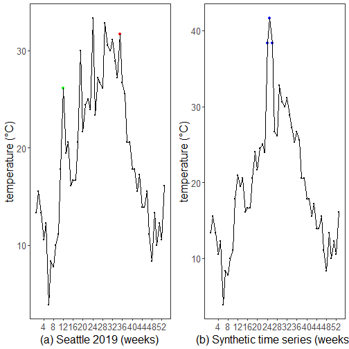

``` r
library(ggplot2)
library(RColorBrewer)
library(readxl)
library(daltoolbox)
library(harbinger)
library(dplyr)
source("https://raw.githubusercontent.com/eogasawara/TSED/refs/heads/main/code/header.R")
```
## Theoretical Overview
This example uses weekly maxima of Seattle 2019 temperatures to illustrate detection on real and synthetic variants.
## Example Overview and Goals
We will: fetch and pre-process weekly temperatures, run FBIAD detection, then generate a synthetic variant and compare results side-by-side.
### What You Will Do
Build two plots: real (2019 weeks) and a perturbed synthetic sequence.
### Setup and Libraries
Load helpers and packages.

### Other Steps
Additional supporting steps that glue the workflow.

``` r
graphic_seattle <- function() {
#Read the dataset and perform any minimal preparation required for modeling.
  load(url("https://raw.githubusercontent.com/eogasawara/TSED/refs/heads/main/data/seattle.RData"))
  seattle$Day <- 1:nrow(seattle)
  seattle$Week <- as.integer(seattle$Day/7) + 1
  seattle$temp <- seattle$Max...4
  #seattle$temp <- as.numeric(seattle$Avg...5)
  seattle$temp <- (seattle$temp - 32)/1.8
  seattle <- seattle |> select(day = Day, week = Week, temp = temp) |> group_by(week) |> summarise(temp = max(temp))
  seattle$event <- FALSE
  seattle$event[12] <- TRUE
# Configure detector and fit to the series
  model <- hanr_fbiad(sw_size=12)
  # fitting the model
  model <- fit(model, seattle$temp)
  # making detections using hanr_fbiad
# Run event detection
    detection <- detect(model, seattle$temp)
  print(detection[detection$event,])
  # ploting the results
# Plot detections over the series
  grf <- har_plot(model, seattle$temp, detection, seattle$event)
  grf <- grf + scale_x_continuous(breaks = seq(4, 52, by = 4), "(a) Seattle 2019 (weeks)")
  grf <- grf + ylab("temperature (°C)")
  grf <- grf  + font
  return(grf)
}
```
### Data Loading and Prep
Helper functions to build the two plots.

``` r
graphic_seattle_seq <- function() {
  load(url("https://raw.githubusercontent.com/eogasawara/TSED/refs/heads/main/data/seattle.RData"))
  seattle$Day <- 1:nrow(seattle)
  seattle$Week <- as.integer(seattle$Day/7) + 1
  seattle$temp <- seattle$Max...4
  #seattle$temp <- as.numeric(seattle$Avg...5)
  seattle$temp <- (seattle$temp - 32)/1.8
  seattle <- seattle |> select(day = Day, week = Week, temp = temp) |> group_by(week) |> summarise(temp = max(temp))
  seattle$event <- FALSE
  seattle$event[24:26] <- TRUE
  seattle$temp[12] <- 0.8*seattle$temp[12]
  seattle$temp[19] <- 0.8*seattle$temp[19]
  seattle$temp[26] <- 1.15*seattle$temp[24]
  seattle$temp[25] <- 1.25*seattle$temp[24]
  seattle$temp[24] <- 1.15*seattle$temp[24]
  seattle$temp[35] <- 0.8*seattle$temp[35]
    model <- harbinger()
      # fitting the model
  model <- fit(model, seattle$temp)
  # making detections using hanr_fbiad
    detection <- detect(model, seattle$temp)
      print(detection[detection$event,])
  # ploting the results
  grf <- har_plot(model, seattle$temp, detection, seattle$event)
  grf <- grf + scale_x_continuous(breaks = seq(4, 52, by = 4), "(b) Synthetic time series (weeks)")
  grf <- grf + ylab("temperature (°C)")
  grf <- grf  + font
  return(grf)
}
```
### Visualization and Output
Plot the series with detected events and optionally save figures. Combine ggplot layers in one chunk for clarity.

``` r
grfS <- graphic_seattle()
```

```
##    idx event    type
## 12  12  TRUE anomaly
## 35  35  TRUE anomaly
```

``` r
grfSeq <- graphic_seattle_seq()
```

```
## [1] idx   event type 
## <0 rows> (or 0-length row.names)
```

``` r
#mypng(file="figures/chap3_seattle.png", width = 1600, height = 720) #144 #720*1.75
gridExtra::grid.arrange(grfS, grfSeq,
                        layout_matrix = matrix(c(1,2), byrow = TRUE, ncol = 2))
```



``` r
#dev.off()  
```
## References
* General: Box, G. E. P. & Jenkins, G. (1970). Time Series Analysis.
* Ogasawara, E., Salles, R., Porto, F., Pacitti, E. Event Detection in Time Series. Springer, 2025. doi:10.1007/978-3-031-75941-3.
