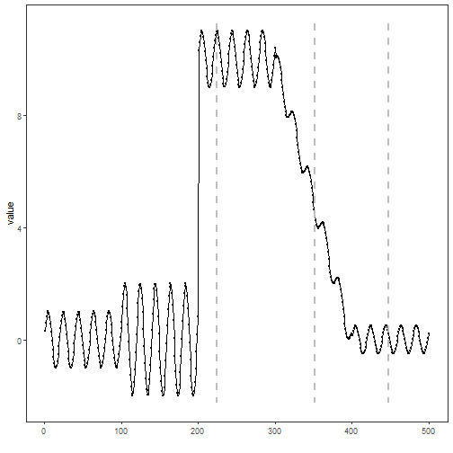

``` r
library(ggplot2)
library(RColorBrewer)
library(daltoolbox)
library(harbinger)
library(heimdall)
source("https://raw.githubusercontent.com/eogasawara/TSED/refs/heads/main/code/header.R")
```
## Theoretical Overview
This example focuses on Event detection in time series. This example follows a general event-detection workflow: data preparation, model configuration, fitting, detection, optional evaluation, and visualization.
## Example Overview and Goals
We demonstrate a complete, reproducible workflow: setting up libraries, loading data, configuring a detector, fitting it, running detection, optionally evaluating, and visualizing the results.
### Setup and Libraries
Load helpers and required packages.

``` r
library(ggplot2)
library(RColorBrewer)
library(daltoolbox)
library(harbinger)
library(heimdall)
source("https://raw.githubusercontent.com/eogasawara/TSED/refs/heads/main/code/header.R")
```
### Data
Load the example and build a simple drift stream.

``` r
data(examples_changepoints)
```
### Other Steps
Additional supporting steps that glue the workflow.

``` r
data <- examples_changepoints$complex
data$event <- NULL
data$prediction <- examples_changepoints$complex$serie > 4
model <- dfr_adwin(target_feat = 'serie')
detection <- c()
state <- list(obj = model, pred = FALSE)
for (i in seq_along(data$serie)) {
  state <- update_state(state$obj, data$serie[i])
  if (state$drift) {
    type <- 'changepoint'
    state$obj <- reset_state(state$obj)
  } else {
    type <- ''
  }
  detection <- rbind(detection, list(idx = i, event = state$drift, type = type))
}
detection <- as.data.frame(detection)
```
### Visualization and Output
Plot the series with detected events and optionally save figures. Combine ggplot layers in one chunk for clarity.

``` r
grf <- har_plot(model, data$serie, detection)
grf <- grf + ylab("value")
grf
```


### Other Steps
Additional supporting steps that glue the workflow.
### Visualization and Output
Plot the series with detected events and optionally save figures. Combine ggplot layers in one chunk for clarity.

``` r
#save_png(grf, "figures/chap4_adwin.png", 1280, 720)
grf
```


## References
* General: Box, G. E. P. & Jenkins, G. (1970). Time Series Analysis.
* Ogasawara, E., Salles, R., Porto, F., Pacitti, E. Event Detection in Time Series. Springer, 2025. doi:10.1007/978-3-031-75941-3.
