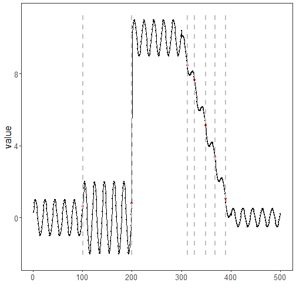

``` r
library(ggplot2)
library(RColorBrewer)
library(daltoolbox)
library(harbinger)
source("https://raw.githubusercontent.com/eogasawara/TSED/refs/heads/main/code/header.R")
```
## Theoretical Overview
Binary Segmentation (BinSeg) recursively partitions a time series by locating the most significant change in each segment, then applying the same procedure to the resulting subsegments. It is a greedy alternative to exact methods like PELT.
## Example Overview and Goals
We load a synthetic change-point series, fit a BinSeg detector with an upper bound on the number of changes, run detection, print indices, and plot results.
### Knitr Options
Keep output clean and reproducible.

### Setup and Libraries
Load helpers and packages.

``` r
library(ggplot2)
library(RColorBrewer)
library(daltoolbox)
library(harbinger)
source("https://raw.githubusercontent.com/eogasawara/TSED/refs/heads/main/code/header.R")
```
### Data
Load the example series.

``` r
data(examples_changepoints)
data <- examples_changepoints$complex
```
### Model, Fit, and Detect
Instantiate the BinSeg detector, fit, and detect events.

``` r
model <- fit(hcp_binseg(Q = 10), data$serie)  # Q: max number of changes
detection <- detect(model, data$serie)
print(detection$idx[detection$event])
```

```
## [1] 101 200 312 327 349 368 389
```
### Visualization and Output
Plot detections and save the figure.

``` r
grf <- har_plot(model, data$serie, detection) + ylab("value") + font
#save_png(grf, "figures/chap4_binseg.png", 1280, 720)
grf
```


## References
* Killick, R., Fearnhead, P., & Eckley, I. A. (2012). Optimal detection of changepoints with a linear computational cost.
* Ogasawara, E., Salles, R., Porto, F., Pacitti, E. Event Detection in Time Series. Springer, 2025. doi:10.1007/978-3-031-75941-3.
