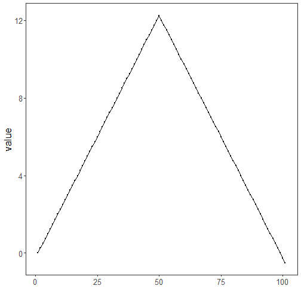

``` r
library(ggplot2)
library(RColorBrewer)
library(daltoolbox)
library(harbinger)
source("https://raw.githubusercontent.com/eogasawara/TSED/refs/heads/main/code/header.R")
```
## Theoretical Overview
Change Finder applies an ARIMA model to generate residuals, then detects change points in the residual stream using a secondary windowed detector. Unusual residual patterns indicate structural shifts not captured by the base model.
## Example Overview and Goals
We demonstrate a complete, reproducible workflow: setting up libraries, loading data, configuring a detector, fitting it, running detection, optionally evaluating, and visualizing the results.
### Knitr Options
Keep output clean and reproducible.

### Setup and Libraries
Load helpers and packages.

``` r
library(ggplot2)
library(RColorBrewer)
library(daltoolbox)
library(harbinger)
source("https://raw.githubusercontent.com/eogasawara/TSED/refs/heads/main/code/header.R")
```
### Data
Load a simple change-point example.

``` r
data(examples_changepoints)
```
### Model, Fit, and Detect
Configure Change Finder with a linear residual detector and detect changes.

``` r
data <- examples_changepoints$simple
model <- fit(hcp_cf_lr(sw_size = 10), data$serie)  # sliding-window size for residual change
detection <- detect(model, data$serie)
print(detection$idx[detection$event])
```

```
## integer(0)
```
### Visualization and Output
Plot the series with detected changes and save the figure.

``` r
grf <- har_plot(model, data$serie, detection) + ylab("value") + font
#save_png(grf, "figures/chap4_cf_arima.png", 1280, 720)
grf
```


## References
* Box, G. E. P., Jenkins, G. M., Reinsel, G. C., & Ljung, G. M. (2015). Time Series Analysis: Forecasting and Control.
* Ogasawara, E., Salles, R., Porto, F., Pacitti, E. Event Detection in Time Series. Springer, 2025. doi:10.1007/978-3-031-75941-3.
