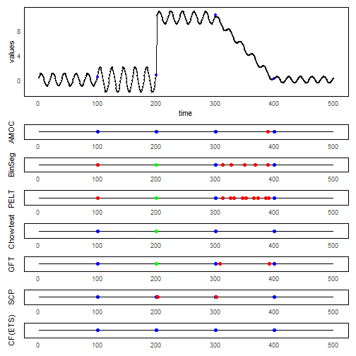

``` r
library(ggplot2)
library(RColorBrewer)
library(ggpmisc)
library(daltoolbox)
library(harbinger)
library(patchwork)
source("https://raw.githubusercontent.com/eogasawara/TSED/refs/heads/main/code/header.R")
```
## Theoretical Overview
This chapter explores change-point detection across multiple scenarios: single and multiple changes, as well as multivariate projections (e.g., autoencoders). We illustrate how to configure detectors and visualize detections for different synthetic regimes.
## Example Overview and Goals
We construct several synthetic series with different change patterns, apply appropriate detectors, and generate clean plots for side-by-side comparison.
### Knitr Options
Keep output clean and reproducible.

### Setup and Libraries
Short rationale for the libraries and any project-specific sources.

### Setup and Libraries
Short rationale for the libraries and any project-specific sources.


``` r
event_plot <- function(model, serie, event, title) {
  # Fit model and detect
  model <- fit(model, serie)
  detection <- detect(model, serie)
  # Remove anomalies for this view
  detection$event[detection$type == "anomaly"] <- FALSE
  detection$type[detection$type == "anomaly"]  <- ""
  # Build compact timeline dataframe
  df <- data.frame(col_TP = as.logical(event) & as.logical(detection$event),
                   col_FN = as.logical(event) & as.logical(!detection$event),
                   col_FP = (!as.logical(event)) & as.logical(detection$event))
  df$x <- seq_along(serie)
  df$y <- 0
  grf <- ggplot() + geom_line(data = df, aes(x = x, y = y), color = "black")
  grf <- grf + geom_point(data = subset(df, col_TP == TRUE), size = 2, col = "green", aes(x = x, y = y))
  grf <- grf + geom_point(data = subset(df, col_FN == TRUE), size = 2, col = "blue",  aes(x = x, y = y))
  grf <- grf + geom_point(data = subset(df, col_FP == TRUE), size = 2, col = "red",   aes(x = x, y = y))
  grf <- grf + theme_minimal()
  grf <- grf + theme(
    panel.background = element_rect(fill = "white"),  # white background
    panel.grid.major = element_blank(),                # no major grid
    panel.grid.minor = element_blank(),
    axis.text.y = element_blank()
  )
  grf <- grf + ylab(title) + xlab(NULL)
  return(grf)
}
```
### Data Loading and Prep
Read the dataset and perform any minimal preparation required for modeling.

``` r
# Load example dataset
data(examples_changepoints)
```
### Other Steps
Additional supporting steps that glue the workflow.

``` r
dataset <- examples_changepoints$complex
#### Time Series
dataset$x <- 1:length(dataset$serie)
```
### Base Plot

``` r
grf_base <- ggplot(data = dataset, aes(x = seq_along(serie), y = serie))
grf_base <- grf_base + geom_line()
grf_base <- grf_base + geom_point(color = "black", size = 0.5)
grf_base <- grf_base + geom_point(data = subset(dataset, event == TRUE), aes(x = x), color = "blue", size = 1.5)   # add blue points where event = TRUE
grf_base <- grf_base + theme_minimal()
grf_base <- grf_base + theme(
  panel.background = element_rect(fill = "white"),
  panel.grid.major = element_blank(),
  panel.grid.minor = element_blank()
)
grf_base <- grf_base + labs(x = "time", y = "values")
```
### Model Configuration
Define the detector/model and its key hyperparameters.

``` r
model <- hcp_amoc()
```
### Visualization and Output
Plot the series with detected events and optionally save figures. Combine ggplot layers in one chunk for clarity.

``` r
grf_amoc <- event_plot(model, dataset$serie, dataset$event, "AMOC")
```
### Model Configuration
Define the detector/model and its key hyperparameters.

``` r
model <- hcp_binseg(Q = 10)
```
### Visualization and Output
Plot the series with detected events and optionally save figures. Combine ggplot layers in one chunk for clarity.

``` r
grf_binseg <- event_plot(model, dataset$serie, dataset$event, "BinSeg")
```
### Model Configuration
Define the detector/model and its key hyperparameters.

``` r
model <- hcp_pelt()
```
### Visualization and Output
Plot the series with detected events and optionally save figures. Combine ggplot layers in one chunk for clarity.

``` r
grf_pelt <- event_plot(model, dataset$serie, dataset$event, "PELT")
```
### Model Configuration
Define the detector/model and its key hyperparameters.

``` r
model <- hcp_chow()
```
### Visualization and Output
Plot the series with detected events and optionally save figures. Combine ggplot layers in one chunk for clarity.

``` r
grf_chow <- event_plot(model, dataset$serie, dataset$event, "Chow test")
```
### Model Configuration
Define the detector/model and its key hyperparameters.

``` r
model <- hcp_gft()
```
### Visualization and Output
Plot the series with detected events and optionally save figures. Combine ggplot layers in one chunk for clarity.

``` r
grf_gft <- event_plot(model, dataset$serie, dataset$event, "GFT")
```
### Model Configuration
Define the detector/model and its key hyperparameters.

``` r
model <- hcp_scp(sw_size = 60)
```
### Visualization and Output
Plot the series with detected events and optionally save figures. Combine ggplot layers in one chunk for clarity.

``` r
grf_scp <- event_plot(model, dataset$serie, dataset$event, "SCP")
```
### Other Steps
Additional supporting steps that glue the workflow.

### Model Configuration
Define the detector/model and its key hyperparameters.

``` r
model <- hcp_cf_ets(sw_size = 60)
```
### Visualization and Output
Plot the series with detected events and optionally save figures. Combine ggplot layers in one chunk for clarity.

``` r
grf_cf_arima <- event_plot(model, dataset$serie, dataset$event, "CF(ETS)")
```

``` r
grf <- wrap_plots(grf_base, grf_amoc, grf_binseg, grf_pelt, grf_chow, grf_gft, grf_scp, grf_cf_arima, ncol = 1, widths = c(1, 1), heights = c(6, 1, 1, 1, 1, 1, 1, 1))
#save_png(grf, "figures/chap4_change_point.png", 1280, 1584)
grf
```


## References
* General: Box, G. E. P. & Jenkins, G. (1970). Time Series Analysis.
* Ogasawara, E., Salles, R., Porto, F., Pacitti, E. Event Detection in Time Series. Springer, 2025. doi:10.1007/978-3-031-75941-3.
