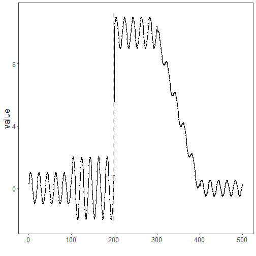

``` r
library(ggplot2)
library(RColorBrewer)
library(daltoolbox)
library(harbinger)
source("https://raw.githubusercontent.com/eogasawara/TSED/refs/heads/main/code/header.R")
```
## Theoretical Overview
The Chow test evaluates whether linear regression parameters differ across two segments, indicating a structural break at a candidate point. It compares the fit of a pooled model versus separate segment models.
## Example Overview and Goals
We load a synthetic change-point series, fit a Chow-test-based detector, run detection, print detected indices, and plot the results with a clean theme.
### Knitr Options
Keep output clean and reproducible.

### Setup and Libraries
Load helpers and required packages.

``` r
library(ggplot2)
library(RColorBrewer)
library(daltoolbox)
library(harbinger)
source("https://raw.githubusercontent.com/eogasawara/TSED/refs/heads/main/code/header.R")
```
### Data
Load the change-point example series.

``` r
data(examples_changepoints)
data <- examples_changepoints$complex
```
### Model, Fit, and Detect
Instantiate the Chow detector, fit, and detect events.

``` r
model <- fit(hcp_chow(), data$serie)
detection <- detect(model, data$serie)
print(detection$idx[detection$event])  # indices flagged by the test
```

```
## [1] 200
```
### Visualization and Output
Plot the series with detections and save the figure.

``` r
grf <- har_plot(model, data$serie, detection)
grf <- grf + ylab("value") + font
#save_png(grf, "figures/chap4_chowtest.png", 1280, 720)
grf
```


## References
* Chow, G. C. (1960). Tests of equality between sets of coefficients in two linear regressions.
* Ogasawara, E., Salles, R., Porto, F., Pacitti, E. Event Detection in Time Series. Springer, 2025. doi:10.1007/978-3-031-75941-3.
