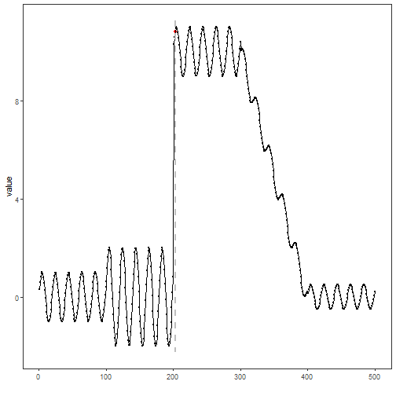

``` r
library(ggplot2)
library(RColorBrewer)
library(daltoolbox)
library(harbinger)
library(heimdall)
source("https://raw.githubusercontent.com/eogasawara/TSED/refs/heads/main/code/header.R")
```
## Theoretical Overview
DDM is an online drift detector based on monitoring the error-rate of a predictive model. It raises warnings or drift alarms when the error distribution changes significantly over time.
## Example Overview and Goals
We simulate a binary prediction stream from a threshold on the signal, feed it to DDM sequentially, reset upon drift, and visualize detections.
### Knitr Options
Keep output clean and reproducible.

### Setup and Libraries
Load helpers and detectors.

``` r
library(ggplot2)
library(RColorBrewer)
library(daltoolbox)
library(harbinger)
library(heimdall)
source("https://raw.githubusercontent.com/eogasawara/TSED/refs/heads/main/code/header.R")
```
### Data
Load a synthetic change-point series and define a simple binary stream for DDM.

``` r
data(examples_changepoints)
```

``` r
data <- examples_changepoints$complex
data$event <- NULL
data$prediction <- data$serie > 4                   # simple threshold-based prediction
model <- dfr_ddm()
detection <- NULL
state <- list(obj = model, pred = FALSE)
for (i in seq_along(data$prediction)) {
  state <- update_state(state$obj, data$prediction[i])  # online update with prediction correctness
  if (state$drift) {
    type <- 'changepoint'
    state$obj <- reset_state(state$obj)                 # reset after drift
  } else {
    type <- ''
  }
  detection <- rbind(detection, data.frame(idx = i, event = state$drift, type = type))
}
```
### Visualization and Output
Plot detections over the original series and save the figure.

``` r
grf <- har_plot(model, data$serie, detection)
grf <- grf + ylab("value")
#save_png(grf, "figures/chap4_ddm.png", 1280, 720)
grf
```


## References
* General: Box, G. E. P. & Jenkins, G. (1970). Time Series Analysis.
* Ogasawara, E., Salles, R., Porto, F., Pacitti, E. Event Detection in Time Series. Springer, 2025. doi:10.1007/978-3-031-75941-3.
