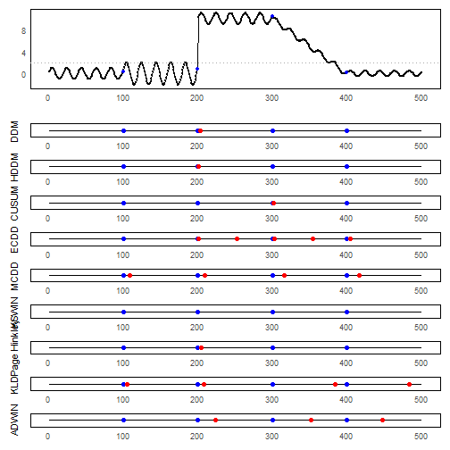

``` r
library(ggplot2)
library(RColorBrewer)
library(ggpmisc)
library(daltoolbox)
library(harbinger)
library(heimdall)
library(patchwork)
source("https://raw.githubusercontent.com/eogasawara/TSED/refs/heads/main/code/header.R")
```
## Theoretical Overview
Concept drift refers to changes in the data-generating process over time. This chapter contrasts several online drift detectors (DDM, HDDM, CUSUM, ECDD, MCDD, KSWIN, Page–Hinkley) that update sequentially and flag changes with low latency.
## Example Overview and Goals
We construct a simple stream and compare how different detectors respond to thresholded predictions vs. raw signals, arranging results in a compact grid for visual comparison.
### Knitr Options
Keep output clean and reproducible.

### Other Steps
Additional supporting steps that glue the workflow.

``` r
# Chapter 4: Drift
# Overview:
# - Loads example dataset (if applicable)
# - Fits a detector and runs event detection
# - Plots results with events overlaid
#
```
### Setup and Libraries
Short rationale for the libraries and any project-specific sources.

### Other Steps
Additional supporting steps that glue the workflow.

``` r
options(scipen=999)
```
### Setup and Libraries
Short rationale for the libraries and any project-specific sources.

### Other Steps
Additional supporting steps that glue the workflow.

``` r
event_plot <- function(model, serie, event, prediction, title) {
  detection <- NULL
  output <- list(obj=model, pred=FALSE)
  for (i in 1:length(serie)){
    output <- update_state(output$obj, prediction[i])
    if (output$drift){
      type <- 'changepoint'
      output$obj <- reset_state(output$obj)
    }else{
      type <- ''
    }
    detection <- rbind(detection, data.frame(idx=i, event=output$drift, type=type))
  }
  # Build a small plotting frame to highlight TP/FN/FP along the timeline
  df <- data.frame(col_TP_verde = logical(length(serie)),
                   col_FN_blue = logical(length(serie)),
                   col_FP_red  = logical(length(serie)))
  df$col_TP_verde <- as.logical(event) & as.logical(detection$event)
  df$col_FN_blue  <- as.logical(event) & as.logical(!detection$event)
  df$col_FP_red   <- (!as.logical(event)) & as.logical(detection$event)
  df$x <- seq_along(serie)
  df$y <- 0  
  grf <-  ggplot() + geom_line(data = df, aes(x = x, y = y), color = "black") 
  grf <- grf + geom_point(data = subset(df, col_TP_verde == TRUE), size = 2, col = "green", aes(x = x, y = y))
  grf <- grf + geom_point(data = subset(df, col_FN_blue  == TRUE), size = 2, col = "blue",  aes(x = x, y = y))
  grf <- grf + geom_point(data = subset(df, col_FP_red   == TRUE), size = 2, col = "red",   aes(x = x, y = y))
  grf <- grf + theme_minimal()
  grf <- grf + theme(
    panel.background = element_rect(fill = "white"),  # white background
    panel.grid.major = element_blank(),                # remove major grid lines
    panel.grid.minor = element_blank(),
    axis.text.y = element_blank()
  )
  grf <- grf+ ylab(title) + xlab(NULL)   
  return(grf)
}
```
### Other Steps
Additional supporting steps that glue the workflow.

``` r
# Load example dataset
```
### Data Loading and Prep
Read the dataset and perform any minimal preparation required for modeling.

``` r
data(examples_changepoints)
```
### Other Steps
Additional supporting steps that glue the workflow.

``` r
dataset <- examples_changepoints$complex
#### Time Series
dataset$x <- 1:length(dataset$serie)
dataset$prediction <- dataset$serie > 2
```
### Visualization and Output
Plot the series with detected events and optionally save figures. Combine ggplot layers in one chunk for clarity.

``` r
grf_base <- ggplot(data = dataset, aes(x = 1:length(serie), y = serie)) 
```
### Other Steps
Additional supporting steps that glue the workflow.

``` r
grf_base <- grf_base + geom_line() 
grf_base <- grf_base + geom_point(color = "black", size = 0.5) 
grf_base <- grf_base + geom_point(data = subset(dataset, event == TRUE),  aes(x = x), color = "blue", size = 1.5)   # Adiciona pontos azuis onde dataset$event = TRUE
grf_base <- grf_base + theme_minimal() 
grf_base <- grf_base + geom_hline(yintercept = 2, col="darkgrey", size = 0.5, linetype="dotted")
grf_base <- grf_base +theme(
  panel.background = element_rect(fill = "white"), 
  panel.grid.major = element_blank(), 
  panel.grid.minor = element_blank()   
)
grf_base <- grf_base + labs( x = " ", y = " ") 
############# Models ################
model <- dfr_ddm()
```
### Visualization and Output
Plot the series with detected events and optionally save figures. Combine ggplot layers in one chunk for clarity.

``` r
grf_ddm <- event_plot(model, dataset$serie, dataset$event, dataset$prediction, "DDM")
```
### Other Steps
Additional supporting steps that glue the workflow.

``` r
model <- dfr_hddm()
```
### Visualization and Output
Plot the series with detected events and optionally save figures. Combine ggplot layers in one chunk for clarity.

``` r
grf_hddm <- event_plot(model, dataset$serie, dataset$event, dataset$prediction, "HDDM")
```
### Other Steps
Additional supporting steps that glue the workflow.

``` r
model <- dfr_cusum(lambda = 100)
```
### Visualization and Output
Plot the series with detected events and optionally save figures. Combine ggplot layers in one chunk for clarity.

``` r
grf_cumsum <- event_plot(model, dataset$serie, dataset$event, dataset$prediction, "CUSUM")
```
### Other Steps
Additional supporting steps that glue the workflow.

``` r
model <- dfr_ecdd(lambda = 0.2, min_run_instances = 50, average_run_length = 100)
```
### Visualization and Output
Plot the series with detected events and optionally save figures. Combine ggplot layers in one chunk for clarity.

``` r
grf_ecdd <- event_plot(model, dataset$serie, dataset$event, dataset$prediction, "ECDD")
```
### Other Steps
Additional supporting steps that glue the workflow.

``` r
model <- dfr_mcdd(target_feat = 'serie', alpha = 0.05, window_size = 100)
```
### Visualization and Output
Plot the series with detected events and optionally save figures. Combine ggplot layers in one chunk for clarity.

``` r
grf_mcdd <- event_plot(model, dataset$serie, dataset$event, dataset$serie, "MCDD")
```
### Other Steps
Additional supporting steps that glue the workflow.

``` r
model <- dfr_kswin(target_feat = 'serie')
```
### Visualization and Output
Plot the series with detected events and optionally save figures. Combine ggplot layers in one chunk for clarity.

``` r
grf_kswin <- event_plot(model, dataset$serie, dataset$event, dataset$serie, "KSWIN")
```
### Other Steps
Additional supporting steps that glue the workflow.

``` r
model <- dfr_page_hinkley(target_feat = 'serie')
```
### Visualization and Output
Plot the series with detected events and optionally save figures. Combine ggplot layers in one chunk for clarity.

``` r
grf_page_hinkley <- event_plot(model, dataset$serie, dataset$event, dataset$serie, "Page Hinkley")
```
### Other Steps
Additional supporting steps that glue the workflow.

``` r
model <- dfr_kldist(target_feat = 'serie')
```
### Visualization and Output
Plot the series with detected events and optionally save figures. Combine ggplot layers in one chunk for clarity.

``` r
grf_kldist <- event_plot(model, dataset$serie, dataset$event, dataset$serie, "KLD")
```
### Other Steps
Additional supporting steps that glue the workflow.

``` r
model <- dfr_adwin(target_feat = 'serie')
```
### Visualization and Output
Plot the series with detected events and optionally save figures. Combine ggplot layers in one chunk for clarity.

``` r
grf_adwin <- event_plot(model, dataset$serie, dataset$event, dataset$serie, "ADWIN")
```
### Visualization and Output
Plot the series with detected events and optionally save figures. Combine ggplot layers in one chunk for clarity.

``` r
grf <- wrap_plots(grf_base, grf_ddm, grf_hddm, grf_cumsum, grf_ecdd,
                  grf_mcdd, grf_kswin, grf_page_hinkley, grf_kldist, grf_adwin, 
                                  ncol = 1,   widths = c(1,1), heights = c(6, 1, 1, 1, 1, 1, 1, 1, 1, 1))
#save_png(grf, "figures/chap4_drift.png", 1280, 1620)
grf
```


## References
* General: Box, G. E. P. & Jenkins, G. (1970). Time Series Analysis.
* Ogasawara, E., Salles, R., Porto, F., Pacitti, E. Event Detection in Time Series. Springer, 2025. doi:10.1007/978-3-031-75941-3.
