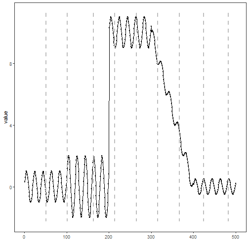

``` r
library(ggplot2)
library(RColorBrewer)
library(daltoolbox)
library(harbinger)
library(heimdall)
source("https://raw.githubusercontent.com/eogasawara/TSED/refs/heads/main/code/header.R")
```
## Theoretical Overview
ECDD tracks changes using an exponentially-weighted statistic akin to CUSUM, triggering drift when the cumulative deviation exceeds a threshold. It is suitable for streaming scenarios where recent data is more informative.
## Example Overview and Goals
We feed the raw signal sequentially to ECDD, collect a compatible detection frame, and visualize detected change points over the series.
### Knitr Options
Keep output clean and reproducible.

### Setup and Libraries
Load helpers and detectors.

``` r
library(ggplot2)
library(RColorBrewer)
library(daltoolbox)
library(harbinger)
library(heimdall)
source("https://raw.githubusercontent.com/eogasawara/TSED/refs/heads/main/code/header.R")
```
### Data
Load the change-point example series.

``` r
data(examples_changepoints)
```

``` r
data <- examples_changepoints$complex
data$event <- NULL
# Configure ECDD parameters:
# - lambda: EWMA smoothing factor
# - min_run_instances / average_run_length: stability controls for activation
model <- dfr_ecdd(lambda = 0.2, min_run_instances = 50, average_run_length = 100)
detection <- c()
state <- list(obj = model, pred = FALSE)
for (i in seq_along(data$serie)) {
  state <- update_state(state$obj, data$serie[i])
  if (state$drift) {
    type <- 'changepoint'
    state$obj <- reset_state(state$obj)
  } else {
    type <- ''
  }
  detection <- rbind(detection, list(idx = i, event = state$drift, type = type))
}
detection <- as.data.frame(detection)
```
### Visualization and Output
Plot the series with detected changes and save the figure.

``` r
grf <- har_plot(model, data$serie, detection) + ylab("value")
#save_png(grf, "figures/chap4_ecdd.png", 1280, 720)
grf
```


## References
* General: Box, G. E. P. & Jenkins, G. (1970). Time Series Analysis.
* Ogasawara, E., Salles, R., Porto, F., Pacitti, E. Event Detection in Time Series. Springer, 2025. doi:10.1007/978-3-031-75941-3.
