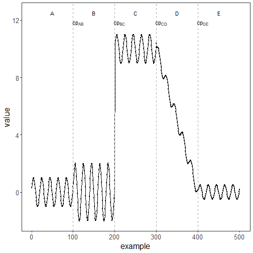

``` r
library(ggplot2)
library(RColorBrewer)
library(daltoolbox)
library(harbinger)
source("https://raw.githubusercontent.com/eogasawara/TSED/refs/heads/main/code/header.R")
```
## Theoretical Overview
This example demonstrates a concise end-to-end event detection workflow using Harbinger over a synthetic series with annotated change points. We load data, fit a default detector, run detection, and produce a figure with labeled segments and reference lines.
## Example Overview and Goals
The goal is to illustrate the minimal steps to: load a dataset, fit a model, detect events, and generate a publication-quality plot with annotations.
### Knitr Options
Make output clean and reproducible across runs.

### Setup and Libraries
Load project helpers and required packages.

``` r
library(ggplot2)
library(RColorBrewer)
library(daltoolbox)
library(harbinger)
source("https://raw.githubusercontent.com/eogasawara/TSED/refs/heads/main/code/header.R")
```
### Data
Load the example series used to illustrate change points.

``` r
data(examples_changepoints)  # built-in dataset from Harbinger examples
```
### Fit and Detect
Instantiate the default Harbinger detector, fit on the series, and run detection.

``` r
data <- examples_changepoints$complex        # select the complex example series
model <- fit(harbinger(), data$serie)        # fit default detector
detection <- detect(model, data$serie)       # compute detections (events/scores)
```
### Visualization and Output
Plot the series and add visual guides to emphasize regime changes. The labels A–E mark segments; dashed lines and cp[...] annotate change points.

``` r
# Base plot with detections overlaid
grf <- har_plot(model, data$serie, detection)
# Cosmetic improvements and annotations
grf <- grf + scale_x_continuous(
  breaks = seq(0, length(data$serie), by = length(data$serie)/5),
  name = "example"
)
grf <- grf + ggplot2::annotate(geom = "text", x = 50, y = 12.5, label = "A", color = "black")
grf <- grf + geom_vline(xintercept = 100, col = "darkgray", linewidth = 0.5, linetype = "dashed")
grf <- grf + ggplot2::annotate(geom = "text", x = 111, y = 11.8, label = "cp[AB]", color = "black", parse = TRUE)
grf <- grf + ggplot2::annotate(geom = "text", x = 150, y = 12.5, label = "B", color = "black")
grf <- grf + geom_vline(xintercept = 200, col = "darkgray", linewidth = 0.5, linetype = "dashed")
grf <- grf + ggplot2::annotate(geom = "text", x = 211, y = 11.8, label = "cp[BC]", color = "black", parse = TRUE)
grf <- grf + ggplot2::annotate(geom = "text", x = 250, y = 12.5, label = "C", color = "black")
grf <- grf + geom_vline(xintercept = 300, col = "darkgray", linewidth = 0.5, linetype = "dashed")
grf <- grf + ggplot2::annotate(geom = "text", x = 311, y = 11.8, label = "cp[CD]", color = "black", parse = TRUE)
grf <- grf + ggplot2::annotate(geom = "text", x = 350, y = 12.5, label = "D", color = "black")
grf <- grf + geom_vline(xintercept = 400, col = "darkgray", linewidth = 0.5, linetype = "dashed")
grf <- grf + ggplot2::annotate(geom = "text", x = 411, y = 11.8, label = "cp[DE]", color = "black", parse = TRUE)
grf <- grf + ggplot2::annotate(geom = "text", x = 450, y = 12.5, label = "E", color = "black")
grf <- grf + ylab("value") + font
# Save figure
#save_png(grf, "figures/chap4_example.png", 1280, 720)
grf
```


## References
* Yeh, C.-C. M., et al. (2016). Matrix Profile I: All Pairs Similarity Joins for Time Series.
* Ogasawara, E., Salles, R., Porto, F., Pacitti, E. Event Detection in Time Series. Springer, 2025. doi:10.1007/978-3-031-75941-3.
