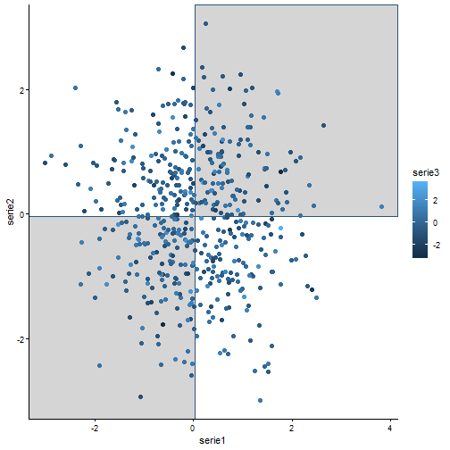
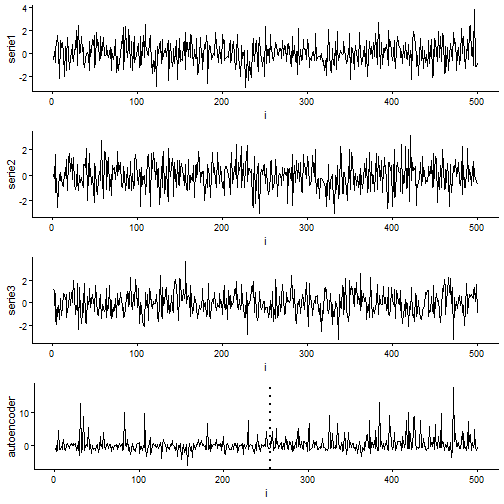

``` r
library(ggplot2)
library(RColorBrewer)
library(daltoolbox)
library(harbinger)
library(heimdall)
source("https://raw.githubusercontent.com/eogasawara/TSED/refs/heads/main/code/header.R")
```
## Theoretical Overview
A 3D autoencoder compresses three correlated signals into a 1D latent representation. Detecting changes on the latent trajectory can be more sensitive than on the raw dimensions.
## Example Overview and Goals
We demonstrate a complete, reproducible workflow: setting up libraries, loading data, configuring a detector, fitting it, running detection, optionally evaluating, and visualizing the results.
### Knitr Options
Keep output clean and reproducible.

### Setup and Libraries
Load helpers and required packages.

``` r
library(ggplot2)
library(RColorBrewer)
library(daltoolbox)
library(harbinger)
library(heimdall)
source("https://raw.githubusercontent.com/eogasawara/TSED/refs/heads/main/code/header.R")
```
### Data Generation (3D)
Create a 3D synthetic dataset and a simple drift pattern; set seeds for reproducibility.

``` r
source_python('https://raw.githubusercontent.com/eogasawara/TSED/refs/heads/main/code/seed.py')
set.seed(1)
seed_everything(1)
n <- 500
data <- data.frame(serie1 = rnorm(n),
                   serie2 = rnorm(n),
                   serie3 = rnorm(n))
m1 <- mean(data$serie1)
m2 <- mean(data$serie2)
m3 <- mean(data$serie3)
data$drift <- ((data$serie1 > m1) & (data$serie2 > m2)) |
              ((data$serie1 < m1) & (data$serie2 < m2))
```
### Visualization and Output
Plot the series with detected events and optionally save figures. Combine ggplot layers in one chunk for clarity.

``` r
grf <- ggplot(data, aes(x = serie1, y = serie2, color = serie3)) +
  geom_rect(xmin = m1, xmax = +Inf, ymin = m2, ymax = +Inf, fill = "lightgray", alpha = 0.2) +
  geom_rect(xmin = -Inf, xmax = m1, ymin = -Inf, ymax = m2, fill = "lightgray", alpha = 0.2) +
  geom_point(size = 2) +
  theme_classic()
plot(grf)
```


### Train/Test Framing
Reorder by drift, add index, and define a single ground-truth event.

``` r
ts_before <- data[data$drift == FALSE, ]
ts_after  <- data[data$drift == TRUE, ]
data <- rbind(ts_before, ts_after)
data$i <- seq_len(nrow(data))
data$event <- FALSE
data$event[min(which(data$drift))] <- TRUE
drift <- which(data$event)
model <- fit(hcp_chow(), data$serie1)
```
### Event Detection (Series 1)

``` r
detection <- detect(model, data$serie1)
print(detection$idx[detection$event])
```

```
## [1] 115
```
### Visualization and Output
Plot the series with detected events and optionally save figures. Combine ggplot layers in one chunk for clarity.

``` r
grfA <- ggplot(data, aes(x = i, y = serie1)) +
  geom_line() +
  theme_classic()
```
### Event Detection (Series 2)

``` r
model <- fit(hcp_chow(), data$serie2)
detection <- detect(model, data$serie2)
print(detection$idx[detection$event])
```

```
## [1] 310
```
### Visualization and Output
Plot the series with detected events and optionally save figures. Combine ggplot layers in one chunk for clarity.

``` r
grfB <- ggplot(data, aes(x = i, y = serie2)) +
  geom_line() +
  theme_classic()
```
### Event Detection (Series 3)

``` r
model <- fit(hcp_chow(), data$serie3)
detection <- detect(model, data$serie3)
print(detection$idx[detection$event])
```

```
## [1] 410
```
### Visualization and Output
Plot the series with detected events and optionally save figures. Combine ggplot layers in one chunk for clarity.

``` r
grfC <- ggplot(data, aes(x = i, y = serie3)) +
  geom_line() +
  theme_classic()
```
### Autoencoder Projection (3D)
Train a 3->1 autoencoder and obtain the 1D latent series.

``` r
auto <- autoenc_e(3, 1)
auto <- fit(auto, data[, 1:3])
autoencoder <- as.vector(transform(auto, data[, 1:3]))
```
### Event Detection (Autoencoder)

``` r
model <- fit(hcp_chow(), autoencoder)
detection <- detect(model, autoencoder)
print(detection$idx[detection$event])
```

```
## [1] 368
```
### Visualization and Output
Plot the series with detected events and optionally save figures. Combine ggplot layers in one chunk for clarity.

``` r
grfAuto <- ggplot(data, aes(x = i, y = autoencoder)) +
  geom_line() +
  geom_vline(xintercept = drift, linetype = "dotted", color = "black", linewidth = 1) +
  theme_classic()
```
### Save Figure

``` r
#mypng(file = "figures/chap4_multivariate_autoencoder3d.png", width = 1280, height = 1440)
gridExtra::grid.arrange(grfA, grfB, grfC, grfAuto,
                        layout_matrix = matrix(c(1, 2, 3, 4), byrow = TRUE, ncol = 1))
```



``` r
#dev.off()
```
## References
* General: Box, G. E. P. & Jenkins, G. (1970). Time Series Analysis.
* Ogasawara, E., Salles, R., Porto, F., Pacitti, E. Event Detection in Time Series. Springer, 2025. doi:10.1007/978-3-031-75941-3.
