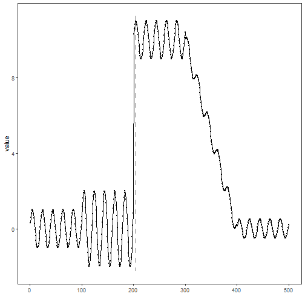

``` r
library(ggplot2)
library(RColorBrewer)
library(daltoolbox)
library(harbinger)
library(heimdall)
source("https://raw.githubusercontent.com/eogasawara/TSED/refs/heads/main/code/header.R")
```
## Theoretical Overview
The Page–Hinkley test is a sequential method for detecting abrupt changes in the mean of a signal. It maintains a cumulative statistic and triggers a change when deviations exceed a threshold.
## Example Overview and Goals
We stream through a synthetic series, update the Page–Hinkley detector state at each time step, reset on drift, collect detections, and plot results.
### Knitr Options
Keep output clean and reproducible.

### Setup and Libraries
Load helpers and required packages.

``` r
library(ggplot2)
library(RColorBrewer)
library(daltoolbox)
library(harbinger)
library(heimdall)
source("https://raw.githubusercontent.com/eogasawara/TSED/refs/heads/main/code/header.R")
```
### Data
Load the change-point example series.

``` r
data(examples_changepoints)
data <- examples_changepoints$complex
data$event <- NULL
```
### Online Detection Loop
Run Page–Hinkley in a streaming fashion and collect a detection data frame compatible with har_plot.

``` r
model <- dfr_page_hinkley(target_feat = 'serie')
detection <- c()
state <- list(obj = model, pred = FALSE)
for (i in seq_along(data$serie)) {
  state <- update_state(state$obj, data$serie[i])  # update sequentially
  if (state$drift) {
    type <- 'changepoint'
    state$obj <- reset_state(state$obj)            # reset after drift
  } else {
    type <- ''
  }
  detection <- rbind(detection, list(idx = i, event = state$drift, type = type))
}
detection <- as.data.frame(detection)
```
### Visualization and Output
Plot the series with detected changes and save the figure.

``` r
grf <- har_plot(model, data$serie, detection) + ylab("value")
#save_png(grf, "figures/chap4_page_hinkley.png", 1280, 720)
grf
```


## References
* Page, E. S. (1954). Continuous inspection schemes.
* Hinkley, D. V. (1971). Inference about the change-point in a sequence of random variables.
* Ogasawara, E., Salles, R., Porto, F., Pacitti, E. Event Detection in Time Series. Springer, 2025. doi:10.1007/978-3-031-75941-3.
