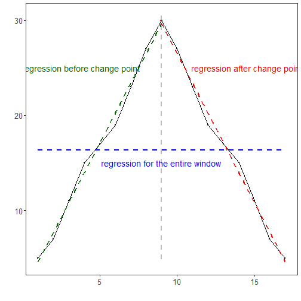

``` r
library(ggplot2)
library(RColorBrewer)
library(ggpmisc)
library(daltoolbox)
library(harbinger)
source("https://raw.githubusercontent.com/eogasawara/TSED/refs/heads/main/code/header.R")
```
## Theoretical Overview
SCP (Sliding Change Point) compares local models before and after a candidate split. A simple illustration uses linear regressions fitted on each side; a significant discrepancy indicates a change point.
## Example Overview and Goals
We demonstrate a complete, reproducible workflow: setting up libraries, loading data, configuring a detector, fitting it, running detection, optionally evaluating, and visualizing the results.
### Knitr Options
Keep output clean and reproducible.

### Setup and Libraries
Load helpers and packages.

``` r
options(scipen = 999)
```
### Synthetic Example
Construct a toy sequence with a piecewise-linear structure and mark the change point at x = 9.

``` r
set.seed(1)
n <- 100
data <- c(2, 1, 2, 3, 2, 1, 2, 3)
data <- data + 3 * (1:length(data))
data <- c(data, 30, rev(data))
x <- seq_along(data)
xb <- c(x[1:9], rep(NA, 8))
datab <- c(data[1:9], rep(NA, 8))
xa <- c(rep(NA, 8), x[9:17])
dataa <- c(rep(NA, 8), data[9:17])
event <- rep(FALSE, n)
model <- fit(harbinger(), data)
```
### Event Detection

``` r
detection <- detect(model, data)
```

``` r
detection$event[9] <- TRUE
detection$type[9] <- "changepoint"
```
### Visualization and Output

``` r
grf <- har_plot(model, data, detection)
```

``` r
grf <- grf + ylab(" ") + font
grf <- grf + geom_smooth(aes(x, data), color = "blue", method = lm, se = FALSE, linewidth = 1, linetype = "dashed")
grf <- grf + ggplot2::annotate(geom = "text", x = 9, y = 15, label = "regression for the entire window", color = "blue", size = 5)
grf <- grf + geom_smooth(aes(xb, datab), color = "darkgreen", method = lm, se = FALSE, linewidth = 1, linetype = "dashed")
grf <- grf + ggplot2::annotate(geom = "text", x = 3.75, y = 25, label = "regression before change point", color = "darkgreen", size = 5)
grf <- grf + geom_smooth(aes(xa, dataa), color = "red", method = lm, se = FALSE, linewidth = 1, linetype = "dashed")
grf <- grf + ggplot2::annotate(geom = "text", x = 14.5, y = 25, label = "regression after change point", color = "red", size = 5)
```
### Save Figure

``` r
#save_png(grf, "figures/chap4_scp_principle.png", 1280, 720)
grf
```


## References
* Killick, R., Fearnhead, P., & Eckley, I. A. (2012). Optimal detection of changepoints with a linear computational cost.
* Ogasawara, E., Salles, R., Porto, F., Pacitti, E. Event Detection in Time Series. Springer, 2025. doi:10.1007/978-3-031-75941-3.
