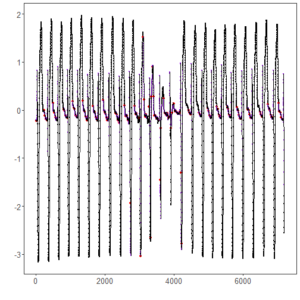

``` r
library(ggplot2)
library(RColorBrewer)
library(daltoolbox)
library(harbinger)
source("https://raw.githubusercontent.com/eogasawara/TSED/refs/heads/main/code/header.R")
```
## Theoretical Overview
SAX (Symbolic Aggregate approXimation) converts time series to symbolic strings by discretizing PAA averages with normal-distribution breakpoints. Discord detection in the SAX domain identifies unusual subsequences whose symbolic patterns deviate from typical ones.
## Example Overview and Goals
We load an ECG-like example, configure a SAX-based discord detector, fit it, run detection, print the detected discord indices, and plot the results.
### Knitr Options
Keep output clean and reproducible.

### Setup and Libraries
Load project helpers and required packages.

``` r
library(ggplot2)
library(RColorBrewer)
library(daltoolbox)
library(harbinger)
source("https://raw.githubusercontent.com/eogasawara/TSED/refs/heads/main/code/header.R")
```
### Data
Load the motif/discord example series.

``` r
data(examples_motifs)
```
### Model, Fit, and Detect
Configure the SAX-based discord detector and run detection.

``` r
data <- examples_motifs$mitdb102
rownames(data) <- 1:nrow(data)
data$event <- FALSE
# hdis_sax parameters (typical):
# - alphabet size (e.g., 26 symbols)
# - window size for subsequences (e.g., 25)
model <- hdis_sax(26, 25)
model <- fit(model, data$serie)
detection <- detect(model, data$serie)
print(detection[detection$event, ])
```

```
##       idx event  type                       seq seqlen
## 16     16  TRUE motif EEEFEEEEGGJOSUUUTSSSRRQPM     25
## 234   234  TRUE motif ONNNMNMMMLLLLLLLKLKKKJJJJ     25
## 260   260  TRUE motif JIIIJIIHHHHIHGGGGGGGFFGGF     25
## 287   287  TRUE motif FFGFFEFFFFEFEFFFFEEEEEEEE     25
## 322   322  TRUE motif EEFFFFGKRTUUTSSRRQQOKEDDD     25
## 486   486  TRUE motif RRRQQQQPPOOOPOOONOOOONNOO     25
## 536   536  TRUE motif MLLLMKLKLKKKKJJJKJJJHIIIH     25
## 563   563  TRUE motif HHHHFGGGGFFFFFGFFFFFFFEEE     25
## 612   612  TRUE motif FFFEEFFGFGHMRTVUTSSSRRQPN     25
## 801   801  TRUE motif OOPPPPOPPPPOOOOPOOOOOOOON     25
## 827   827  TRUE motif NONNMMMNMMLLLMLLKKLKKJKJJ     25
## 857   857  TRUE motif JJJIHIIJIIHHHIIHHHHHIHGGG     25
## 903   903  TRUE motif GGHIIIHKOSTVUTSSSSRRQPKED     25
## 1066 1066  TRUE motif RRRRRRQRQQQQQQQQQPPQQQPPP     25
## 1096 1096  TRUE motif PPPQPPPQQQPPPPPPPOOPPPOOO     25
## 1122 1122  TRUE motif OOONMNNNNLLMMMLLKLLLKJJKK     25
## 1157 1157  TRUE motif JJIIHIIIIIHHIIIHHHIIIHGHH     25
## 1190 1190  TRUE motif HHGHHHHHGIIJJLQTUUTTSSSRR     25
## 1362 1362  TRUE motif SRRRQQQQQPPPPPPOOPPOONOOO     25
## 1410 1410  TRUE motif NNNMLMMMLLLLLLKKKKKKJIIJJ     25
## 1437 1437  TRUE motif HIIIIHGGIHHGGGGGGGFGGGGFF     25
## 1486 1486  TRUE motif EFFFFFGGGHIJPTUUTSSSSSRQO     25
## 1660 1660  TRUE motif QQQQPOOOOONMNNNNNMNNNNNMN     25
## 1709 1709  TRUE motif MMMLLLLLKKJKJKJJIIJJJIHHH     25
## 1735 1735  TRUE motif HHGGGHHFGFGGGFFFFFFEFFFFF     25
## 1786 1786  TRUE motif EFFFFEFGIJLQTUUTSSSRRRQOK     25
## 1953 1953  TRUE motif SSRRRRQQQQQPPOPOOONNNNNNM     25
## 1995 1995  TRUE motif MNNONMMNNNNNMMNNNMLLLMLLK     25
## 2021 2021  TRUE motif LLKKJJJKJJIIJIIIHHHIHHGGG     25
## 2047 2047  TRUE motif GGFFGGFFFFFFFFFFFFFEEEFFF     25
## 2074 2074  TRUE motif EFFFFEFFEEEEEFFFFFGGHHHGH     25
## 2100 2100  TRUE motif HGFFGHKOSTUTTSRRQQPOMIEDD     25
## 2313 2313  TRUE motif LLMNMLLMMMMLLLMMMLLLLLLKK     25
## 2339 2339  TRUE motif KKKJJJJJJIIIIIIIGHGHHGFFG     25
## 2379 2379  TRUE motif EEEFFEEEFGGGFGGHHGFFFFFEE     25
## 2411 2411  TRUE motif EEEEEIQTUUTSRRRQPOLHDDDDD     25
## 2574 2574  TRUE motif QQQPOOONMMMMLLKKKKKKJJJJJ     25
## 2605 2605  TRUE motif IIIIJIJIIJJJJJJKKKKKJJKKK     25
## 2633 2633  TRUE motif JIJJIIJIIIHHIIHGGGGHFFFFF     25
## 2673 2673  TRUE motif EEFFGFFFGGGGFFFFFEEEEEEEE     25
## 2708 2708  TRUE motif EEGNSUUTSSRRRQPOKEDDDDDCC     25
## 2734 2734  TRUE motif CCCCCBBBBBBBBBAAAAAAAABBB     25
## 2862 2862  TRUE motif QQPPOOONNMMNMMKLKLLKLKKKK     25
## 2888 2888  TRUE motif KKKLKLKKKKLLLLLLMMMLLLLLL     25
## 2914 2914  TRUE motif LMLLLKKKKKJJJJJIIHHIIHGGH     25
## 2996 2996  TRUE motif GLRTUTSSRRRQQPNKEDDDDDCCC     25
## 3039 3039  TRUE motif AAABBBBBCCCCCDDDDHORSSSTT     25
## 3111 3111  TRUE motif XXXXXXWWWWWVVVUUUUTTTTTSS     25
## 3137 3137  TRUE motif SRRRQPPPOONNMMLLKKKKKKIJJ     25
## 3165 3165  TRUE motif IIJJJIIIJJJJIIJKKKJKKKKKK     25
## 3193 3193  TRUE motif KKJJKKJIJJJJIHHHIIHGGGGGH     25
## 3284 3284  TRUE motif QTUTSSRRQQQPNKFDDDDDDCCCC     25
## 3324 3324  TRUE motif BBBCCCDDDDDDEGJMOPQRRRRSS     25
## 3352 3352  TRUE motif SSSSSSTTTTTTTTTTTTTUUUUUU     25
## 3386 3386  TRUE motif VVVVVVVVVVVUUUUUUUTTTTTTS     25
## 3412 3412  TRUE motif SSSSRRQQPPONNNMMLKKKKKJJJ     25
## 3440 3440  TRUE motif JIJJJKJJKJKJJJJJKJJIJKJJI     25
## 3466 3466  TRUE motif JJJJIIHIIIHHIIIIHGGGHGGFH     25
## 3501 3501  TRUE motif FFFGFGFFFGFFFGGGHGGHIIHHG     25
## 3574 3574  TRUE motif EFFFGIMSTUTSSSSRRRRQPLEDD     25
## 3602 3602  TRUE motif CCCCCCCCCCCCCCCCCCCCDDDDD     25
## 3628 3628  TRUE motif DDEFHIIKMMMNNOPPPPQQQQQQR     25
## 3704 3704  TRUE motif SSSRRRRQQQQPPOONNNMMLMLLL     25
## 3741 3741  TRUE motif LMMMMLLLMMLLLLMMMLKKLLLKK     25
## 3777 3777  TRUE motif KLLLKJJKKKKKKKKKJJJJJJJIJ     25
## 3816 3816  TRUE motif LLLKKKJJIIIIHHGFFFFFFFGIH     25
## 3843 3843  TRUE motif GHIIHHGHIIIIHIIIIIHHIIIHH     25
## 3874 3874  TRUE motif IJJJJJLNRTUUTTSSSSSSRQNGD     25
## 3924 3924  TRUE motif DDEEEFFGGHIJIJJJKKLLKLLMM     25
## 3950 3950  TRUE motif MNNNNNNOOPPPPPPPQQQQQQRRQ     25
## 3996 3996  TRUE motif RRRQRQQQQQQQQPPPOOOOONNNN     25
## 4035 4035  TRUE motif NNOONNNOOONNNNONNNNNNNNMM     25
## 4065 4065  TRUE motif NNNNNMLMNMMMMMNMMMMMMMMML     25
## 4101 4101  TRUE motif LLMMMLLLLLLKKLLMLKKLLLLKK     25
## 4127 4127  TRUE motif LLLLKLLLLLKKLLLLKLLLLKLLL     25
## 4153 4153  TRUE motif LKKLLLLLLMNNNNNNOOOONOOOO     25
## 4179 4179  TRUE motif NNOOOOQSUVVUTSSSRROJEDDDD     25
## 4205 4205  TRUE motif DCCCCCCCBBBBBBBBBBBBBBBBB     25
## 4232 4232  TRUE motif BBBBCCCCCDDDDDDJPRSTTUUUU     25
## 4426 4426  TRUE motif OOONNMNNNNMMNNNNMMMMMMLLL     25
## 4452 4452  TRUE motif MMLLLLLLKKLLLLKLLLLLKLKLL     25
## 4491 4491  TRUE motif KLLMMNORTVVUTTTSSSSRRPLED     25
## 4731 4731  TRUE motif MMMMMLLLLLLKKKKKKKKKKKKJJ     25
## 4757 4757  TRUE motif KJJJJKKJJIJJKJJIIJJIIIIIJ     25
## 4789 4789  TRUE motif IIIJJIIIIIJJKKNRTUUTSSSSR     25
## 4982 4982  TRUE motif PPPPPPPPPPPPPOOPPOOOOOOON     25
## 5008 5008  TRUE motif NNONMMMMMLLKLLLLKKKKKKJJJ     25
## 5037 5037  TRUE motif JJJJIIIIJIIHIIIIHHHIIHHHG     25
## 5076 5076  TRUE motif HHGGGHGHGGHIJLQTUUTSSRRQN     25
## 5240 5240  TRUE motif QQQQQPOPOPPOOOPPOOOOOPOPP     25
## 5278 5278  TRUE motif PPOOONOOONNNNNNMMLLMLLKKL     25
## 5307 5307  TRUE motif JKKKJIIJJIIIIIJIIHHIIHHHG     25
## 5333 5333  TRUE motif IHHGGHHHHHGHHHHGGGHHHGGHH     25
## 5364 5364  TRUE motif HGGGHHIIIJLQTUVUTSSSRRRQN     25
## 5549 5549  TRUE motif QQQQQQQQQPQQQQQQQQQPQPPPP     25
## 5575 5575  TRUE motif POOOOOONNNNNMMMMMMLLLLLLK     25
## 5601 5601  TRUE motif KKKKJJJJKJJJIIJIIIIIIIIIH     25
## 5651 5651  TRUE motif IHHGHHIIHHIIKNRTUUTSSRRQP     25
## 5826 5826  TRUE motif QPPOOPOOOOOOOOOOOOOOOOOOO     25
## 5865 5865  TRUE motif NOOONNMNNMMMLLLLLKKKKKKJJ     25
## 5891 5891  TRUE motif KJJIIIJJIIHHIIHGGHIHGGGHH     25
## 5919 5919  TRUE motif FGHGGFFGGGGFFGGGGGFGGGGGF     25
## 5959 5959  TRUE motif FGGGIJKPSUUTTSSRRPLGDDDDD     25
## 6152 6152  TRUE motif OOOPPOPOOPPPPOPPOOOOOOOON     25
## 6178 6178  TRUE motif OOONMNNNNLMLMLLLKKKLKKJJJ     25
## 6204 6204  TRUE motif KJIJJJJJIIIJIIHHHIHHHGHHH     25
## 6230 6230  TRUE motif GGGHHHGGHHHGGGHHHHGGHHGGG     25
## 6264 6264  TRUE motif HHHIKMRTUVUTSSSSRRQPLFDDD     25
## 6501 6501  TRUE motif MNMMLLLMMMKKKKLKKKJKKKJJJ     25
## 6527 6527  TRUE motif KKKJJKKJJIIJJJIJJJKJIIIIJ     25
## 6560 6560  TRUE motif HIJJJIIJJKLMQTUVUTSSSRRPM     25
## 6736 6736  TRUE motif RRQQQQQQQPPPPPPPPPPPPPOPP     25
## 6783 6783  TRUE motif OOPONNNNNNMMMNNNMMLLLLKKK     25
## 6812 6812  TRUE motif KKKKKJIIIJJIHIIIJHHIIIIHH     25
## 6838 6838  TRUE motif HIHHGGIHHHGGHHHGGHGHHGFGH     25
## 6869 6869  TRUE motif HGGFFGGGGFHJMQTUUUTSSRRQO     25
## 7038 7038  TRUE motif RRQQQPPPOOOOONNNNONNNNNON     25
## 7069 7069  TRUE motif NNNOONNNNONONMMNNNMMMMMLL     25
## 7095 7095  TRUE motif LMLLKKKKKKJJJJJJIHHIHHGGG     25
## 7121 7121  TRUE motif HGGFGGGGFFFGFFFEFFGGFFFFF     25
## 7172 7172  TRUE motif FGHJOSUUTSSSRRRQOKEDDDDDC     25
```
### Visualization and Output
Plot the series with detected discords and save the figure.

``` r
grf <- har_plot(model, data$serie, detection) + font
#save_png(grf, "figures/chap5_discords_sax.png", 1280, 720)
grf
```


## References
* Yeh, C.-C. M., et al. (2016). Matrix Profile I: All Pairs Similarity Joins for Time Series.
* Ogasawara, E., Salles, R., Porto, F., Pacitti, E. Event Detection in Time Series. Springer, 2025. doi:10.1007/978-3-031-75941-3.
