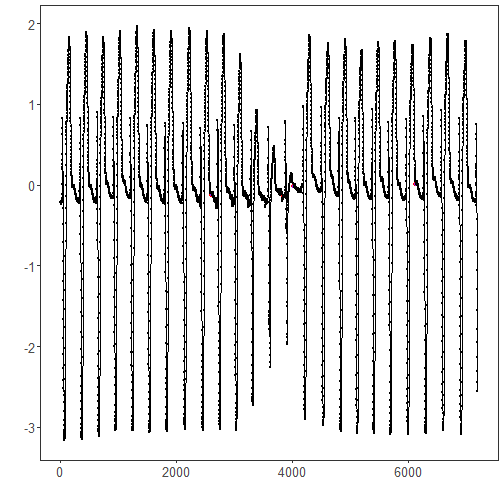

``` r
library(ggplot2)
library(RColorBrewer)
library(daltoolbox)
library(harbinger)
source("https://raw.githubusercontent.com/eogasawara/TSED/refs/heads/main/code/header.R")
```
## Theoretical Overview
Matrix Profile (MP) provides an efficient way to compute nearest-neighbor distances between all subsequences in a series. Discords are subsequences with large MP distances (weak nearest neighbors), making them good candidates for anomalies.
## Example Overview and Goals
We load an ECG-like example, configure a discord detector using MP with STAMP, fit it, run detection, print the detected discord indices, and plot the results.
### Knitr Options
Keep output clean and reproducible.

### Setup and Libraries
Load project helpers and required packages.

``` r
library(ggplot2)
library(RColorBrewer)
library(daltoolbox)
library(harbinger)
source("https://raw.githubusercontent.com/eogasawara/TSED/refs/heads/main/code/header.R")
```
### Data
Load the motif/discord example series.

``` r
data(examples_motifs)
```
### Model, Fit, and Detect
Configure the Matrix Profile discord detector and run detection on the full series.

``` r
data <- examples_motifs$mitdb102
rownames(data) <- 1:nrow(data)
data$event <- FALSE
# hdis_mp parameters:
# - mode = "stamp": randomized algorithm suitable for large series
# - w = 25: subsequence window size
# - qtd = 10: number of discords to return
model <- fit(hdis_mp(mode = "stamp", w = 25, qtd = 10), data$serie)
detection <- detect(model, data$serie)
print(detection[detection$event, ])  # show detected discord indices
```

```
##       idx event  type seq seqlen
## 2602 2602  TRUE motif   1     25
## 3844 3844  TRUE motif   1     25
## 4017 4017  TRUE motif   1     25
## 6135 6135  TRUE motif   1     25
```
### Visualization and Output
Plot the series with detected discords and save the figure.

``` r
grf <- har_plot(model, data$serie, detection) + font
#save_png(grf, "figures/chap5_discords_mp.png", 1280, 720)
grf
```


## References
* Yeh, C.-C. M., et al. (2016). Matrix Profile I: All Pairs Similarity Joins for Time Series.
* Ogasawara, E., Salles, R., Porto, F., Pacitti, E. Event Detection in Time Series. Springer, 2025. doi:10.1007/978-3-031-75941-3.
