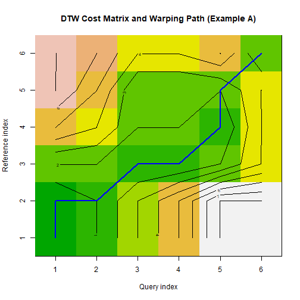
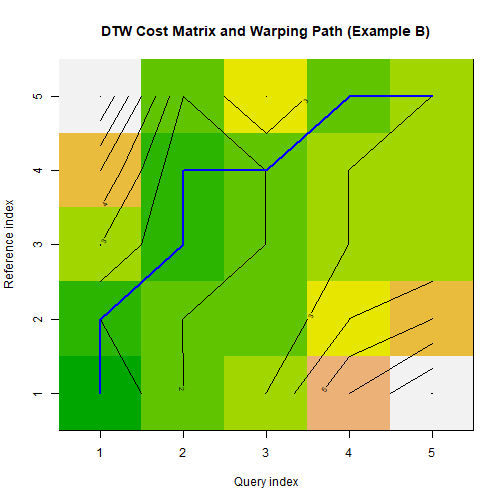

``` r
library(dtw)
```
## Theoretical Overview
Dynamic Time Warping (DTW) measures similarity between two time series that may vary in speed or be locally misaligned. It finds an optimal alignment path that minimizes cumulative distance under allowed warping, returning both the cost (overall distance) and the index mapping between the two sequences.
## Example Overview and Goals
We build two small examples to illustrate how DTW aligns sequences, how to access the alignment path, and how to interpret the cost matrix and summary distance. The goal is to provide an intuitive understanding of the tool rather than a full event-detection workflow.
### Knitr Options
Make chunk output reproducible and easy to read.

### Setup and Libraries
Load the DTW implementation used in both examples.

``` r
library(dtw)
```
## Example A: Simple Local Misalignment
Define two short sequences with a mild out-of-sync pattern and compute the DTW alignment.

``` r
# Define two short sequences
t1 <- c(1, 2, 3, 3, 4, 1)
t2 <- c(1, 1, 3, 4, 3, 1)
# Compute alignment using standard dynamic programming
# - keep = TRUE stores costMatrix and index mapping for inspection
alignment_a <- dtw(t1, t2, keep = TRUE)
# The cost matrix accumulates local distances along all possible paths
cost_a <- alignment_a$costMatrix
# Overall DTW distance (lower implies better alignment)
alignment_a$distance
```

```
## [1] 2
```

``` r
# Index mappings along the optimal warping path
# - index1: positions in t1
# - index2: matched positions in t2
alignment_a$index1
```

```
## [1] 1 1 2 3 4 5 5 6
```

``` r
alignment_a$index2
```

```
## [1] 1 2 2 3 3 4 5 6
```

``` r
# Visualize the warping path over the cost matrix
plot(alignment_a, type = "density", main = "DTW Cost Matrix and Warping Path (Example A)")
```


## Example B: Another Pair with Different Local Variations
Repeat with a second pair to contrast path and distance behavior.

``` r
# Define a second pair with different local variations
t1 <- c(1, 3, 2, 4, 3)
t2 <- c(1, 2, 3, 3, 4)
# Compute alignment and inspect key outputs again
alignment_b <- dtw(t1, t2, keep = TRUE)
alignment_b$distance
```

```
## [1] 3
```

``` r
alignment_b$index1
```

```
## [1] 1 1 2 2 3 4 5
```

``` r
alignment_b$index2
```

```
## [1] 1 2 3 4 4 5 5
```

``` r
plot(alignment_b, type = "density", main = "DTW Cost Matrix and Warping Path (Example B)")
```


## References
* General: Box, G. E. P. & Jenkins, G. (1970). Time Series Analysis.
* Ogasawara, E., Salles, R., Porto, F., Pacitti, E. Event Detection in Time Series. Springer, 2025. doi:10.1007/978-3-031-75941-3.
