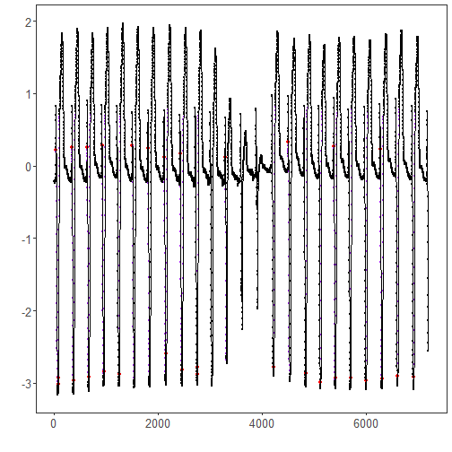

``` r
library(ggplot2)
library(RColorBrewer)
library(daltoolbox)
library(harbinger)
source("https://raw.githubusercontent.com/eogasawara/TSED/refs/heads/main/code/header.R")
```
## Theoretical Overview
Matrix Profile (MP) enables fast nearest-neighbor search across all subsequences. Motifs are highly repeated patterns corresponding to low MP distances. MP can be computed with algorithms such as STAMP/STOMP.
## Example Overview and Goals
We load an ECG-like series, configure a motif detector using MP with STAMP, fit it, run detection, print discovered motifs, and plot results.
### Knitr Options
Keep output clean and reproducible.

### Setup and Libraries
Load helpers and packages.

``` r
library(ggplot2)
library(RColorBrewer)
library(daltoolbox)
library(harbinger)
source("https://raw.githubusercontent.com/eogasawara/TSED/refs/heads/main/code/header.R")
```
### Data
Load example series.

``` r
data(examples_motifs)
data <- examples_motifs$mitdb102
rownames(data) <- 1:nrow(data)
data$event <- FALSE
```
### Model, Fit, and Detect
Configure MP-based motif detector and run detection.

``` r
# hmo_mp parameters:
# - mode = "stamp": randomized MP algorithm
# - w = 25: window size
# - qtd = 10: number of motifs to return
model <- fit(hmo_mp(mode = "stamp", w = 25, qtd = 10), data$serie)
detection <- detect(model, data$serie)
print(detection[detection$event, ])
```

```
##       idx event  type seq seqlen
## 34     34  TRUE motif   3     25
## 75     75  TRUE motif   2     25
## 76     76  TRUE motif   1     25
## 335   335  TRUE motif   3     25
## 376   376  TRUE motif   2     25
## 630   630  TRUE motif   3     25
## 671   671  TRUE motif   1     25
## 918   918  TRUE motif   3     25
## 958   958  TRUE motif   1     25
## 1251 1251  TRUE motif   2     25
## 1504 1504  TRUE motif   3     25
## 1803 1803  TRUE motif   3     25
## 2115 2115  TRUE motif   3     25
## 2160 2160  TRUE motif   1     25
## 2423 2423  TRUE motif   3     25
## 2466 2466  TRUE motif   2     25
## 2757 2757  TRUE motif   2     25
## 2758 2758  TRUE motif   1     25
## 3291 3291  TRUE motif   3     25
## 4232 4232  TRUE motif   2     25
## 4506 4506  TRUE motif   3     25
## 4851 4851  TRUE motif   2     25
## 5133 5133  TRUE motif   1     25
## 5382 5382  TRUE motif   3     25
## 5422 5422  TRUE motif   1     25
## 5711 5711  TRUE motif   2     25
## 6013 6013  TRUE motif   2     25
## 6278 6278  TRUE motif   3     25
## 6319 6319  TRUE motif   2     25
## 6619 6619  TRUE motif   2     25
## 6929 6929  TRUE motif   2     25
```
### Visualization and Output
Plot the series with detected motifs and save the figure.

``` r
grf <- har_plot(model, data$serie, detection) + font
#save_png(grf, "figures/chap5_motifs_mp.png", 1280, 720)
grf
```


## References
* Yeh, C.-C. M., et al. (2016). Matrix Profile I: All Pairs Similarity Joins for Time Series.
* Ogasawara, E., Salles, R., Porto, F., Pacitti, E. Event Detection in Time Series. Springer, 2025. doi:10.1007/978-3-031-75941-3.
