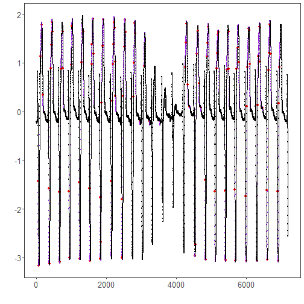

``` r
library(ggplot2)
library(RColorBrewer)
library(daltoolbox)
library(harbinger)
source("https://raw.githubusercontent.com/eogasawara/TSED/refs/heads/main/code/header.R")
```
## Theoretical Overview
SAX (Symbolic Aggregate approXimation) maps PAA-compressed values to symbols using normal-distribution breakpoints. Recurrent symbolic patterns correspond to motifs; identifying them in SAX space is efficient and robust to noise.
## Example Overview and Goals
We load an ECG-like series, configure a SAX-based motif detector, fit it, run detection, and visualize motifs.
### Knitr Options
Keep output clean and reproducible.

### Setup and Libraries
Load helpers and packages.

``` r
library(ggplot2)
library(RColorBrewer)
library(daltoolbox)
library(harbinger)
source("https://raw.githubusercontent.com/eogasawara/TSED/refs/heads/main/code/header.R")
```
### Data
Load example series.

``` r
data(examples_motifs)
data <- examples_motifs$mitdb102
rownames(data) <- 1:nrow(data)
data$event <- FALSE
```
### Model, Fit, and Detect
Configure SAX-based motif detector and run detection.

``` r
# hmo_sax parameters (typical):
# - alphabet size (e.g., 26 symbols)
# - window size (e.g., 25)
model <- hmo_sax(26, 25)
model <- fit(model, data$serie)
detection <- detect(model, data$serie)
print(detection[detection$event, ])
```

```
##       idx event  type                       seq seqlen
## 47     47  TRUE motif CCCCCBBBBBBAAAAAAAAAAAAAA     25
## 65     65  TRUE motif AAAAAAAAAAABBBBCCCCCDDDDD     25
## 118   118  TRUE motif WWWWWWWWXXXXXXXXXYYYYYYYY     25
## 144   144  TRUE motif ZZZZZZZZZZZZZYYYYXXXXXWWW     25
## 183   183  TRUE motif SSSSSSRRRRQQQPPPPOOOOOONN     25
## 349   349  TRUE motif CCCCCBBBBBAAAAAAAAAAAAAAA     25
## 366   366  TRUE motif AAAAAAAAAAABBBBCCCCCDDDDD     25
## 406   406  TRUE motif VVVVVVVVWWWWWWWWWWXXXXXXX     25
## 425   425  TRUE motif XXXXXXYYYYYYYZZZZZZZZZZZZ     25
## 442   442  TRUE motif ZZZZZZZZZZZZZYYYYXXXXWWWW     25
## 457   457  TRUE motif YYXXXXWWWWVVVUUUUUTTTTTSS     25
## 644   644  TRUE motif CCCCCBBBBBBAAAAAAAAAAAAAA     25
## 661   661  TRUE motif AAAAAAAAAABBBBBCCCCDDDDDD     25
## 701   701  TRUE motif VVVVVVVVWWWWWWWWWWXXXXXXX     25
## 748   748  TRUE motif YYYXXXXWWWWVVVUUUUTTTTTSS     25
## 761   761  TRUE motif VUUUUTTTTTSSSSSSRRRRRQQQQ     25
## 932   932  TRUE motif CCCCCCBBBBBBBAAAAAAAAAAAA     25
## 947   947  TRUE motif AAAAAAAAAABBBBBCCCCCDDDDD     25
## 991   991  TRUE motif VVVVVWWWWWWWWXXXXXXXXYYYY     25
## 1018 1018  TRUE motif ZZZZZZZZZZZZZZZZZZYYYYXXX     25
## 1224 1224  TRUE motif CCCCCCBBBBBBBAAAAAAAAAAAA     25
## 1241 1241  TRUE motif AAAAAAAAABBBBBCCCCCCDDDDD     25
## 1286 1286  TRUE motif VVVWWWWWWWXXXXXXXYYYYYZZZ     25
## 1333 1333  TRUE motif YYXXXXWWWWVVVUUUUUTTTTTSS     25
## 1518 1518  TRUE motif CCCCCBBBBBBAAAAAAAAAAAAAA     25
## 1535 1535  TRUE motif AAAAAAAAABBBBBCCCCCCDDDDD     25
## 1578 1578  TRUE motif VVVVWWWWWWWXXXXXXXXYYYYYY     25
## 1591 1591  TRUE motif XXXXXXYYYYYYZZZZZZZZZZZZZ     25
## 1610 1610  TRUE motif ZZZZZZZZZZZZZYYYYXXXXWWWW     25
## 1633 1633  TRUE motif WWVVVVUUUUUTTTTTTSSSSSSRR     25
## 1818 1818  TRUE motif CCCCCBBBBBBAAAAAAAAAAAAAA     25
## 1833 1833  TRUE motif AAAAAAAAAABBBBBBCCCCCDDDD     25
## 1846 1846  TRUE motif BBBCCCCCDDDDDDEKPRSTTTUUU     25
## 1863 1863  TRUE motif RSTTTUUUUUUVVVVVVVVWWWWWW     25
## 1889 1889  TRUE motif XXXXXXYYYYYYYZZZZZZZZZZZZ     25
## 1909 1909  TRUE motif ZZZZZZZZZZZZZYYYYXXXXWWWW     25
## 2128 2128  TRUE motif CCCCCCBBBBBBBBBAAAAAAAAAA     25
## 2177 2177  TRUE motif STTTUUUUUUVVVVVVVWWWWWWWX     25
## 2190 2190  TRUE motif VVVVWWWWWWWXXXXXXXXYYYYYY     25
## 2203 2203  TRUE motif XXXXXXYYYYYYZZZZZZZZZZZZZ     25
## 2219 2219  TRUE motif ZZZZZZZZZZZZZZZZZZYYYYXXX     25
## 2237 2237  TRUE motif YYYYXXXXXWWWWVVVVUUUUTTTT     25
## 2250 2250  TRUE motif VVVVUUUUTTTTTTSSSSSSSRRRR     25
## 2265 2265  TRUE motif SSSSSSRRRRQQQPPPPOOOOOONN     25
## 2438 2438  TRUE motif CCCCCCBBBBBBBBBAAAAAAAAAA     25
## 2455 2455  TRUE motif AAAAAAAAAABBBBBCCCCCDDDDD     25
## 2485 2485  TRUE motif STTTUUUUUUVVVVVVVWWWWWWWX     25
## 2509 2509  TRUE motif XXXXXXYYYYYYZZZZZZZZZZZZZ     25
## 2527 2527  TRUE motif ZZZZZZZZZZZZZYYYYXXXXWWWW     25
## 2542 2542  TRUE motif YYXXXXWWWWVVVVUUUTTTTTTSS     25
## 2776 2776  TRUE motif STTTUUUUUUVVVVVVVWWWWWWWX     25
## 2790 2790  TRUE motif VVVWWWWWWWXXXXXXXYYYYYZZZ     25
## 2815 2815  TRUE motif ZZZZZZZZZZZZZYYYYXXXXWWWW     25
## 2830 2830  TRUE motif YYXXXXWWWWVVVVUUUTTTTTTSS     25
## 2966 2966  TRUE motif EEEEEEEEEEEEEEEEEEEEEEEEE     25
## 3079 3079  TRUE motif VVVVVWWWWWWWWXXXXXXXXYYYY     25
## 3240 3240  TRUE motif EEEEEEEEEEEEEEEEEEEEEEEEE     25
## 3532 3532  TRUE motif EEEEEEEEEEEEEEEEEEEEEEEEE     25
## 4259 4259  TRUE motif VVVVVVWWWWWWWWWWWWXXXXXXX     25
## 4281 4281  TRUE motif XXXXXXYYYYYYYZZZZZZZZZZZZ     25
## 4299 4299  TRUE motif ZZZZZZZZZZZZYYYYYXXXXXWWW     25
## 4336 4336  TRUE motif TTTTTTSSSSSSSSSRRRRRRRRRR     25
## 4388 4388  TRUE motif QQQQQQQQQQQQQQQQQQQQQQQPP     25
## 4536 4536  TRUE motif AAAAAAAAAABBBBBBCCCCCDDDD     25
## 4549 4549  TRUE motif BBBCCCCCDDDDDDEKPRSTTTUUU     25
## 4590 4590  TRUE motif WWWWWWWWXXXXXXXXXXXXXYYYY     25
## 4631 4631  TRUE motif YYYYXXXXXWWWWVVVVUUUUTTTT     25
## 4652 4652  TRUE motif TTTTTTSSSSSSSSSRRRRRRRRRR     25
## 4702 4702  TRUE motif QQQQQQQQQQPPPPPOOOOOOONNN     25
## 4823 4823  TRUE motif CCCCCCBBBBBBBAAAAAAAAAAAA     25
## 4840 4840  TRUE motif AAAAAAAAAABBBBBCCCCCDDDDD     25
## 4885 4885  TRUE motif WWWWWWWWXXXXXXXXXXXXXYYYY     25
## 4898 4898  TRUE motif XXXXXXXXYYYYYYYYYZZZZZZZZ     25
## 4915 4915  TRUE motif ZZZZZZZZZZZZYYYYYXXXXXWWW     25
## 5109 5109  TRUE motif CCCCCBBBBBAAAAAAAAAAAAAAA     25
## 5162 5162  TRUE motif VVVVVVVVWWWWWWWWWWXXXXXXX     25
## 5175 5175  TRUE motif WWWWWXXXXXXXXXXYYYYYYYYYY     25
## 5192 5192  TRUE motif YYYYYYYYYYYYYYYYYXXXXXWWW     25
## 5205 5205  TRUE motif YYYYXXXXXWWWWVVVVUUUUTTTT     25
## 5396 5396  TRUE motif CCCCCBBBBBAAAAAAAAAAAAAAA     25
## 5412 5412  TRUE motif AAAAAAAAAABBBBBCCCCDDDDDD     25
## 5450 5450  TRUE motif VVVVVVVVWWWWWWWWWWXXXXXXX     25
## 5498 5498  TRUE motif YYYXXXXWWWWVVVUUUUTTTTTSS     25
## 5511 5511  TRUE motif VUUUUTTTTTSSSSSSRRRRRQQQQ     25
## 5685 5685  TRUE motif CCCCCBBBBBBAAAAAAAAAAAAAA     25
## 5701 5701  TRUE motif AAAAAAAAAABBBBBCCCCCDDDDD     25
## 5738 5738  TRUE motif VVVVVVVVWWWWWWWWWWXXXXXXX     25
## 5756 5756  TRUE motif XXXXXXXXYYYYYYYYYZZZZZZZZ     25
## 5800 5800  TRUE motif VVVUUUUTTTTTSSSSSRRRRRQQQ     25
## 5987 5987  TRUE motif CCCCCBBBBBBAAAAAAAAAAAAAA     25
## 6003 6003  TRUE motif AAAAAAAAAAABBBBCCCCCDDDDD     25
## 6030 6030  TRUE motif RSTTTUUUUUUVVVVVVVVVVWWWW     25
## 6043 6043  TRUE motif VVVVVVVVWWWWWWWWWWXXXXXXX     25
## 6078 6078  TRUE motif YYYYYYYYYYYYYYYYYXXXXXWWW     25
## 6091 6091  TRUE motif YYYYXXXXXWWWWVVVVUUUUTTTT     25
## 6105 6105  TRUE motif VVVUUUUTTTTTSSSSSRRRRRQQQ     25
## 6309 6309  TRUE motif AAAAAAAAAABBBBBCCCCCDDDDD     25
## 6337 6337  TRUE motif RSTTTUUUUUUVVVVVVVVVVWWWW     25
## 6359 6359  TRUE motif WWWWWWWWXXXXXXXXXYYYYYYYY     25
## 6386 6386  TRUE motif ZZZZZZZZZZZZZYYYYXXXXXWWW     25
## 6399 6399  TRUE motif YYYYXXXXXWWWWVVVVUUUUTTTT     25
## 6412 6412  TRUE motif VVVVUUUUTTTTTTSSSSSSSRRRR     25
## 6459 6459  TRUE motif QQQQQQQQQQQQQQQQQQQQQQQPP     25
## 6472 6472  TRUE motif QQQQQQQQQQPPPPPOOOOOOONNN     25
## 6594 6594  TRUE motif CCCCCBBBBBBAAAAAAAAAAAAAA     25
## 6609 6609  TRUE motif AAAAAAAAAABBBBBCCCCCDDDDD     25
## 6645 6645  TRUE motif VVVVVVVVWWWWWWWWWWXXXXXXX     25
## 6658 6658  TRUE motif WWWWWXXXXXXXXXXYYYYYYYYYY     25
## 6686 6686  TRUE motif ZZZZZZZZZZZZYYYYYXXXXXWWW     25
## 6709 6709  TRUE motif WWVVVVUUUUUTTTTTTSSSSSSRR     25
## 6903 6903  TRUE motif CCCCCBBBBBBAAAAAAAAAAAAAA     25
## 6919 6919  TRUE motif AAAAAAAAAABBBBBCCCCCDDDDD     25
## 6946 6946  TRUE motif RSTTTUUUUUUVVVVVVVVWWWWWW     25
## 6959 6959  TRUE motif VVVVVVWWWWWWWWWWWWXXXXXXX     25
```
### Visualization and Output
Plot the series with detected motifs and save the figure.

``` r
grf <- har_plot(model, data$serie, detection) + font
#save_png(grf, "figures/chap5_motifs_sax.png", 1280, 720)
grf
```


## References
* Yeh, C.-C. M., et al. (2016). Matrix Profile I: All Pairs Similarity Joins for Time Series.
* Ogasawara, E., Salles, R., Porto, F., Pacitti, E. Event Detection in Time Series. Springer, 2025. doi:10.1007/978-3-031-75941-3.
