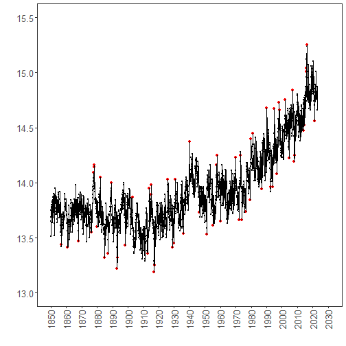

``` r
library(ggplot2)
library(RColorBrewer)
library(daltoolbox)
library(harbinger)
library(gifski)
library(magick)
source("https://raw.githubusercontent.com/eogasawara/TSED/refs/heads/main/code/header.R")
```
## Theoretical Overview
This chapter demonstrates online (streaming) event detection: updating a detector as new observations arrive and visualizing detections frame by frame through time.
## Example Overview and Goals
We iterate year by year over a monthly global-temperature series, fit an online-capable detector using data available up to the current year, run detection, save a plot for each year, and assemble the frames into an animated GIF.
### Knitr Options
Keep the notebook clean and reproducible.

### Setup and Libraries
Load helper utilities and packages used in this chapter.

``` r
# Project helper: defines plot theme object `font` and helper `save_png()`
# Sourced remotely to keep examples consistent across chapters.
# Data utilities
# Event detection for time series (Harbinger)
# GIF assembly for the animation
```
### Data Loading and Prep
Read the example dataset, extract the series, and add simple helper columns.

``` r
# Load example datasets bundled with Harbinger
data(examples_harbinger)
# Monthly global temperature example
monthly_data <- examples_harbinger$global_temperature_monthly
# Convenience columns for plotting and masking "future" observations
monthly_data$year  <- as.numeric(format(monthly_data$i, "%Y"))
monthly_data$event <- FALSE  # no labels available; kept for plotting API compatibility
```
### Generate Frames With Online Detection
For each year, fit an online-capable detector using only data up to that year,
run detection, plot the results, and save a PNG frame. These frames will later
be stitched into an animated GIF.

``` r
# Clean up any previously generated PNG frames in the figure directory
unlink("figure", recursive = TRUE)   # knitr default figure dir
# Create one frame per year using an online detector
for (i in 1851:2022) {
  # 1) Configure an online-capable detector
  model <- hanr_fbiad()
  # 2) Mask "future" values to emulate streaming data at year i
  data_i <- monthly_data
  data_i$serie[data_i$year > i] <- NA
  # 3) Fit the detector using only the observed (non-NA) portion
  model <- fit(model, data_i$serie)
  # 4) Run event detection on the same partially observed series
  detection <- detect(model, data_i$serie)
  # Attach context for plotting
  detection$year        <- i
  detection$temperature <- data_i$serie
  # 5) Plot detections up to the current year and save a frame
  grf <- har_plot(model, data_i$serie, detection, data_i$event, idx = data_i$i) +
    font +
    scale_x_date(breaks = "10 years",
                 date_labels = "%Y",
                 limits = c(as.Date("1850-01-01"), as.Date("2030-01-01"))) +
    scale_y_continuous(limits = c(13, 15.5)) +
    theme(axis.text.x = element_text(angle = 90, vjust = 0.5, hjust = 1))
  save_png(grf, file.path("figure", sprintf("%d.png", i)), 1280, 720)
}
```
### Visualize the Last Frame
Display the final frame from the loop for a quick static preview.

``` r
plot(grf)  # shows the most recently generated frame
```


### Build the Animation (GIF)
Collect the generated PNG frames and assemble them into an animated GIF, then
embed it in the document.

``` r
png_files <- list.files("figure", pattern = ".*\\.png$", full.names = TRUE)
png_files <- sort(png_files)  # ensure chronological order
output_gif <- "fig/chap6_online/chap6_online.gif"
gif <- gifski(png_files, gif_file = output_gif, width = 1280, height = 720, delay = 0.1)
# View gif at https://github.com/eogasawara/TSED/blob/main/examples/chapter6/fig/chap6_online/chap6_online.gif
```


``` r
unlink("fig/chap6_online/*.png", recursive = TRUE)
```

## References
- Box, G. E. P., & Jenkins, G. (1970). Time Series Analysis.
- Ogasawara, E., Salles, R., Porto, F., Pacitti, E. Event Detection in Time Series. Springer, 2025. doi:10.1007/978-3-031-75941-3.
- R packages: harbinger (time-series event detection), daltoolbox (data utilities), gifski (GIF encoding).
