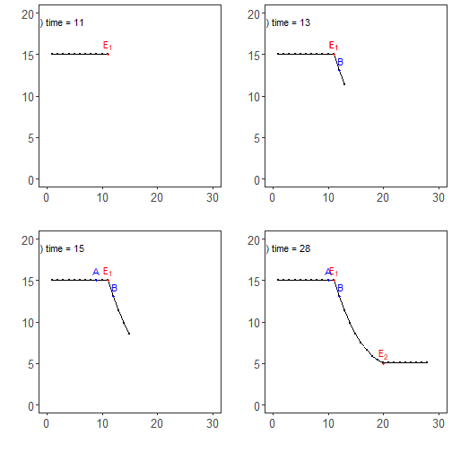

``` r
library(ggplot2)
library(RColorBrewer)
library(daltoolbox)
library(harbinger)
source("https://raw.githubusercontent.com/eogasawara/TSED/refs/heads/main/code/header.R")
```
## Theoretical Overview
This example focuses on visualizing evolving detections over time and introducing evaluation perspectives (e.g., ROC, soft overlaps, tolerance windows). The emphasis here is on how detections appear as the time index increases.
## Example Overview and Goals
We demonstrate a complete, reproducible workflow: setting up libraries, loading data, configuring a detector, fitting it, running detection, optionally evaluating, and visualizing the results.
### Knitr Options
Make output clean and reproducible.

### Setup and Libraries
Load project helpers and packages.

### Synthetic Series and Detection
Generate a simple synthetic series; fit and detect with Harbinger, then create stepwise visualizations to illustrate how detections build over time.

``` r
# Reproducibility
set.seed(1)
data_a <- function() {
  data <- NULL
  data <- c(data, rep(10, 10))                 # initial level
  data <- c(data, rev((seq(1, 10, 1)^2) / 10)) # descending curve
  data <- c(data, rep(0.1, 10))                # low tail
  return(data + 5)
}
# Build the synthetic series
data <- data_a()
# Fit a baseline Harbinger model
model <- fit(harbinger(), data)
```
### Event Detection
Run the detector to obtain event flags or scores.

``` r
detection <- detect(model, data)
```
### Other Steps
Additional supporting steps that glue the workflow.

``` r
event <- rep(FALSE, length(data))
grfA <- function(data, detection, event) {
  t <- 11
  i <- 1:t
  data <- data[i]
  detection <- detection[i,]
  event <- event[i]
  # Plot detections over the series
  grf <- har_plot(model, data, detection, event)
  grf <- grf + ylab(" ") + ylim(0, 20) + xlim(0, 30)
  grf <- grf + font 
  grf <- grf + ggplot2::annotate(geom="text", x=11, y=16.2, label="E[1]", color="red", parse=TRUE)
  grf <- grf + geom_point(aes(11, 15), colour = "red", size = 1)  
  grf <- grf + ggplot2::annotate(geom="text", x=2, y=19, label="(a) time = 11", color="black", parse=FALSE)
}
grfB <- function(data, detection, event) {
  t <- 13
  i <- 1:t
  data <- data[i]
  detection <- detection[i,]
  event <- event[i]
  grf <- har_plot(model, data, detection, event)
  grf <- grf + ylab(" ") + ylim(0, 20) + xlim(0, 30)
  grf <- grf + font 
  grf <- grf + ggplot2::annotate(geom="text", x=11, y=16.2, label="E[1]", color="red", parse=TRUE)
  grf <- grf + ggplot2::annotate(geom="text", x=11, y=16.2, label="E[1]", color="red", parse=TRUE)
  grf <- grf + ggplot2::annotate(geom="text", x=12.2, y=14.2, label="B", color="blue", parse=TRUE)
  grf <- grf + geom_point(aes(11, 15), colour = "red", size = 1)  
  grf <- grf + geom_point(aes(12, data[12]), colour = "blue", size = 1.25)  
  grf <- grf + ggplot2::annotate(geom="text", x=2, y=19, label="(b) time = 13", color="black", parse=FALSE)
}
grfC <- function(data, detection, event) {
  t <- 15
  i <- 1:t
  data <- data[i]
  detection <- detection[i,]
  event <- event[i]
  grf <- har_plot(model, data, detection, event)
  grf <- grf + ylab(" ") + ylim(0, 20) + xlim(0, 30)
  grf <- grf + font 
  grf <- grf + ggplot2::annotate(geom="text", x=11, y=16.2, label="E[1]", color="red", parse=TRUE)
  grf <- grf + ggplot2::annotate(geom="text", x=12.2, y=14.2, label="B", color="blue", parse=TRUE)
  grf <- grf + ggplot2::annotate(geom="text", x=9, y=16.2, label="A", color="blue", parse=TRUE)
  grf <- grf + geom_point(aes(11, 15), colour = "red", size = 1)  
  grf <- grf + geom_point(aes(9, 15), colour = "blue", size = 1.25)  
  grf <- grf + geom_point(aes(12, data[12]), colour = "blue", size = 1.25)  
  grf <- grf + ggplot2::annotate(geom="text", x=2, y=19, label="(c) time = 15", color="black", parse=FALSE)
}
grfD <- function(data, detection, event) {
  t <- 28
  i <- 1:t
  data <- data[i]
  detection <- detection[i,]
  event <- event[i]
  grf <- har_plot(model, data, detection, event)
  grf <- grf + ylab(" ") + ylim(0, 20) + xlim(0, 30)
  grf <- grf + font 
  grf <- grf + ggplot2::annotate(geom="text", x=11, y=16.2, label="E[1]", color="red", parse=TRUE)
  grf <- grf + ggplot2::annotate(geom="text", x=20, y=6.2, label="E[2]", color="red", parse=TRUE)
  grf <- grf + ggplot2::annotate(geom="text", x=12.2, y=14.2, label="B", color="blue", parse=TRUE)
  grf <- grf + ggplot2::annotate(geom="text", x=10, y=16.2, label="A", color="blue", parse=TRUE)
  grf <- grf + geom_point(aes(11, 15), colour = "red", size = 1)  
  grf <- grf + geom_point(aes(20, 5), colour = "red", size = 1)  
  grf <- grf + geom_point(aes(10, 15), colour = "blue", size = 1.25)  
  grf <- grf + geom_point(aes(12, data[12]), colour = "blue", size = 1.25)  
  grf <- grf + ggplot2::annotate(geom="text", x=2, y=19, label="(d) time = 28", color="black", parse=FALSE)
}
grfa <- grfA(data, detection, event)
grfb <- grfB(data, detection, event)
grfc <- grfC(data, detection, event)
grfd <- grfD(data, detection, event)
```
### Visualization and Output
Plot the series with detected events and optionally save figures. Combine ggplot layers in one chunk for clarity.

``` r
#mypng(file="figures/chap7_evaluation.png", width = 1600, height = 720)
gridExtra::grid.arrange(grfa, grfb, grfc, grfd, layout_matrix = matrix(c(1,2,3,4), byrow = TRUE, ncol = 2))
```



``` r
#dev.off()  
```
## References
* Fawcett, T. (2006). An introduction to ROC analysis.
* Ogasawara, E., Salles, R., Porto, F., Pacitti, E. Event Detection in Time Series. Springer, 2025. doi:10.1007/978-3-031-75941-3.
