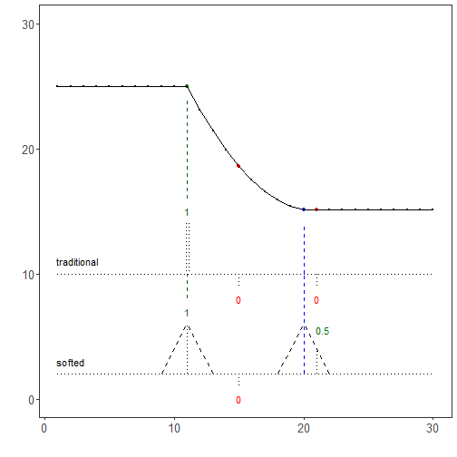

``` r
library(ggplot2)
library(RColorBrewer)
library(daltoolbox)
library(harbinger)
source("https://raw.githubusercontent.com/eogasawara/TSED/refs/heads/main/code/header.R")
```
## Theoretical Overview
This chapter illustrates soft evaluation: assigning partial credit to detections within a tolerance interval around the true event time, and visualizing how traditional (binary) vs. soft scoring differ.
## Example Overview and Goals
We demonstrate a complete, reproducible workflow: setting up libraries, loading data, configuring a detector, fitting it, running detection, optionally evaluating, and visualizing the results.
### Knitr Options
Make output clean and reproducible.

### Setup and Libraries
Load project helpers and packages.

``` r
# Project helper: plot theme `font` and utility `save_png()`
```
### Setup and Libraries
Short rationale for the libraries and any project-specific sources.

### Data and Model
Create a synthetic series and fit a baseline Harbinger model to illustrate the
difference between traditional (binary) and soft evaluation.

``` r
# Reproducibility
set.seed(1)
data_a <- function() {
  data <- NULL
  data <- c(data, rep(10, 10))                 # initial level
  data <- c(data, rev((seq(1, 10, 1)^2) / 10)) # descending curve
  data <- c(data, rep(0.1, 10))                # low tail
  return(data + 15)                             # shift for plotting
}
a <- data_a()
# Fit a Harbinger model using the series
model <- fit(harbinger(), a)
```
### Event Detection
Run the detector to obtain event flags or scores.

``` r
detection <- detect(model, a)
```
### Labeling and Plot Setup
Mark detected events (for illustration) and define the ground-truth labels to
contrast traditional vs. soft credit within a tolerance window.

``` r
detection$event[c(11,15,21)] <- TRUE
detection$type[c(11,15,21)] <- "anomaly"
event <- rep(FALSE, length(a))
event[c(11,20)] <- TRUE
# Plot detections over the series
```
### Visualization and Output
Plot the series with detected events and optionally save figures. Combine ggplot layers in one chunk for clarity.

``` r
grf <- har_plot(model, a, detection, event, colors=c("darkgreen", "blue", "red", "purple"))
grf <- grf + ylab(" ") + ylim(0, 30)
grf <- grf + geom_segment(aes(x = 9, y = 2, xend = 11, yend = 6), col="black", linewidth = 0.25, linetype="dashed")
grf <- grf + geom_segment(aes(x = 13, y = 2, xend = 11, yend = 6), col="black", linewidth = 0.25, linetype="dashed")
grf <- grf + geom_segment(aes(x = 11, y = 2, xend = 11, yend = 6), col="black", linewidth = 0.125, linetype="dotted")
grf <- grf + geom_segment(aes(x = 18, y = 2, xend = 20, yend = 6), col="black", linewidth = 0.25, linetype="dashed")
grf <- grf + geom_segment(aes(x = 22, y = 2, xend = 20, yend = 6), col="black", linewidth = 0.25, linetype="dashed")
grf <- grf + geom_segment(aes(x = 1, y = 10, xend = 30, yend = 10), col="black", linewidth = 0.125, linetype="dotted")
grf <- grf + geom_segment(aes(x = 10.9, y = 14, xend = 10.9, yend = 10), col="black", linewidth = 0.125, linetype="dotted")
grf <- grf + geom_segment(aes(x = 11.1, y = 14, xend = 11.1, yend = 10), col="black", linewidth = 0.125, linetype="dotted")
grf <- grf + geom_segment(aes(x = 10.9, y = 14, xend = 11.1, yend = 14), col="black", linewidth = 0.125, linetype="dotted")
grf <- grf + geom_segment(aes(x = 15, y = 10, xend = 15, yend = 9), col="black", linewidth = 0.125, linetype="dotted")
grf <- grf + geom_segment(aes(x = 21, y = 10, xend = 21, yend = 9), col="black", linewidth = 0.125, linetype="dotted")
grf <- grf + ggplot2::annotate(geom="text", x=11, y=15, label="1", color="darkgreen")
grf <- grf + ggplot2::annotate(geom="text", x=15, y=8, label="0", color="red")
grf <- grf + ggplot2::annotate(geom="text", x=21, y=8, label="0", color="red")
grf <- grf + ggplot2::annotate(geom="text", x=2.5, y=11, label="traditional", color="black")
grf <- grf + geom_segment(aes(x = 21, y = 2, xend = 21, yend = 4), col="black", linewidth = 0.125, linetype="dotted")
grf <- grf + geom_segment(aes(x = 15, y = 2, xend = 15, yend = 1), col="black", linewidth = 0.125, linetype="dotted")
grf <- grf + geom_segment(aes(x = 1, y = 2, xend = 30, yend = 2), col="black", linewidth = 0.125, linetype="dotted")
grf <- grf + ggplot2::annotate(geom="text", x=11, y=7, label="1", color="darkgreen")
grf <- grf + ggplot2::annotate(geom="text", x=15, y=0, label="0", color="red")
grf <- grf + ggplot2::annotate(geom="text", x=21.5, y=5.5, label="0.5", color="darkgreen")
grf <- grf + ggplot2::annotate(geom="text", x=2, y=3, label="softed", color="black")
grf <- grf + geom_segment(aes(x = 11, y = 16, xend = 11, yend = 24), col="darkgreen", linewidth = 0.125, linetype="dashed")
grf <- grf + geom_segment(aes(x = 20, y = 10, xend = 20, yend = 14), col="blue", linewidth = 0.125, linetype="dashed")
grf <- grf + geom_segment(aes(x = 11, y = 8, xend = 11, yend = 10), col="darkgreen", linewidth = 0.125, linetype="dashed")
grf <- grf + geom_segment(aes(x = 20, y = 2, xend = 20, yend = 10), col="blue", linewidth = 0.125, linetype="dashed")
grf <- grf + font 
```
### Visualization and Output
Plot the series with detected events and optionally save figures. Combine ggplot layers in one chunk for clarity.

``` r
#save_png(grf, "figures/chap7_soft_evaluation.png", 1280, 720)
grf
```


## References
* Fawcett, T. (2006). An introduction to ROC analysis.
* Ogasawara, E., Salles, R., Porto, F., Pacitti, E. Event Detection in Time Series. Springer, 2025. doi:10.1007/978-3-031-75941-3.
