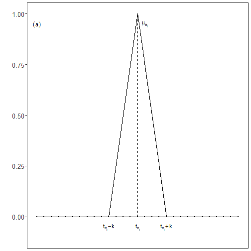
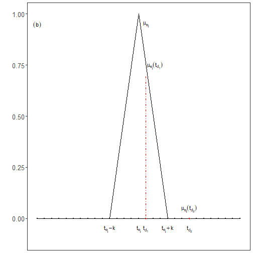
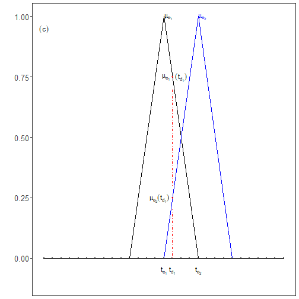
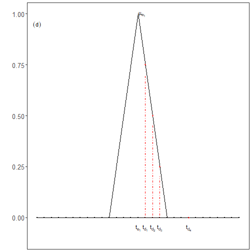
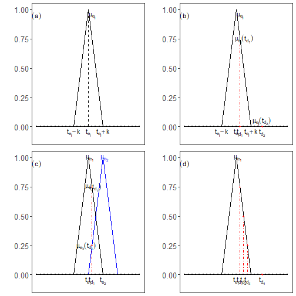

``` r
library(ggplot2)
library(RColorBrewer)
library(harbinger)
source("https://raw.githubusercontent.com/eogasawara/TSED/refs/heads/main/code/header.R")
```
## Theoretical Overview
Soft evaluation considers temporal tolerance around event times instead of strict point matches. It assigns partial credit within a window (e.g., via a triangular membership centered at the event), better reflecting near-miss detections.
## Example Overview and Goals
We demonstrate a complete, reproducible workflow: setting up libraries, loading data, configuring a detector, fitting it, running detection, optionally evaluating, and visualizing the results.
### Knitr Options
Make output clean and reproducible.

### Setup and Libraries
Short rationale for the libraries and any project-specific sources.

``` r
# Project helper: plot theme `font` and utility `save_png()`
# Harbinger is used to provide the plotting helper `har_plot()`
```
### Other Steps
Additional supporting steps that glue the workflow.

``` r
set.seed(1)
data_a <- function(offset=0) {
  data <- NULL
  data <- c(data, rep(0, 29)) 
  return(data)
}
```

``` r
grfa <- function(data) {
  model <- fit(harbinger(), data)
# Run event detection
  detection <- detect(model, data)
  event <- rep(FALSE, length(data))
# Plot detections over the series
  grf <- har_plot(model, data, detection, event)
  grf <- grf + ylab(" ") + ylim(-0.1, 1.0)
  grf <- grf + font 
  grf <- grf + ggplot2::annotate(geom="text", x=16, y=0.95, label="mu[e[j]]", color="black", parse=TRUE)
  grf <- grf + ggplot2::annotate(geom="text", x=15, y=-0.05, label="t[e[j]]", color="black", parse=TRUE)
  grf <- grf + ggplot2::annotate(geom="text", x=11, y=-0.05, label="t[e[j]]-k", color="black", parse=TRUE)
  grf <- grf + ggplot2::annotate(geom="text", x=19, y=-0.05, label="t[e[j]]+k", color="black", parse=TRUE)
  grf <- grf + geom_segment(aes(x = 11, y = 0, xend = 15, yend = 1), col="black", linewidth = 0.125, linetype="solid")
  grf <- grf + geom_segment(aes(x = 15, y = 0, xend = 15, yend = 1), col="black", linewidth = 0.125, linetype="dashed")
  grf <- grf + geom_segment(aes(x = 19, y = 0, xend = 15, yend = 1), col="black", linewidth = 0.125, linetype="solid")
  grf <- grf + theme(axis.title.x=element_blank(), axis.text.x=element_blank(), axis.ticks.x=element_blank())
  grf <- grf + ggplot2::annotate(geom="text", x=1, y=0.95, label="(a)", color="black", parse=TRUE)
  return(grf)
}
```
### Event Detection
Run the detector to obtain event flags or scores.

``` r
grfb <- function(data) {
  model <- fit(harbinger(), data)
  detection <- detect(model, data)
  event <- rep(FALSE, length(data))
  grf <- har_plot(model, data, detection, event)
  grf <- grf + ylab(" ") + ylim(-0.1, 1.0)
  grf <- grf + font 
  grf <- grf + ggplot2::annotate(geom="text", x=15, y=-0.05, label="t[e[j]]", color="black", parse=TRUE)
  grf <- grf + ggplot2::annotate(geom="text", x=11, y=-0.05, label="t[e[j]]-k", color="black", parse=TRUE)
  grf <- grf + ggplot2::annotate(geom="text", x=19, y=-0.05, label="t[e[j]]+k", color="black", parse=TRUE)
  grf <- grf + theme(axis.title.x=element_blank(), axis.text.x=element_blank(), axis.ticks.x=element_blank())
  grf <- grf + geom_segment(aes(x = 16, y = 0, xend = 16, yend = 0.70), col="red", linewidth = 0.125, linetype="dotdash")
  grf <- grf + ggplot2::annotate(geom="text", x=16, y=0.95, label="mu[e[j]]", color="black", parse=TRUE)
  grf <- grf + ggplot2::annotate(geom="text", x=22, y=0.05, label="mu[e[j]](t[d[2]])", color="black", parse=TRUE)
  grf <- grf + ggplot2::annotate(geom="text", x=17.25, y=0.75, label="mu[e[j]](t[d[1]])", color="black", parse=TRUE)
  grf <- grf + ggplot2::annotate(geom="text", x=16, y=-0.05, label="t[d[1]]", color="black", parse=TRUE)
  grf <- grf + ggplot2::annotate(geom="text", x=22, y=-0.05, label="t[d[2]]", color="black", parse=TRUE)
  grf <- grf + geom_segment(aes(x = 11, y = 0, xend = 15, yend = 1), col="black", linewidth = 0.125, linetype="solid")
  grf <- grf + geom_segment(aes(x = 19, y = 0, xend = 15, yend = 1), col="black", linewidth = 0.125, linetype="solid")
  grf <- grf + geom_point(aes(16, 0), colour = "red", size = 1)  
  grf <- grf + geom_point(aes(22, 0), colour = "red", size = 1)  
  grf <- grf + ggplot2::annotate(geom="text", x=1, y=0.95, label="(b)", color="black", parse=TRUE)
  return(grf)
}
```
### Event Detection
Run the detector to obtain event flags or scores.

``` r
grfc <- function(data) {
  model <- fit(harbinger(), data)
  detection <- detect(model, data)
  event <- rep(FALSE, length(data))
  grf <- har_plot(model, data, detection, event)
  grf <- grf + ylab(" ") + ylim(-0.1, 1.0)
  grf <- grf + font 
  grf <- grf + ggplot2::annotate(geom="text", x=15, y=-0.05, label="t[e[1]]", color="black", parse=TRUE)
  grf <- grf + ggplot2::annotate(geom="text", x=15+4, y=-0.05, label="t[e[2]]", color="black", parse=TRUE)
  grf <- grf + theme(axis.title.x=element_blank(), axis.text.x=element_blank(), axis.ticks.x=element_blank())
  grf <- grf + geom_segment(aes(x = 16, y = 0.3, xend = 16, yend = 0.70), col="red", linewidth = 0.125, linetype="dotdash")
  grf <- grf + geom_segment(aes(x = 16, y = 0, xend = 16, yend = 0.20), col="red", linewidth = 0.125, linetype="dotdash")
  grf <- grf + geom_segment(aes(x = 11, y = 0, xend = 15, yend = 1), col="black", linewidth = 0.125, linetype="solid")
  grf <- grf + geom_segment(aes(x = 19, y = 0, xend = 15, yend = 1), col="black", linewidth = 0.125, linetype="solid")
  grf <- grf + geom_segment(aes(x = 11+4, y = 0, xend = 15+4, yend = 1), col="blue", linewidth = 0.125, linetype="solid")
  grf <- grf + geom_segment(aes(x = 19+4, y = 0, xend = 15+4, yend = 1), col="blue", linewidth = 0.125, linetype="solid")
  grf <- grf + ggplot2::annotate(geom="text", x=16, y=-0.05, label="t[d[1]]", color="black", parse=TRUE)
  grf <- grf + ggplot2::annotate(geom="text", x=15.5, y=1, label="mu[e[1]]", color="black", parse=TRUE)
  grf <- grf + ggplot2::annotate(geom="text", x=15.25, y=0.75, label="mu[e[1]]", color="black", parse=TRUE)
  grf <- grf + ggplot2::annotate(geom="text", x=17, y=0.75, label="(t[d[1]])", color="black", parse=TRUE)
  grf <- grf + ggplot2::annotate(geom="text", x=14.5, y=0.25, label="mu[e[2]](t[d[1]])", color="black", parse=TRUE)
  grf <- grf + ggplot2::annotate(geom="text", x=15.5+4, y=1, label="mu[e[2]]", color="blue", parse=TRUE)
  grf <- grf + geom_point(aes(16, 0.75), colour = "red", size = 1)  
  grf <- grf + geom_point(aes(16, 0.25), colour = "red", size = 1)  
  grf <- grf + ggplot2::annotate(geom="text", x=1, y=0.95, label="(c)", color="black", parse=TRUE)
  return(grf)
}
```
### Event Detection
Run the detector to obtain event flags or scores.

``` r
grfd <- function(data) {
  model <- fit(harbinger(), data)
  detection <- detect(model, data)
  event <- rep(FALSE, length(data))
  grf <- har_plot(model, data, detection, event)
  grf <- grf + ylab(" ") + ylim(-0.1, 1.0)
  grf <- grf + font 
  grf <- grf + ggplot2::annotate(geom="text", x=15, y=-0.05, label="t[e[1]]", color="black", parse=TRUE)
  grf <- grf + theme(axis.title.x=element_blank(), axis.text.x=element_blank(), axis.ticks.x=element_blank())
  grf <- grf + geom_segment(aes(x = 16, y = 0, xend = 16, yend = 0.70), col="red", linewidth = 0.125, linetype="dotdash")
  grf <- grf + geom_segment(aes(x = 17, y = 0, xend = 17, yend = 0.45), col="red", linewidth = 0.125, linetype="dotdash")
  grf <- grf + geom_segment(aes(x = 18, y = 0, xend = 18, yend = 0.20), col="red", linewidth = 0.125, linetype="dotdash")
  grf <- grf + geom_segment(aes(x = 11, y = 0, xend = 15, yend = 1), col="black", linewidth = 0.125, linetype="solid")
  grf <- grf + geom_segment(aes(x = 19, y = 0, xend = 15, yend = 1), col="black", linewidth = 0.125, linetype="solid")
  grf <- grf + ggplot2::annotate(geom="text", x=16, y=-0.05, label="t[d[1]]", color="black", parse=TRUE)
  grf <- grf + ggplot2::annotate(geom="text", x=17, y=-0.05, label="t[d[2]]", color="black", parse=TRUE)
  grf <- grf + ggplot2::annotate(geom="text", x=18, y=-0.05, label="t[d[3]]", color="black", parse=TRUE)
  grf <- grf + ggplot2::annotate(geom="text", x=22, y=-0.05, label="t[d[4]]", color="black", parse=TRUE)
  grf <- grf + ggplot2::annotate(geom="text", x=15.5, y=1, label="mu[e[1]]", color="black", parse=TRUE)
  grf <- grf + geom_point(aes(16, 0.75), colour = "red", size = 1)  
  grf <- grf + geom_point(aes(17, 0.50), colour = "red", size = 1)  
  grf <- grf + geom_point(aes(18, 0.25), colour = "red", size = 1)  
  grf <- grf + geom_point(aes(22, 0), colour = "red", size = 1)  
  grf <- grf + ggplot2::annotate(geom="text", x=1, y=0.95, label="(d)", color="black", parse=TRUE)
  return(grf)
}
```
### Visualization and Output
Plot the series with detected events and optionally save figures. Combine ggplot layers in one chunk for clarity.

``` r
grfA <- grfa(data_a())
grfA
```


### Other Steps
Additional supporting steps that glue the workflow.

``` r
grfB <- grfb(data_a())
grfB
```


### Other Steps
Additional supporting steps that glue the workflow.

``` r
grfC <- grfc(data_a())
grfC
```


### Other Steps
Additional supporting steps that glue the workflow.

``` r
grfD <- grfd(data_a())
grfD
```


### Other Steps
Additional supporting steps that glue the workflow.

``` r
#mypng(file="figures/chap6_softed.png", width = 1600, height = 720) #144 #720*1.75
gridExtra::grid.arrange(grfA, grfB, grfC, grfD, layout_matrix = matrix(c(1,2,3,4), byrow = TRUE, ncol = 2))
```



``` r
#dev.off()  
```
## References
* Fawcett, T. (2006). An introduction to ROC analysis.
* Ogasawara, E., Salles, R., Porto, F., Pacitti, E. Event Detection in Time Series. Springer, 2025. doi:10.1007/978-3-031-75941-3.
