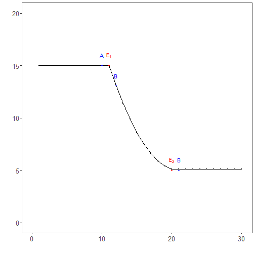

``` r
library(RColorBrewer)
library(ggplot2)
library(daltoolbox)
library(harbinger)
source("https://raw.githubusercontent.com/eogasawara/TSED/refs/heads/main/code/header.R")
```
## Theoretical Overview
This chapter focuses on tolerance windows for event evaluation. Instead of strict point matching, detections within a window around the event time are considered acceptable, easing timing mismatches.
## Example Overview and Goals
We demonstrate a complete, reproducible workflow: setting up libraries, loading data, configuring a detector, fitting it, running detection, optionally evaluating, and visualizing the results.
### Knitr Options
Make output clean and reproducible.

### Setup and Libraries
Short rationale for the libraries and any project-specific sources.

``` r
# Project helper: plot theme `font` and utility `save_png()`
```
### Setup and Libraries
Short rationale for the libraries and any project-specific sources.

### Setup and Libraries
Short rationale for the libraries and any project-specific sources.

### Data and Model
Create a simple synthetic series and fit a baseline Harbinger model. Comments
explain the intent of each step to make the flow didactic.

``` r
# Reproducibility
set.seed(1)
# Simple synthetic series with a peak then plateau
data_a <- function() {
  data <- NULL
  data <- c(data, rep(10, 10))                  # initial level
  data <- c(data, rev((seq(1, 10, 1)^2) / 10))  # descending curve
  data <- c(data, rep(0.1, 10))                 # low tail
  return(data + 5)                               # shift upward for plotting
}
data <- data_a()
# Fit a Harbinger model using the full series
model <- fit(harbinger(), data)
```
### Event Detection
Run the detector to obtain event flags or scores.

``` r
detection <- detect(model, data)
```
### Plot Construction
Build a didactic plot that highlights two true events (E[1], E[2]) and points
around them (A, B) to discuss tolerance windows.

``` r
event <- rep(FALSE, length(data))
grfD <- function(data, detection, event) {
  grf <- har_plot(model, data, detection, event)
  grf <- grf + ylab(" ") + ylim(0, 20) + xlim(0, 30)
  grf <- grf + font
  grf <- grf + ggplot2::annotate(geom="text", x=11, y=16, label="E[1]", color="red", parse=TRUE)
  grf <- grf + ggplot2::annotate(geom="text", x=20, y=6, label="E[2]", color="red", parse=TRUE)
  grf <- grf + ggplot2::annotate(geom="text", x=12, y=14, label="B", color="blue", parse=TRUE)
  grf <- grf + ggplot2::annotate(geom="text", x=21, y=6, label="B", color="blue", parse=TRUE)
  grf <- grf + ggplot2::annotate(geom="text", x=10, y=16, label="A", color="blue", parse=TRUE)
  grf <- grf + geom_point(aes(11, 15), colour = "red", size = 1)  
  grf <- grf + geom_point(aes(20, 5), colour = "red", size = 1)  
  grf <- grf + geom_point(aes(10, 15), colour = "blue", size = 1.25)  
  grf <- grf + geom_point(aes(21, 5), colour = "blue", size = 1.25)  
  grf <- grf + geom_point(aes(12, data[12]), colour = "blue", size = 1.25)  
}
grfd <- grfD(data, detection, event)
```
### Visualization and Output
Plot the series with detected events and optionally save figures. Combine ggplot layers in one chunk for clarity.

``` r
#save_png(grfd, "figures/chap7_tolerance.png", 1280, 720)
grfd
```


## References
* Fawcett, T. (2006). An introduction to ROC analysis.
* Ogasawara, E., Salles, R., Porto, F., Pacitti, E. Event Detection in Time Series. Springer, 2025. doi:10.1007/978-3-031-75941-3.
