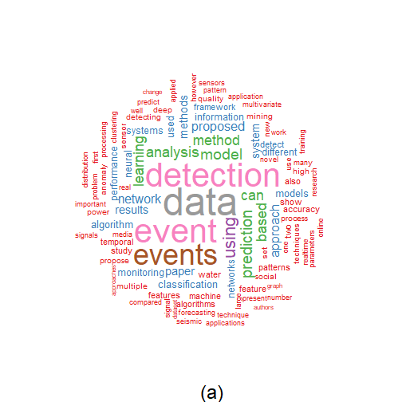
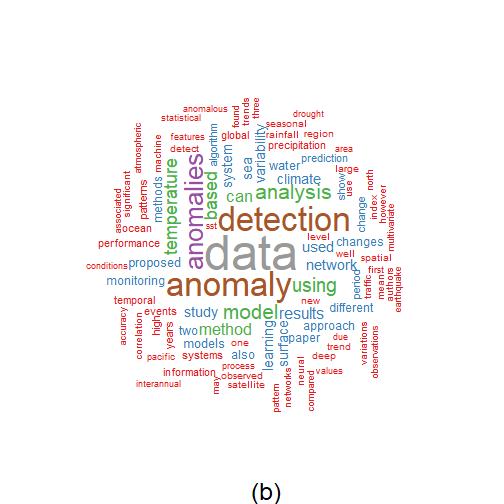
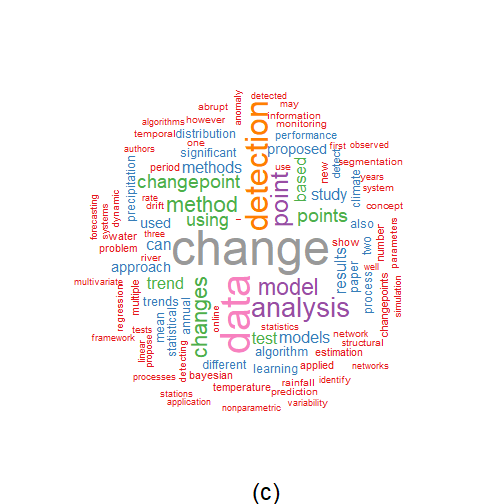
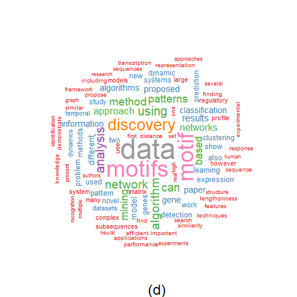

``` r
library(ggplot2)
library(wordcloud)
library(RColorBrewer)
library(wordcloud2)
library(tm)
library(dplyr)
source("https://raw.githubusercontent.com/eogasawara/TSED/refs/heads/main/code/header.R")
```
## Theoretical Overview
This chapter performs lightweight text analysis over titles/abstracts to visualize term salience via word clouds for each topic corpus.
## Example Overview and Goals
We demonstrate a complete, reproducible workflow: setting up libraries, loading data, configuring a detector, fitting it, running detection, optionally evaluating, and visualizing the results.
### Knitr Options
Keep output clean and reproducible.

### Setup and Libraries
Short rationale for the libraries and any project-specific sources.

``` r
# Color palette for wordclouds (skip color 6 to avoid low contrast)
colors <- brewer.pal(9, "Set1")[-6]
```
### Helpers
Utility to clean text and compute term frequencies for a word cloud.

``` r
plot_cloud <- function(data, stops = NULL) {
  # Concatenate relevant fields into a single text stream per record
  data$text <- paste(data$title, data$abstract, data$author_keywords)
  # Build a text corpus from raw strings
  docs <- Corpus(VectorSource(data$text))
  # Basic normalization: numbers, punctuation, whitespace, lowercase
  docs <- docs |>
    tm_map(removeNumbers) |>
    tm_map(removePunctuation) |>
    tm_map(stripWhitespace)
  docs <- tm_map(docs, content_transformer(tolower))
  # Remove default and custom stopwords
  docs <- tm_map(docs, removeWords, stopwords("english"))
  if (!is.null(stops)) docs <- tm_map(docs, removeWords, stops)
  # Term-document matrix and frequency aggregation
  dtm <- TermDocumentMatrix(docs)
  m <- as.matrix(dtm)
  words <- sort(rowSums(m), decreasing = TRUE)
  df <- data.frame(word = names(words), freq = words)
  return(df)
}
```
### Data Loading and Prep
Read the dataset and perform any minimal preparation required for modeling.

``` r
load(url("https://raw.githubusercontent.com/eogasawara/TSED/refs/heads/main/data/event_detection.RData"))
load(url("https://raw.githubusercontent.com/eogasawara/TSED/refs/heads/main/data/event_prediction.RData"))
```

``` r
# Event Detection/Prediction corpus word cloud
df <- plot_cloud(rbind(event_detection, event_prediction),
                 c("series", "time", "timeseries", "ieee", "springer"))
set.seed(1234)  # reproducibility for layout
wordcloud(words = df$word, freq = df$freq,
          random.order = FALSE, rot.per = 0.35, max.words = 100,
          colors = colors)
title(sub = "(a)", font.sub = 1, cex.sub = 2)
```


### Data Loading and Prep
Read the dataset and perform any minimal preparation required for modeling.

``` r
load(url("https://raw.githubusercontent.com/eogasawara/TSED/refs/heads/main/data/anomalies.RData"))
```

``` r
# Anomalies corpus word cloud
df <- plot_cloud(anomalies, c("series", "time", "timeseries", "ieee", "springer"))
set.seed(1234)
wordcloud(words = df$word, freq = df$freq,
          random.order = FALSE, rot.per = 0.35, max.words = 100,
          colors = colors)
title(sub = "(b)", font.sub = 1, cex.sub = 2)
```


### Data Loading and Prep
Read the dataset and perform any minimal preparation required for modeling.

``` r
load(url("https://raw.githubusercontent.com/eogasawara/TSED/refs/heads/main/data/change_point.RData"))
load(url("https://raw.githubusercontent.com/eogasawara/TSED/refs/heads/main/data/concept_drift.RData"))
```

``` r
# Change Point + Concept Drift corpus word cloud
df <- plot_cloud(rbind(change_point, concept_drift),
                 c("series", "time", "timeseries", "ieee", "springer"))
set.seed(1234)
wordcloud(words = df$word, freq = df$freq,
          random.order = FALSE, rot.per = 0.35, max.words = 100,
          colors = colors)
title(sub = "(c)", font.sub = 1, cex.sub = 2)
```


### Data Loading and Prep
Read the dataset and perform any minimal preparation required for modeling.

``` r
load(url("https://raw.githubusercontent.com/eogasawara/TSED/refs/heads/main/data/motif.RData"))
```

``` r
# Motif corpus word cloud
df <- plot_cloud(motif, c("series", "time", "timeseries", "ieee", "springer"))
set.seed(1234)
wordcloud(words = df$word, freq = df$freq,
          random.order = FALSE, rot.per = 0.35, max.words = 100,
          colors = colors)
title(sub = "(d)", font.sub = 1, cex.sub = 2)
```


## References
* General: Box, G. E. P. & Jenkins, G. (1970). Time Series Analysis.
* Ogasawara, E., Salles, R., Porto, F., Pacitti, E. Event Detection in Time Series. Springer, 2025. doi:10.1007/978-3-031-75941-3.
